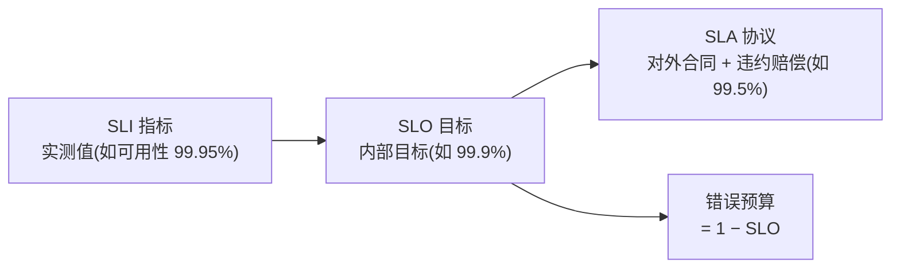
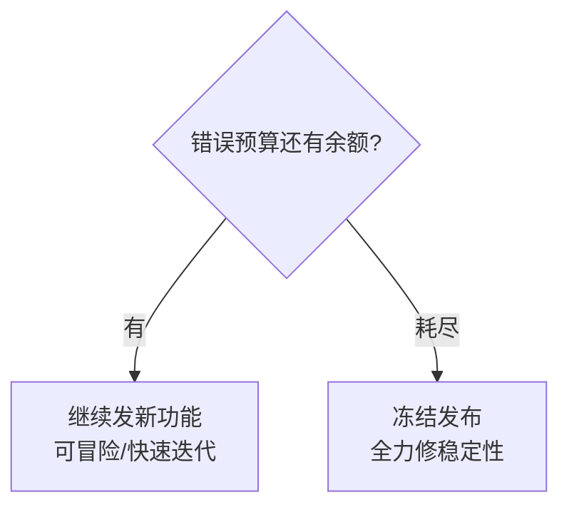

# 软件开发流程与模型(二十九)SRE与错误预算

> [!abstract] 速览
> **SRE（Site Reliability Engineering，站点可靠性工程）** 由 Google 提出，用**软件工程方法解决运维问题**。其招牌创新是 **SLI/SLO + 错误预算(Error Budget)**：用数据定义"多可靠才够"，并用"剩余错误预算"来**仲裁"发新功能"还是"保稳定"**。
> 一句话：**SRE 把"可靠性"变成可量化、可决策的工程问题**——"100% 可靠"既不可能也不划算，关键是定一个合理的 SLO，把允许的不可靠(错误预算)花在创新上。本篇深入 SLI/SLO/SLA、错误预算、消除琐务。

## 1. SRE 是什么

Google 的名言：**"SRE 是当你让软件工程师去做运维时得到的东西。"** 它用编码、自动化、度量来取代手工运维，把运维当软件工程问题解。

## 2. SRE vs DevOps

| 维度 | DevOps | SRE |
| --- | --- | --- |
| 定位 | **理念 / 文化**(要什么) | **具体实现**(怎么做) |
| 类比 | 接口 | 实现类 |
| 招牌 | CALMS / 三步法 | SLO / 错误预算 / 消除琐务 |

> 常说："**class SRE implements DevOps**"——SRE 是 DevOps 理念的一种工程化实现。

## 3. SLI / SLO / SLA

| 概念 | 含义 | 例 |
| --- | --- | --- |
| **SLI** | 服务级别**指标**(实际测量) | 请求成功率、延迟 |
| **SLO** | 服务级别**目标**(内部承诺) | 99.9% 可用 |
| **SLA** | 服务级别**协议**(对外合同+赔偿) | 99.5% 否则赔款 |

> 关系：**SLA 通常宽于 SLO**(留缓冲)，SLO 基于 SLI 设定。

## 4. 错误预算(Error Budget)——SRE 的灵魂

> **错误预算 = 1 − SLO**

SLO 99.9% → 允许 0.1% 不可用 = 每月约 43 分钟"可以坏"的额度。这个额度就是**错误预算**。

它的精妙在于：**把"可靠"与"创新"的矛盾变成一个共享的数字账户**——开发想多发功能(消耗预算)、运维想稳定(保护预算)，现在大家看同一个余额说话。

## 5. 错误预算如何驱动发布决策

- 预算充足 → **大胆发布**、快速迭代；
- 预算耗尽 → **冻结新功能**，团队转去做可靠性。

这消除了"开发只管发、运维只管稳"的对立——**用数据自动仲裁**。

## 6. 消除琐务(Toil)

**琐务(Toil)** = 手工的、重复的、可自动化的、无长期价值的运维劳动。SRE 主张**把琐务控制在 50% 以下**，其余时间用于工程(自动化、改进)。

| 琐务特征 | 例 |
| --- | --- |
| 手工 | 手动扩容 |
| 重复 | 每天重复同样操作 |
| 可自动化 | 本可脚本化 |
| 无长期价值 | 做完不带来持久改进 |

## 7. SRE 核心实践

| 实践 | 说明 |
| --- | --- |
| 监控与告警 | 基于 SLO 告警(见 [[30.可观测性与混沌工程]]) |
| 应急响应 | On-call、事件管理 |
| **无指责复盘** | 对事不对人，从故障学习 |
| 容量规划 | 预测并准备资源 |
| 自动化 | 消除琐务 |
| 发布工程 | 渐进发布(见 [[27.发布与部署策略]]) |

## 8. 可靠性与速度的平衡

> [!note] 核心哲学
> **追求 100% 可靠是错的**——成本指数上升、还拖死创新。合理做法是：**定一个"足够好"的 SLO，把允许的不可靠(错误预算)当资源花在快速迭代上**。可靠性不是越高越好，而是"恰好满足用户期望"。

## 9. 优点与挑战

| 优点 | 挑战 |
| --- | --- |
| 可靠性可量化、可决策 | 设合理 SLO 需经验与数据 |
| 化解开发 vs 运维对立 | 需监控/可观测性基建 |
| 数据驱动发布 | 文化转变(接受"可以坏一点") |

## 10. 真实案例：错误预算冻结发布

某服务 SLO=99.9%，某月因两次事故把错误预算用掉 90%。按 SRE 约定，团队**暂停新功能发布**，集中修复根因(加重试、改容量、补监控)。下月预算恢复后再继续发版——**用预算自动平衡了速度与稳定**。

## 11. 工具链

Prometheus / Grafana(指标)、SLO 工具(Nobl9 / Sloth)、PagerDuty / Opsgenie(on-call)、事件管理与复盘工具。

## 12. 常见误区与面试要点

> [!warning] 易错点
> - **SLI = SLO = SLA？** 不。SLI 是实测指标、SLO 是内部目标、SLA 是对外合同。
> - **错误预算怎么算？** 1 − SLO。
> - **追求 100% 可用？** 错。成本极高且拖死创新，应定"足够好"的 SLO。
> - **SRE = 高级运维？** 是**用软件工程做运维**，核心是自动化与量化。
> - **SRE vs DevOps？** SRE 是 DevOps 理念的工程化实现。
> - **Toil 要消灭到多少？** SRE 建议 < 50%。

## 13. 对常见说法的修正

> [!note] 修正清单
> 1. **"可靠性越高越好"**——错。100% 不现实也不划算；SRE 主张用错误预算把"允许的不可靠"当资源。
> 2. **"SRE 就是换个名字的运维"**——它用 SLO/错误预算/自动化把运维变成可量化、可决策的工程，本质不同。

## 14. 一句话记忆

> **SRE** = 用软件工程做运维：以 **SLI/SLO** 量化可靠性、用 **错误预算(=1−SLO)** 仲裁"发功能还是保稳定"、把 **琐务(Toil)** 自动化到 50% 以下——核心哲学是"**别追求 100%，把允许的不可靠当资源花在创新上**"。

## 延伸阅读

- 上位文化：[[20.DevOps文化与体系]]
- 监控基建：[[30.可观测性与混沌工程]]
- 发布控制：[[27.发布与部署策略]]
- 平台搭档：[[28.平台工程与内部开发者平台]]
- 度量：[[38.软件度量DORA与SPACE]]
- 横向速查：[[46.模型对比速查大表]]

## 参考文献

1. Beyer, B. 等(Google). *Site Reliability Engineering*（SRE Book）。
2. Google. *The Site Reliability Workbook*.
3. Nobl9 / Google. *SLO 工程实践*。

---

> ⬅️ [[28.平台工程与内部开发者平台]] ｜ 🏠 [[00.软件开发流程与模型总览]] ｜ [[30.可观测性与混沌工程]] ➡️
