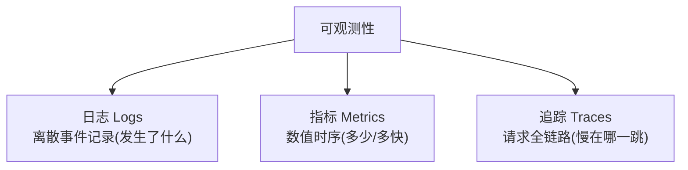
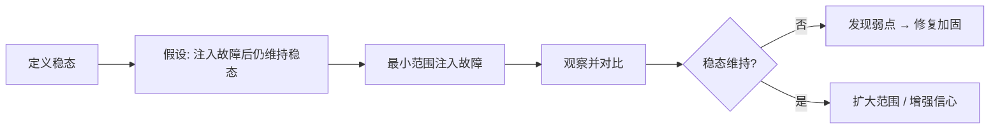

# 软件开发流程与模型(三十)可观测性与混沌工程

> [!abstract] 速览
> **可观测性(Observability)** 让你能从系统外部输出**推断其内部状态**，回答"它为什么坏"，三大支柱：**日志、指标、追踪**。**混沌工程(Chaos Engineering)** 则**主动注入故障**，在事故发生前发现系统弱点。
> 一句话：**可观测性让你"看得见"系统、混沌工程让你"主动验证"系统的韧性**——前者是后者的前提(看不见就别乱注入)。二者是 [[29.SRE与错误预算|SRE]]/[[20.DevOps文化与体系|DevOps]] 保障可靠性的左膀右臂。

## 1. 可观测性 vs 监控

| 维度 | 监控 Monitoring | 可观测性 Observability |
| --- | --- | --- |
| 回答 | "**已知**问题发生了吗"(已知的未知) | "**为什么**坏"(未知的未知) |
| 方式 | 预设指标 / 告警 | 可任意切片探查 |
| 比喻 | 仪表盘上的灯 | 能拆开发动机查任意零件 |

> 监控是可观测性的子集——监控看"预设的已知指标"，可观测性能探查"没预料到的问题"。

## 2. 三大支柱

| 支柱 | 回答 | 工具 |
| --- | --- | --- |
| **日志 Logs** | 发生了什么 | ELK、Loki |
| **指标 Metrics** | 多少、多快、多稳 | Prometheus |
| **追踪 Traces** | 分布式请求慢在哪 | Jaeger、Zipkin |

> 现代标准 **OpenTelemetry(OTel)** 统一了三支柱的采集。

## 3. 可观测性实践

| 实践 | 说明 |
| --- | --- |
| 结构化日志 | JSON 化，可检索 |
| 分布式追踪 | 跨服务串联 traceId |
| 基于 SLO 告警 | 告警绑定 [[29.SRE与错误预算\|SLO]]，减少噪音 |
| 关联分析 | 日志/指标/追踪相互跳转 |

## 4. 混沌工程是什么

混沌工程由 Netflix 开创(**Chaos Monkey** 随机杀实例)。理念：**与其等系统在凌晨 3 点自己崩，不如主动在白天注入故障，看它扛不扛得住**——在可控条件下暴露弱点。

## 5. 混沌工程五原则

| 原则 | 说明 |
| --- | --- |
| **建立稳态假设** | 先定义"正常"的可衡量指标 |
| **多样化真实事件** | 模拟真实故障(宕机/延迟/网络分区) |
| **在生产环境实验** | 最真实(谨慎，逐步) |
| **自动化持续运行** | 常态化而非一次性 |
| **最小化爆炸半径** | 控制影响范围，可随时中止 |

## 6. 混沌实验流程

## 7. 二者的关系

> [!note]
> **可观测性是混沌工程的前提**——如果你看不清系统状态，注入故障就是盲目破坏、无法判断结果。先有可观测性"看得见"，才能用混沌工程"主动验证"。二者共同服务于 [[29.SRE与错误预算|SRE]] 的可靠性目标。

## 8. 优点与挑战

| 优点 | 挑战 |
| --- | --- |
| 事前发现弱点(而非事后) | 生产实验需勇气与防护 |
| 提升系统韧性与信心 | 需成熟的可观测性基建 |
| 验证容错 / 降级 / 回滚 | 文化上接受"主动制造故障" |

## 9. 真实案例：Netflix 的 Simian Army

Netflix 把混沌工程做成"猴子军团"：Chaos Monkey(随机杀实例)、Latency Monkey(注入延迟)、Chaos Kong(模拟整个区域故障)。常态化注入让其架构**天生抗故障**——某可用区挂掉用户几乎无感。

## 10. 工具链

可观测性：Prometheus/Grafana、ELK/Loki、Jaeger、**OpenTelemetry**；混沌：Chaos Monkey、Gremlin、Chaos Mesh、LitmusChaos。

## 11. 常见误区与面试要点

> [!warning] 易错点
> - **可观测性 = 监控？** 监控是子集；可观测性能查"未知的未知"。
> - **三大支柱是什么？** 日志、指标、追踪。
> - **混沌工程 = 随便搞破坏？** 不。有稳态假设、最小爆炸半径、可中止，是受控实验。
> - **混沌一定在生产？** 最真实但需谨慎，常从测试环境起步、逐步上生产。
> - **先有什么才能混沌？** 先有可观测性(看得见)。
> - **OpenTelemetry 是什么？** 统一三支柱采集的标准。

## 12. 对常见说法的修正

> [!note] 修正清单
> 1. **"加了监控就有可观测性"**——监控看已知指标，可观测性要能探查未预料的问题，需结构化日志 + 追踪 + 高基数数据。
> 2. **"混沌工程太危险不能在生产做"**——控制好爆炸半径 + 可随时中止 + 可观测性兜底，生产混沌恰恰最能验证真实韧性。

## 13. 一句话记忆

> **可观测性**(日志+指标+追踪)让你**看得见**系统、回答"为什么坏"；**混沌工程**(稳态假设+最小爆炸半径)让你**主动注入故障**、事前发现弱点——前者是后者的前提，二者共保可靠性。

## 延伸阅读

- 可靠性框架：[[29.SRE与错误预算]]
- 上位文化：[[20.DevOps文化与体系]]
- 发布安全：[[27.发布与部署策略]]
- 横向速查：[[46.模型对比速查大表]]

## 参考文献

1. Majors, C. 等. *Observability Engineering*.
2. Netflix. *Principles of Chaos Engineering*（principlesofchaos.org）。
3. OpenTelemetry 官方文档。

---

> ⬅️ [[29.SRE与错误预算]] ｜ 🏠 [[00.软件开发流程与模型总览]] ｜ [[31.ITIL与变更管理]] ➡️
