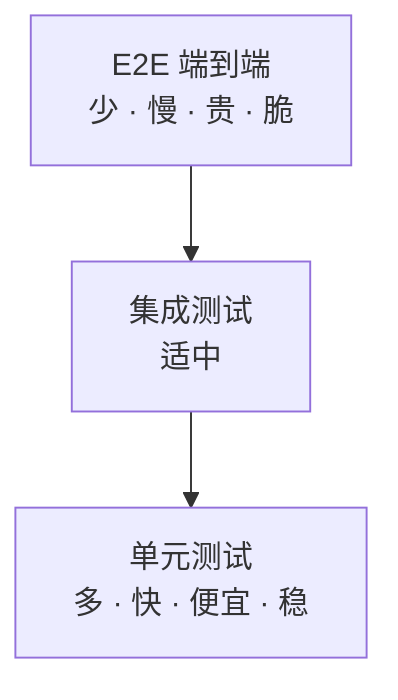
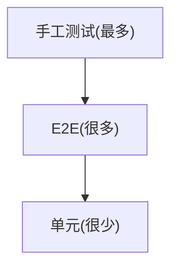

# 软件开发流程与模型(三十二)软件测试流程与测试金字塔

> [!abstract] 速览
> 软件测试通过 **验证(Verification) 与 确认(Validation)** 保障质量。**测试金字塔(Test Pyramid，Mike Cohn)** 给出分层策略：**底层单元测试多而快、中层集成测试适中、顶层 E2E 测试少而慢**。
> 一句话：**多写快而便宜的单元测试，少写慢而脆的端到端测试**——倒过来(冰淇淋甜筒)就会又慢又脆。本篇深入测试分层、金字塔与反模式、测试类型全景、覆盖率与左移右移。

## 1. 测试与 V&V

- **验证 Verification**："做对了吗"——符合规格(单元/集成测试)；
- **确认 Validation**："做的是对的吗"——满足需求(验收测试)。

（详见 [[02.软件开发生命周期SDLC]]、[[04.V模型]]）

## 2. 测试分层

| 层 | 测什么 | 特点 |
| --- | --- | --- |
| **单元测试** | 单个函数 / 类 | 多、快、便宜、稳定 |
| **集成测试** | 模块 / 服务间协作 | 中等 |
| **系统 / E2E** | 端到端完整流程 | 少、慢、贵、易脆 |
| **验收测试** | 用户场景 / 业务 | 面向需求 |

## 3. 测试金字塔

> 越往下：数量越多、速度越快、越便宜、越稳定。理想分布常说 **70% 单元 / 20% 集成 / 10% E2E**（视项目而定）。

## 4. 反模式：冰淇淋甜筒

**冰淇淋甜筒(Ice Cream Cone)** = 金字塔倒过来：大量慢而脆的 E2E + 手工测试、极少单元测试。后果：测试慢、易 flaky、反馈迟、维护贵。**这是最常见的测试反模式。**

## 5. 测试奖杯(Testing Trophy)

Kent C. Dodds 针对前端提出 **Testing Trophy**：**加重集成测试**(认为它性价比最高)，形如奖杯(静态分析→单元→集成最大→E2E)。提醒我们：金字塔比例**因技术栈而异**，前端常更重集成。

## 6. 测试类型全景

| 类别 | 类型 |
| --- | --- |
| **功能测试** | 单元、集成、系统、验收、回归、冒烟 |
| **非功能测试** | 性能、压力、负载、安全(见 [[24.DevSecOps与供应链安全]])、兼容性、可用性 |
| **方法维度** | 黑盒(看行为) / 白盒(看代码)、静态(不运行) / 动态(运行) |

## 7. 测试覆盖率

| 覆盖率 | 含义 |
| --- | --- |
| 语句覆盖 | 每行是否执行 |
| 分支覆盖 | 每个分支真假都走 |
| **MC-DC** | 修正条件判定覆盖(航空 DO-178C 强制) |

> [!warning]
> 覆盖率是**手段不是目的**。100% 覆盖 ≠ 没 bug(可能断言无效)；但极低覆盖肯定有风险。别为凑覆盖率写无意义测试。

## 8. 测试左移与右移

- **左移**：测试尽早(需求即测、[[33.测试驱动开发TDD|TDD]]、CI 跑测试)——发现越早越便宜。
- **右移**：在生产测(灰度、[[30.可观测性与混沌工程|混沌]]、监控、A/B)——真实环境验证。
- 现代实践"两头都测"。

## 9. 真实案例：修复倒金字塔

某团队 80% 是 Selenium E2E，跑一次 40 分钟还经常 flaky，开发都不敢信。重构：把大量业务逻辑校验下沉为单元测试、保留少量关键 E2E、引入契约测试替代部分集成。测试套件从 40 分钟降到 5 分钟、稳定性大增——**金字塔归位**。

## 10. 工具链

单元(JUnit/pytest/Jest)、集成(Testcontainers/契约测试 Pact)、E2E(Selenium/Cypress/Playwright)、覆盖率(JaCoCo/Istanbul)、性能(JMeter/k6)。

## 11. 常见误区与面试要点

> [!warning] 易错点
> - **E2E 越多越好？** 不。E2E 慢且脆，应少而精；多写单元。
> - **金字塔比例固定？** 不。前端常更重集成(Testing Trophy)，因栈而异。
> - **覆盖率 100% = 没 bug？** 不。覆盖率是手段，断言无效照样漏。
> - **冰淇淋甜筒是什么？** 倒金字塔反模式(E2E/手工多、单元少)。
> - **验证 vs 确认？** Verification 对规格、Validation 对需求。
> - **MC-DC 用在哪？** 航空等安全攸关(DO-178C)。

## 12. 对常见说法的修正

> [!note] 修正清单
> 1. **"E2E 最能保证质量所以多写"**——E2E 慢、脆、贵，过多会拖垮反馈；应金字塔分布。
> 2. **"覆盖率越高质量越好"**——覆盖率到一定程度边际收益递减，且易被无效断言注水。

## 13. 一句话记忆

> **测试金字塔** = **底层单元多而快、顶层 E2E 少而慢**；倒过来(冰淇淋甜筒)又慢又脆是反模式；比例因栈而异(前端可重集成=Testing Trophy)；覆盖率是手段非目的，测试要左移(早测)右移(生产验证)。

## 延伸阅读

- 测试先行：[[33.测试驱动开发TDD]] · [[34.行为驱动开发BDD]]
- V&V 与 V 模型：[[04.V模型]] · [[02.软件开发生命周期SDLC]]
- 工程实践：[[15.极限编程XP]] · [[21.持续集成与持续交付CICD]]
- 横向速查：[[46.模型对比速查大表]]

## 参考文献

1. Cohn, M. *Succeeding with Agile*（测试金字塔）。
2. Fowler, M. *TestPyramid*.
3. Dodds, K. C. *The Testing Trophy*.

---

> ⬅️ [[31.ITIL与变更管理]] ｜ 🏠 [[00.软件开发流程与模型总览]] ｜ [[33.测试驱动开发TDD]] ➡️
