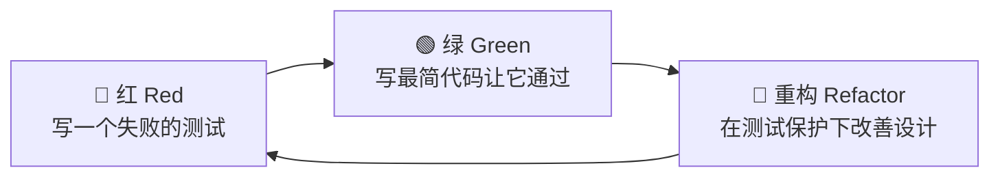

# 软件开发流程与模型(三十三)测试驱动开发TDD

> [!abstract] 速览
> **测试驱动开发（TDD, Test-Driven Development）** 由 Kent Beck 倡导，把测试**写在实现之前**：先写一个失败的测试(红)，写最简代码让它通过(绿)，再重构(重构)，循环往复。
> 一句话：**TDD 不只是"测试技术"，更是一种"设计方法"**——测试先行倒逼你想清楚接口与行为，并天然产出高覆盖、可回归的测试网。本篇深入红绿重构、三定律、两大学派与完整代码示例。

## 1. TDD 是什么

TDD 颠倒了常规顺序：**先写测试，再写实现**。它强迫你在动手前先回答"这段代码**该有什么行为、怎么验证**"，从而把"测试"变成"设计的一部分"。

## 2. 红-绿-重构循环



| 步骤 | 做什么 | 关键 |
| --- | --- | --- |
| **红** | 写一个会失败的测试 | 先定义期望行为 |
| **绿** | 写**最简**实现让测试通过 | 不求优雅，只求通过 |
| **重构** | 在测试保护下优化 | 测试是安全网 |

## 3. TDD 三定律(Robert C. Martin)

1. 不写任何产品代码，**除非是为了让一个失败的测试通过**；
2. 只写**刚好失败**的测试(编译失败也算失败)；
3. 只写**刚好让当前失败测试通过**的产品代码。

> 三定律强制你以**极小步**推进——写一点测试、写一点实现，循环以秒/分钟计。

## 4. 完整代码示例（FizzBuzz）

```python
# 🔴 红：先写失败的测试
def test_fizz():
    assert fizzbuzz(3) == "Fizz"     # fizzbuzz 还不存在 → 失败

# 🟢 绿：最简实现让它通过
def fizzbuzz(n):
    if n % 3 == 0:
        return "Fizz"
    return str(n)

# 🔴 再加一个测试，驱动新行为
def test_buzz():
    assert fizzbuzz(5) == "Buzz"     # 当前实现返回 "5" → 失败

# 🟢 扩展实现
def fizzbuzz(n):
    if n % 15 == 0: return "FizzBuzz"
    if n % 3 == 0:  return "Fizz"
    if n % 5 == 0:  return "Buzz"
    return str(n)

# 🔵 重构：消除重复、提取规则(测试保护下安全进行)
```

> 每个行为都由一个测试"驱动"出来——实现是测试逼出来的，而非凭空设计。

## 5. 测试先行的价值

| 价值 | 说明 |
| --- | --- |
| 驱动设计 | 先想接口/行为，设计更清晰、可测 |
| 高覆盖 | 代码天然被测试覆盖 |
| 安全重构 | 测试网让重构无所畏惧 |
| 活文档 | 测试即"代码该怎么用"的示例 |
| 快速反馈 | 秒级知道写错没 |

## 6. TDD vs 测试后写(TLD)

| 维度 | TDD(先写测试) | 测试后写 |
| --- | --- | --- |
| 设计影响 | **驱动可测设计** | 易写出难测代码 |
| 覆盖 | 天然高 | 常遗漏 |
| 心态 | 小步、有安全网 | 易跳过测试 |

## 7. 两大学派：经典派 vs 伦敦派

| 学派 | 别名 | 特点 |
| --- | --- | --- |
| **经典派 Classicist** | 底特律派/芝加哥派 | 少用 mock，测真实协作，关注状态 |
| **伦敦派 Mockist** | London School | 大量 mock 依赖，关注交互/行为，自顶向下 |

> 两派各有适用：经典派测试更稳健、伦敦派隔离更彻底。实战常混用。

## 8. TDD 与设计

> [!note]
> **难测 = 设计有问题的信号**。如果一个类很难写测试(依赖太多、职责太杂)，TDD 会**逼你改进设计**(解耦、依赖注入、单一职责)。这是 TDD 最被低估的价值——它是一种**设计反馈机制**。

## 9. 优点与缺点

| 优点 | 缺点 / 局限 |
| --- | --- |
| 设计更好、覆盖更高 | 初期慢、有学习曲线 |
| 重构安全、回归保护 | 探索性 / UI / 算法原型不易先测 |
| 减少调试时间 | 写不好会产出脆弱测试 |

## 10. 适用与局限

- **适合**：业务逻辑、库、可明确定义行为的代码；
- **不太适合**：纯探索/不确定的原型(可先 spike 再补测试)、纯 UI 布局。

## 11. 真实案例：用 TDD 驯服复杂计费逻辑

某计费规则极复杂(阶梯价、优惠叠加、封顶)。团队用 TDD：每条规则先写测试用例(含边界)，再实现。结果不仅 bug 极少，这套测试还成了"规则的活文档"——业务一变，先改测试就知道影响面。

## 12. 工具链

xUnit 家族(JUnit/pytest/Jest/NUnit)、mock 库(Mockito/unittest.mock)、断言库、覆盖率工具；配合 [[21.持续集成与持续交付CICD|CI]] 每次提交跑测试。

## 13. 常见误区与面试要点

> [!warning] 易错点
> - **TDD 只是测试技术？** 不。它更是**设计方法**(驱动可测、解耦的设计)。
> - **红绿重构哪步不能省？** **重构**最常被省，但它是 TDD 价值的关键。
> - **TDD = 100% 覆盖？** 高覆盖是副产品，目的不是凑覆盖率。
> - **难测怎么办？** 是设计有问题的信号，改设计而非跳过测试。
> - **三定律核心？** 极小步：测试先行、刚好失败、刚好通过。
> - **经典派 vs 伦敦派？** 前者少 mock 重状态，后者多 mock 重交互。

## 14. 对常见说法的修正

> [!note] 修正清单
> 1. **"TDD 拖慢开发"**——初期慢，但减少调试与返工，中长期常更快(且重构无惧)。
> 2. **"TDD 万能/必须 100% 用"**——探索性原型、纯 UI 不强求先测；TDD 是利器但非教条。

## 15. 一句话记忆

> **TDD** = **红(写失败测试)→ 绿(最简实现)→ 重构** 的小步循环：测试先行不只保覆盖，更**驱动出可测、解耦的好设计**；难测就是设计变坏的信号——它是测试，更是设计方法。

## 延伸阅读

- 测试体系：[[32.软件测试流程与测试金字塔]]
- 衍生方法：[[34.行为驱动开发BDD]]
- 工程母体：[[15.极限编程XP]]
- 集成保障：[[21.持续集成与持续交付CICD]]
- 横向速查：[[46.模型对比速查大表]]

## 参考文献

1. Beck, K. *Test-Driven Development: By Example*.
2. Martin, R. C. *Clean Code*（TDD 三定律）。
3. Freeman, S. & Pryce, N. *Growing Object-Oriented Software, Guided by Tests*（伦敦派）。

---

> ⬅️ [[32.软件测试流程与测试金字塔]] ｜ 🏠 [[00.软件开发流程与模型总览]] ｜ [[34.行为驱动开发BDD]] ➡️
