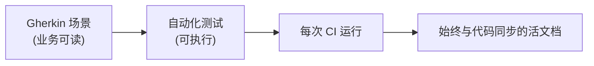
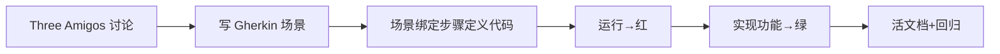

# 软件开发流程与模型(三十四)行为驱动开发BDD

> [!abstract] 速览
> **行为驱动开发（BDD, Behavior-Driven Development）** 由 Dan North 从 [[33.测试驱动开发TDD|TDD]] 演化而来，用**业务可读的自然语言(Given-When-Then)** 描述系统行为，让**业务、开发、测试三方**对"要做什么"达成共识，并让这些描述**直接变成自动化测试**。
> 一句话：**BDD = 用人话写验收标准，且这些人话能自动跑成测试**——它弥合了"业务说的"和"代码做的"之间的鸿沟，产出**活文档(Living Documentation)**。本篇深入 Gherkin、三个朋友、实例化需求与代码示例。

## 1. BDD 是什么

TDD 关注"代码单元对不对"，但业务看不懂单元测试。BDD 把焦点上移到**"系统行为/业务价值"**，用**所有人都能读懂的语言**写规约，再用工具把它跑成自动化测试。

## 2. BDD vs TDD

| 维度 | [[33.测试驱动开发TDD\|TDD]] | BDD |
| --- | --- | --- |
| 关注 | 代码单元正确性 | **系统行为 / 业务价值** |
| 语言 | 代码(开发看) | **自然语言**(人人看) |
| 受众 | 开发 | 业务 + 开发 + 测试 |
| 产出 | 单元测试 | 验收测试 + **活文档** |

> BDD 是"面向业务的 TDD"，二者不冲突：常 BDD 定行为、TDD 做实现。

## 3. Gherkin 语法：Given-When-Then

BDD 用 **Gherkin** 写场景，结构：

| 关键字 | 含义 |
| --- | --- |
| **Given(假如)** | 前置条件 |
| **When(当)** | 触发动作 |
| **Then(那么)** | 预期结果 |
| And/But(并且/但是) | 补充 |

```gherkin
功能: 购物车结算
  作为 顾客
  我想 对购物车商品结算
  以便 完成购买

  场景: 满减优惠
    假如 购物车有 120 元商品
    并且 存在"满100减20"活动
    当 我点击结算
    那么 应付金额应为 100 元
```

> Gherkin 支持中文关键字，业务方也能读写。

## 4. 三个朋友(Three Amigos)

写场景前，**业务(PO) + 开发 + 测试**三方坐一起(Three Amigos)，从各自视角厘清需求与边界，共同写出验收场景——这能在编码前消除大量理解偏差。

## 5. 实例化需求(Specification by Example)

BDD 的核心思想(Gojko Adzic)：**用具体例子说明需求**，而非抽象描述。"满 100 减 20"配上"120→100"的具体例子，比一句模糊的"支持满减"清晰得多，且例子能直接变测试。

## 6. 活文档(Living Documentation)



> Gherkin 场景既是**需求**、又是**测试**、还是**文档**——因为它每次 CI 都跑，**永不过期**(不像传统文档写完就烂)。

## 7. BDD 流程



## 8. 与 ATDD 的关系

**ATDD(验收测试驱动开发)** 与 BDD 高度重叠：都先定验收标准再开发。BDD 更强调**自然语言与协作**，ATDD 更强调**验收测试驱动**——常被视为近义。

## 9. 优点与缺点

| 优点 | 缺点 |
| --- | --- |
| 业务-开发-测试共识 | 维护 Gherkin + 步骤定义有成本 |
| 活文档永不过期 | 写不好会沦为"啰嗦的测试" |
| 需求即测试、可回归 | 过度用于底层逻辑得不偿失 |

## 10. 真实案例：用 BDD 锁定结算规则

某电商结算规则常引发"业务说 A、开发做 B"的扯皮。引入 BDD：Three Amigos 把每条规则写成 Gherkin 场景(带具体金额例子)，开发据此实现、测试自动跑。规则一变就改场景——**业务和代码再也不会各说各话**。

## 11. 工具链

Cucumber(Java/Ruby/JS)、SpecFlow(.NET)、behave(Python)、Gauge；与 [[21.持续集成与持续交付CICD|CI]] 集成持续运行活文档。

## 12. 常见误区与面试要点

> [!warning] 易错点
> - **BDD = 测试工具？** 它首先是**协作 + 共识**方法，工具(Cucumber)只是载体。
> - **BDD 取代 TDD？** 不。BDD 定行为、TDD 做实现，互补。
> - **Gherkin 用于所有测试？** 不。适合**业务行为**，底层逻辑用 TDD 更合适。
> - **Given-When-Then 是什么？** 前置条件-动作-预期结果。
> - **Three Amigos 是哪三方？** 业务、开发、测试。
> - **活文档为何不过期？** 因为它每次 CI 都作为测试运行。

## 13. 对常见说法的修正

> [!note] 修正清单
> 1. **"BDD 就是写 Cucumber 测试"**——核心是 Three Amigos 协作与实例化需求，工具是末节；只写不协作=啰嗦的测试。
> 2. **"什么都用 Gherkin"**——给底层算法/工具函数套 Gherkin 是浪费；它属于业务行为层。

## 14. 一句话记忆

> **BDD** = 用 **Given-When-Then** 的人话(Gherkin)、由 **Three Amigos(业务+开发+测试)** 共写**带具体例子**的验收场景，再自动跑成测试——需求即测试即**活文档**(永不过期)；它是面向业务的 TDD。

## 延伸阅读

- 母体方法：[[33.测试驱动开发TDD]]
- 需求上游：[[35.需求工程流程]] · [[36.用户故事地图与影响地图]]
- 测试体系：[[32.软件测试流程与测试金字塔]]
- 工程母体：[[15.极限编程XP]]
- 横向速查：[[46.模型对比速查大表]]

## 参考文献

1. North, D. *Introducing BDD*.
2. Adzic, G. *Specification by Example*.
3. Wynne, M. & Hellesøy, A. *The Cucumber Book*.

---

> ⬅️ [[33.测试驱动开发TDD]] ｜ 🏠 [[00.软件开发流程与模型总览]] ｜ [[35.需求工程流程]] ➡️
