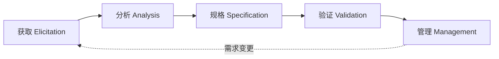

# 软件开发流程与模型(三十五)需求工程流程

> [!abstract] 速览
> **需求工程（Requirements Engineering）** 系统化地处理"软件该做什么"：**获取 → 分析 → 规格 → 验证 → 管理**。需求错误是**最贵的错误**(到生产才发现成本可达需求阶段的几十上百倍，见 [[03.瀑布模型]])，因此需求工程是软件成败的源头。
> 一句话：**做对的产品(Validation)比把产品做对(Verification)更重要**——再完美的实现，做错了需求也是白费。本篇深入五活动、需求分类、获取技术、SRS、好需求标准与优先级方法。

## 1. 需求工程是什么

它回答"**做什么、为谁做、为什么做**"，是连接"业务问题"与"软件解决方案"的桥梁。需求没搞对，后面全是返工。

## 2. 需求的分类

| 类别 | 含义 | 例 |
| --- | --- | --- |
| **功能需求** | 系统要做什么 | "支持微信登录" |
| **非功能需求(NFR)** | 质量属性 / 约束 | 性能、安全、可用性、可维护性 |
| **约束** | 技术 / 法规 / 预算限制 | "必须用国产数据库" |

> 非功能需求常被忽视却极关键——"能用"和"好用/扛得住"差在 NFR。

## 3. 需求工程五活动

| 活动 | 做什么 |
| --- | --- |
| **获取** | 从干系人挖出需求 |
| **分析** | 梳理、建模、解决冲突、定优先级 |
| **规格** | 形成文档(SRS / 用户故事) |
| **验证** | 确认需求正确、完整、一致 |
| **管理** | 变更控制、追溯、基线 |

## 4. 需求获取技术

| 技术 | 适用 |
| --- | --- |
| 访谈 | 深入了解个体诉求 |
| 工作坊 / JAD | 多方快速对齐 |
| 问卷 | 大范围收集 |
| 观察 | 了解真实工作流 |
| **原型** | 澄清模糊需求(见 [[05.原型模型]]) |
| 文档分析 | 现有系统 / 法规 |

## 5. 需求分析与建模

| 工具 | 用途 |
| --- | --- |
| 用例图 / 用例 | 系统与角色的交互 |
| **用户故事** | 敏捷需求("作为…我想…以便…") |
| 用户故事地图 | 全局视角(见 [[36.用户故事地图与影响地图]]) |
| 数据流图 / ER 图 | 数据与流程建模 |

## 6. 需求规格说明书(SRS)

**SRS（Software Requirements Specification）** 是需求的正式文档，标准如 **IEEE 830 / ISO·IEC·IEEE 29148**。敏捷中常用**用户故事 + 验收标准**替代厚重 SRS，但思想相通(把需求写清楚、可验证)。

## 7. 需求验证

确认需求**正确、完整、一致、可行、可验证**。手段：需求评审、原型确认、[[34.行为驱动开发BDD|BDD]] 把验收标准实例化。

## 8. 需求管理

| 实践 | 说明 |
| --- | --- |
| **变更控制** | 需求变更走评估与审批(见 [[41.配置管理与变更管理]]) |
| **可追溯** | 需求↔设计↔代码↔测试(RTM，见 [[04.V模型]]) |
| **基线** | 冻结某版本作为基准 |

## 9. 好需求的特征

| 标准 | 含义 |
| --- | --- |
| 正确、完整、一致 | 无错、无缺、无矛盾 |
| **可验证** | 能测(否则是空话) |
| 无歧义 | 只有一种解读 |
| 可行 | 技术 / 预算可实现 |
| **INVEST**(用户故事) | 独立/可协商/有价值/可估/小/可测 |

## 10. 需求优先级

| 方法 | 说明 |
| --- | --- |
| **MoSCoW** | Must/Should/Could/Won't(见 [[06.增量模型]]) |
| **Kano 模型** | 基本型 / 期望型 / 兴奋型需求 |
| 价值 vs 成本 | 高价值低成本先做 |

> Kano 提醒：**基本型需求**(没有就不满)、**兴奋型需求**(有则惊喜)——资源该如何分配很有讲究。

## 11. 真实案例：非功能需求的代价

某系统功能全做对，上线却因没人定义"并发量"(NFR 缺失)在大促时崩溃。教训：**非功能需求(性能/容量/可用性)必须在需求阶段显式定义**，否则功能再全也扛不住真实负载。

## 12. 工具链

需求管理(DOORS/Jama/Polarion)、协作文档(Confluence)、建模(Enterprise Architect/PlantUML)、敏捷(Jira 用户故事)。

## 13. 常见误区与面试要点

> [!warning] 易错点
> - **需求 = 功能列表？** 不。还有关键的**非功能需求**与约束。
> - **需求一次定死？** 计划驱动倾向冻结，敏捷持续演进；都需变更控制。
> - **Verification vs Validation？** 做对了(对规格) vs 做的是对的(对需求)。
> - **好需求最关键特征？** **可验证**——不可测的需求是空话。
> - **Kano 三类需求？** 基本型、期望型、兴奋型。
> - **敏捷里 SRS 去哪了？** 用用户故事+验收标准替代，思想相通。

## 14. 对常见说法的修正

> [!note] 修正清单
> 1. **"敏捷不需要需求工程"**——敏捷只是**形式更轻、持续进行**(故事+梳理)，需求获取/分析/验证一样不能少。
> 2. **"需求就是甲方说什么写什么"**——需求工程要**挖掘真实需要、解决冲突、定义可验证标准**，而非照单全收。

## 15. 一句话记忆

> **需求工程** = **获取→分析→规格→验证→管理** 五活动，搞清"做什么/为谁/为何"；既要功能需求也要**非功能需求**，需求要**可验证**，用 MoSCoW/Kano 定优先级——做对的产品比把产品做对更重要。

## 延伸阅读

- 澄清手段：[[05.原型模型]]
- 可视化需求：[[36.用户故事地图与影响地图]]
- 实例化验收：[[34.行为驱动开发BDD]]
- 变更与追溯：[[41.配置管理与变更管理]] · [[04.V模型]]
- 横向速查：[[46.模型对比速查大表]]

## 参考文献

1. Sommerville, I. *Software Engineering*（需求工程章）。
2. Wiegers, K. & Beatty, J. *Software Requirements*.
3. ISO/IEC/IEEE 29148；IEEE 830。

---

> ⬅️ [[34.行为驱动开发BDD]] ｜ 🏠 [[00.软件开发流程与模型总览]] ｜ [[36.用户故事地图与影响地图]] ➡️
