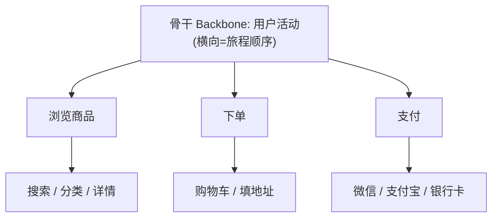
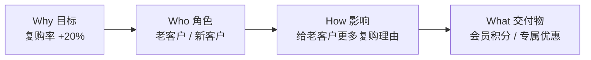

# 软件开发流程与模型(三十六)用户故事地图与影响地图

> [!abstract] 速览
> 扁平的用户故事列表(backlog)看不出全局、容易"见树不见林"。**用户故事地图(Jeff Patton)** 把故事按**用户旅程**二维铺开，**影响地图(Gojko Adzic)** 则从**业务目标**反推该做什么。
> 一句话：**故事地图回答"用户旅程上还缺什么、先发哪个切片"，影响地图回答"为达成目标，最该做什么、别做无关功能"**——两者都把需求从"列表"升级成"有结构的图"。本篇深入两种地图的结构、价值与配合。

## 1. 为什么把需求"画"出来

一长串 backlog 的问题：看不出**全局**、看不出**优先级切片**、容易**遗漏**用户旅程中的环节。可视化地图把需求的**结构与关系**显性化。

## 2. 用户故事地图(Story Mapping)

| 维度 | 含义 |
| --- | --- |
| **横轴** | 用户活动的**时间 / 旅程顺序**(骨干) |
| **纵轴** | 同一活动下的**优先级**(上=必要,下=可选) |
| **横切线** | 划出**发布切片**(如 MVP=每个活动取最上面一条) |

## 3. 故事地图的价值

| 价值 | 说明 |
| --- | --- |
| 全局视角 | 一眼看清完整用户旅程 |
| 切 MVP / 增量 | 横向切片 = 一个端到端可用版本(见 [[06.增量模型]]) |
| 发现遗漏 | 旅程上缺的环节一目了然 |
| 共识 | 团队围着地图讨论 |

> 关键技巧：**MVP 是"横切一条最小可用旅程"，而非"纵向做完第一个活动的所有功能"**——要端到端能走通。

## 4. 影响地图(Impact Mapping)

从**目标**出发，问四层"为什么/谁/怎样/做什么"：

| 层 | 问题 |
| --- | --- |
| **Why** | 目标是什么(可量化) |
| **Who** | 哪些角色能影响目标 |
| **How** | 他们的行为要怎么改变 |
| **What** | 我们做什么来促成 |

## 5. 影响地图的价值

> [!note]
> 影响地图最大的作用是**防止"为做功能而做功能"**——每个"What"都能往上追溯到"为什么做"。如果一个功能挂不到任何目标上，就该质疑它是否该做(消除 [[16.精益软件开发Lean|浪费]])。

## 6. 二者对比与配合

| 维度 | 用户故事地图 | 影响地图 |
| --- | --- | --- |
| 出发点 | **用户旅程**(横向流程) | **业务目标**(自上而下) |
| 回答 | 旅程缺什么、先发哪片 | 为达标该做什么 |
| 配合 | 影响地图定"做什么大方向"，故事地图把它铺成旅程并切片 | |

## 7. 与用户旅程地图的区别

**用户旅程地图(User Journey Map)** 偏 UX，描述用户体验的情绪/触点；**用户故事地图**偏需求规划,组织待开发的故事。二者相关但目的不同。

## 8. 优点与缺点

| 优点 | 缺点 |
| --- | --- |
| 全局可视、易共识 | 需协作工作坊投入 |
| 切片清晰、利于增量 | 地图需持续维护 |
| 防止做无价值功能(影响地图) | 大型产品地图会很大 |

## 9. 真实案例：用故事地图切 MVP

某团队做在线教育,backlog 有 200 条故事,不知从何发起。开工作坊画故事地图:横轴排"注册→选课→学习→考试→结业"旅程,每列纵向排功能。横切最上面一条得到 MVP:"能注册→能选一门课→能看视频→能简单测验→能拿证书"——**一个端到端最小可用闭环**,而非"把注册做到极致却没法上课"。

## 10. 工具链

物理白板 + 便利贴(最佳协作)、Miro / Mural、StoriesOnBoard、Avion;影响地图:Miro / draw.io。

## 11. 常见误区与面试要点

> [!warning] 易错点
> - **MVP = 做完第一个模块?** 不。MVP 是**横切一条端到端可用旅程**,不是纵向做完一个活动。
> - **故事地图 = backlog?** 它是 backlog 的**二维结构化**,显示旅程与优先级。
> - **影响地图从功能出发?** 反了,从**业务目标**出发反推功能。
> - **故事地图横轴是优先级?** 不。横轴是**旅程顺序**,纵轴才是优先级。
> - **用户旅程地图 = 故事地图?** 不。前者偏 UX 体验,后者偏需求规划。

## 12. 对常见说法的修正

> [!note] 修正清单
> 1. **"先把一个功能做完美再做下一个"**——故事地图主张先横切端到端最小旅程(MVP),让用户尽早走通全流程。
> 2. **"有需求就该做"**——影响地图要求每个功能能追溯到业务目标,挂不上的就该质疑。

## 13. 一句话记忆

> **用户故事地图**(横轴旅程、纵轴优先级)帮你看全局、**横切出端到端的 MVP**;**影响地图**(Why→Who→How→What)从业务目标反推该做什么、**防止做无价值功能**——把需求从"列表"升级成"有结构的图"。

## 延伸阅读

- 需求上游：[[35.需求工程流程]]
- MVP 与精益：[[42.精益创业LeanStartup与MVP]] · [[16.精益软件开发Lean]]
- 增量切片：[[06.增量模型]]
- 验收实例化：[[34.行为驱动开发BDD]]
- 横向速查：[[46.模型对比速查大表]]

## 参考文献

1. Patton, J. *User Story Mapping*.
2. Adzic, G. *Impact Mapping*.

---

> ⬅️ [[35.需求工程流程]] ｜ 🏠 [[00.软件开发流程与模型总览]] ｜ [[37.软件估算方法]] ➡️
