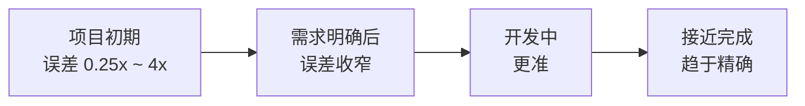

# 软件开发流程与模型(三十七)软件估算方法

> [!abstract] 速览
> 软件估算难,因为软件**无形、不确定、人易乐观**。主流方法分四类:**专家判断、类比估算、参数化模型(COCOMO/功能点)、分解估算**;敏捷则用 [[18.敏捷估算与度量|故事点+速度]]。
> 一句话:**估算的目标不是"精确",而是"在当前不确定性下给出有用的区间"**——理解"锥形不确定性"(早期误差大、越往后越准)和认知偏差,比追求精确数字更重要。本篇深入各方法、COCOMO/功能点、PERT 与估算偏差。

## 1. 为什么估算难

| 原因 | 说明 |
| --- | --- |
| 无形性 | 软件看不见,难类比实物 |
| 不确定性 | 需求会变、技术有未知 |
| **乐观偏差** | 人天生低估工作量 |
| 独特性 | 每个项目都不太一样 |

## 2. 估算方法四大类

| 类别 | 思路 | 例 |
| --- | --- | --- |
| **专家判断** | 靠经验估 | 德尔菲 / 宽带德尔菲 |
| **类比估算** | 比照历史相似项目 | "和上个项目差不多" |
| **参数化模型** | 用公式 + 历史数据 | COCOMO、功能点 |
| **分解估算** | 拆成小任务分别估再汇总 | WBS、故事点 |

## 3. 专家判断:宽带德尔菲

多位专家**独立估算**→ 匿名汇总分歧 → 讨论 → 再估,多轮收敛。**独立 + 匿名**防止权威带偏(类似 [[18.敏捷估算与度量|计划扑克]])。

## 4. 类比估算

找一个**历史相似项目**作基准,按规模/复杂度差异调整。快、依赖历史数据质量。

## 5. 参数化模型:COCOMO

Boehm 的 **COCOMO(构造性成本模型)**:用代码规模(KLOC)和项目类型估工作量。

> **工作量 ≈ a × (KLOC)^b × 调整因子**

- b > 1 体现**规模不经济**(项目越大,单位成本越高);
- COCOMO II 加入了规模、复用、团队等更多驱动因子。

## 6. 功能点(Function Point)

Albrecht 提出,**从功能角度而非代码行**度量规模:数外部输入、输出、查询、文件、接口,加权求和。优点:**语言无关、需求阶段即可估**;缺点:计算繁琐、需专业人员。

## 7. 故事点(敏捷)

相对估算的无量纲单位,配速度做预测——详见 [[18.敏捷估算与度量]]。与上述绝对方法的根本区别:**比较而非测量绝对值**。

## 8. PERT 三点估算

用三个值算期望,纳入不确定性:

> **期望 = (乐观 O + 4×最可能 M + 悲观 P) ÷ 6**

比单点估算更稳健,能体现风险范围。

## 9. 锥形不确定性(Cone of Uncertainty)

> [!note]
> 项目**越早期,估算误差越大**(可达 4 倍);随信息增加逐步收敛。所以早期应给**宽区间**,并随项目推进**重估**——一次定死早期估算是大忌。

## 10. 估算的认知偏差

| 偏差 | 表现 | 对策 |
| --- | --- | --- |
| 乐观偏差 | 系统性低估 | 用历史数据校准、加缓冲 |
| 锚定效应 | 被第一个数字带偏 | 独立估算(德尔菲/扑克) |
| 学生综合征 | 拖到 deadline 才赶 | 小批量、时间盒 |
| 帕金森定律 | 工作填满所有可用时间 | 设定合理压力 |

## 11. 真实案例:用 PERT + 缓冲对外承诺

某模块,开发估"乐观 5 天、最可能 8 天、悲观 20 天"。PERT 期望 = (5+32+20)/6 ≈ 9.5 天。考虑悲观尾部风险,对外承诺"约 2 周",而非拍脑袋的"1 周"——**纳入不确定性的估算更靠谱**。

## 12. 工具链

COCOMO 计算器、功能点工具、[[18.敏捷估算与度量|计划扑克工具]]、Jira(速度/预测)、蒙特卡洛模拟工具。

## 13. 常见误区与面试要点

> [!warning] 易错点
> - **估算 = 承诺?** 不。估算是**预测(有不确定性)**,承诺是另一回事,别混。
> - **追求精确单点?** 应给**区间 + 概率**,尤其早期。
> - **COCOMO 的 b 为何 > 1?** 体现规模不经济(越大单位成本越高)。
> - **功能点比代码行好在哪?** 语言无关、需求期可估。
> - **PERT 公式?** (O + 4M + P)/6。
> - **锥形不确定性说明?** 早期误差大,要随项目重估。

## 14. 对常见说法的修正

> [!note] 修正清单
> 1. **"估算应该精确"**——软件早期不可能精确,强求精确单点反而误导;给区间、随进展重估才科学。
> 2. **"估算=给个死期"**——估算是预测、是输入;把预测当承诺、当 deadline 施压,是项目失败常见根源。

## 15. 一句话记忆

> **软件估算** 四类法(专家/类比/参数化COCOMO·功能点/分解),敏捷用故事点+速度;牢记**锥形不确定性**(早期误差可达4倍)与**乐观偏差**——给**区间而非单点**、用 PERT 纳入风险、随项目**重估**,且估算≠承诺。

## 延伸阅读

- 敏捷估算:[[18.敏捷估算与度量]]
- 度量延伸:[[38.软件度量DORA与SPACE]]
- 风险:[[08.螺旋模型]]
- 项目管理:[[40.项目管理PMBOK与PRINCE2]]
- 横向速查:[[46.模型对比速查大表]]

## 参考文献

1. Boehm, B. *Software Engineering Economics*（COCOMO）。
2. McConnell, S. *Software Estimation: Demystifying the Black Art*（锥形不确定性）。
3. Albrecht, A. *Function Point Analysis*.

---

> ⬅️ [[36.用户故事地图与影响地图]] ｜ 🏠 [[00.软件开发流程与模型总览]] ｜ [[38.软件度量DORA与SPACE]] ➡️
