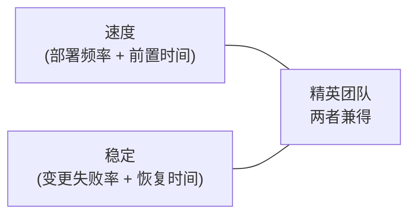

# 软件开发流程与模型(三十八)软件度量DORA与SPACE

> [!abstract] 速览
> "度量什么,就得到什么"——度量错了会引导错误行为。现代研发效能度量的三套主流框架:**DORA 四指标**(交付效能,最权威)、**SPACE**(多维度开发者生产力)、**Flow Framework**(价值流动)。
> 一句话:**别用代码行/工时等"产出量"度量生产力(会被博弈),要用 DORA 的"快且稳"、SPACE 的"多维平衡"来度量真正的价值交付**。本篇深入 DORA 四指标、SPACE 五维、Flow 指标与 Goodhart 定律。

## 1. 为什么度量、度量陷阱

度量驱动行为。但 **Goodhart 定律**警告:"**当一个度量变成目标,它就不再是好度量**"——用代码行考核就会有人灌水,用 bug 数考核就会有人瞒报。好度量要**抗博弈、看结果、多维平衡**。

## 2. DORA 四指标(交付效能金标准)

来自《Accelerate》一书的多年研究:

| 指标 | 含义 | 维度 |
| --- | --- | --- |
| **部署频率** | 多久发一次 | 速度 |
| **变更前置时间** | 提交→上线耗时 | 速度 |
| **变更失败率** | 发布导致故障的比例 | 稳定 |
| **故障恢复时间(MTTR)** | 出事→恢复耗时 | 稳定 |

## 3. 速度与稳定:不是取舍而是兼得

> [!note] 关键发现
> DORA 研究推翻了"快=不稳"的直觉:**精英团队又快又稳**——高频小批量发布反而降低了失败率、缩短了恢复。速度与稳定**正相关**,而非取舍。

## 4. 精英 vs 低绩效团队

DORA 按四指标把团队分精英/高/中/低。精英团队:**按需多次部署、前置时间<1天、变更失败率低、恢复以分钟计**;低绩效团队则以月计、失败率高。

## 5. SPACE 框架(多维生产力)

单一指标度量"生产力"必然片面。**SPACE**(Forsgren 等)主张从五维度量:

| 维度 | 含义 |
| --- | --- |
| **S — Satisfaction** | 满意度与幸福感 |
| **P — Performance** | 结果/质量 |
| **A — Activity** | 活动量(慎用,易博弈) |
| **C — Communication** | 协作与沟通 |
| **E — Efficiency** | 流动与无阻塞 |

> SPACE 的核心信息:**别用单一维度(尤其 Activity)代表生产力**,要组合多维、含主观感受。

## 6. Flow Framework(价值流动)

Mik Kersten 的 **Flow Framework** 从价值流视角度量:

| 指标 | 含义 |
| --- | --- |
| Flow Velocity | 单位时间完成的流动项 |
| Flow Efficiency | 增值时间÷总时间(见 [[16.精益软件开发Lean]]) |
| Flow Time | 端到端耗时 |
| Flow Load | 在制品负载(WIP) |
| Flow Distribution | 特性/缺陷/债务/风险的投入占比 |

## 7. 度量反模式

| 反模式 | 危害 |
| --- | --- |
| **代码行数** | 鼓励写废话、复制粘贴 |
| **提交次数/活动量** | 刷数据、无关价值 |
| **个人绩效排名** | 破坏协作、局部最优 |
| **速度跨团队比** | 点数膨胀(见 [[18.敏捷估算与度量]]) |

## 8. 北极星指标

团队应找一个**北极星指标(代表真实价值)**,辅以护栏指标防止顾此失彼(如:追求部署频率,但护栏住变更失败率)。

## 9. 真实案例:用 DORA 驱动改进

某团队季度发布、出事恢复要数小时。测 DORA 后定位瓶颈:前置时间长(手工测试)、恢复慢(无监控)。投入 [[21.持续集成与持续交付CICD|CI/CD]] + [[30.可观测性与混沌工程|监控]] + [[27.发布与部署策略|金丝雀]]。一年后部署频率从季度→每日、MTTR 从小时→分钟——**四指标全面跃迁**。

## 10. 工具链

DORA:DevOps 平台内置(GitLab/Jellyfish/LinearB/Haystack);Flow:Tasktop/Planview;SPACE:需组合调研 + 客观数据。

## 11. 常见误区与面试要点

> [!warning] 易错点
> - **代码行能度量生产力?** 不。典型反模式,易被博弈。
> - **DORA 四指标?** 部署频率、变更前置时间、变更失败率、恢复时间。
> - **快和稳必须取舍?** 不。DORA 证明精英团队**又快又稳**。
> - **SPACE 为何存在?** 反对用单一维度(尤其 Activity)代表生产力。
> - **Goodhart 定律?** 度量一旦成目标就失效。
> - **个人 KPI 排名好吗?** 破坏协作,反模式。

## 12. 对常见说法的修正

> [!note] 修正清单
> 1. **"提高速度必然牺牲质量"**——DORA 数据显示二者正相关(小批量+自动化让快与稳兼得)。
> 2. **"度量开发者就看产出量"**——产出量(代码行/活动)是最易博弈的反模式;要用 DORA(结果)+SPACE(多维)。

## 13. 一句话记忆

> **研发度量** 用 **DORA 四指标**(部署频率+前置时间=快,变更失败率+恢复时间=稳,且精英团队**又快又稳**) + **SPACE 五维**(别只看活动量) + **Flow 流动指标**;牢记 **Goodhart 定律**——别用代码行/工时,否则一度量就被博弈。

## 延伸阅读

- 敏捷度量:[[18.敏捷估算与度量]]
- DevOps:[[20.DevOps文化与体系]] · [[29.SRE与错误预算]]
- 流动:[[16.精益软件开发Lean]] · [[14.看板方法Kanban]]
- 成熟度:[[39.CMMI能力成熟度模型]]
- 横向速查:[[46.模型对比速查大表]]

## 参考文献

1. Forsgren, N., Humble, J., Kim, G. *Accelerate*（DORA）。
2. Forsgren, N. 等 (2021). *The SPACE of Developer Productivity*.
3. Kersten, M. *Project to Product*（Flow Framework）。

---

> ⬅️ [[37.软件估算方法]] ｜ 🏠 [[00.软件开发流程与模型总览]] ｜ [[39.CMMI能力成熟度模型]] ➡️
