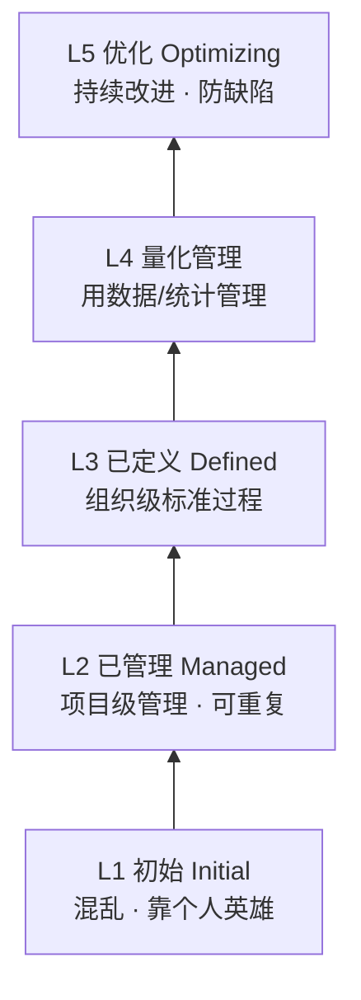

# 软件开发流程与模型(三十九)CMMI能力成熟度模型

> [!abstract] 速览
> **CMMI（Capability Maturity Model Integration,能力成熟度模型集成）** 由卡内基梅隆 SEI 提出,用 **5 个成熟度等级** 衡量一个组织的**过程成熟度**,并指导**过程改进**。从"混乱靠英雄"(L1)到"持续优化"(L5)。
> 一句话:**CMMI 评估的是"组织过程"的成熟度,不是产品质量**——它常用于外包/政府/国防招标资质,也常被误解为"和敏捷对立"。本篇深入五级、连续式/阶段式、过程域,及其与敏捷的张力与融合。

## 1. CMMI 是什么

CMMI 关注"**组织把事情做对的能力有多稳定可复制**"。同样的项目,L1 组织靠个别英雄救火、结果飘忽;L5 组织靠成熟过程,结果可预测、持续改进。

## 2. 五个成熟度等级

| 级 | 名称 | 特征 |
| --- | --- | --- |
| **L1** | 初始 | 过程混乱、不可预测、靠个人 |
| **L2** | 已管理 | 项目级有计划/跟踪,可重复 |
| **L3** | 已定义 | 组织级标准过程,统一裁剪 |
| **L4** | 量化管理 | 用**量化数据**管理过程性能 |
| **L5** | 优化 | 基于数据**持续改进**、主动防缺陷 |

## 3. 连续式 vs 阶段式表示

| 表示法 | 关注 | 输出 |
| --- | --- | --- |
| **阶段式(Staged)** | 组织整体成熟度 | 成熟度**等级**(1~5) |
| **连续式(Continuous)** | 单个过程域的能力 | 各域**能力等级** |

## 4. 过程域(Process Areas)

CMMI 由若干**过程域**组成(如需求管理、项目规划、配置管理、过程与产品质量保证等),每个域有需达成的目标与实践。达成相应域即可"升级"。

## 5. CMMI vs 敏捷:张力

| 维度 | CMMI | [[13.Scrum框架\|敏捷]] |
| --- | --- | --- |
| 取向 | 过程标准化、文档化 | 个体互动、可工作软件 |
| 印象 | 重、规范 | 轻、灵活 |
| 误解 | "和敏捷对立" | "没有过程纪律" |

## 6. CMMI 与敏捷:其实可融合

> [!note] 关键澄清
> CMMI 说"**做什么(目标)**"——要有需求管理、要有配置管理;敏捷说"**怎么做(实践)**"——用 backlog、用 [[23.GitOps|Git]]、用回顾。SEI 官方明确:**敏捷实践可以满足 CMMI 的目标**。很多组织"用敏捷的方式达成 CMMI 的过程域"。二者不是非此即彼。

## 7. CMMI 的现代意义

- **招标资质**:政府/国防/外包常要求 CMMI 等级;
- **过程改进地图**:给组织一个"从混乱到优化"的演进阶梯;
- 批评:认证可能"为评而评"、流于形式(见误区)。

## 8. 优点与缺点

| 优点 | 缺点 |
| --- | --- |
| 系统的过程改进框架 | 易被当"认证生意",形式化 |
| 提升过程可预测性 | 重落地成本 |
| 招标/资质认可 | 用不好会僵化、官僚 |

## 9. 真实案例:用敏捷达成 CMMI L3

某外包公司客户要求 CMMI L3 资质,团队又想保持敏捷。做法:用 Scrum 的 backlog/梳理满足"需求管理"、用 [[41.配置管理与变更管理|Git+CI]]满足"配置管理"、用回顾会满足"过程改进"——**以敏捷实践逐一对齐 L3 过程域目标**,既拿到资质又没退回重型瀑布。

## 10. 工具链

过程资产库、[[41.配置管理与变更管理|配置管理工具]]、度量平台([[38.软件度量DORA与SPACE|DORA]]可支撑 L4 量化管理)、CMMI 评估(SCAMPI)。

## 11. 常见误区与面试要点

> [!warning] 易错点
> - **CMMI 评产品质量?** 不。评的是**组织过程成熟度**。
> - **CMMI 和敏捷对立?** 不。CMMI 说目标、敏捷说实践,可融合。
> - **五级哪级是"标准过程"?** L3 已定义(组织级标准)。
> - **L4 vs L5?** L4 量化管理(用数据控),L5 优化(持续改进)。
> - **连续式 vs 阶段式?** 前者评单域能力,后者评组织整体等级。
> - **CMMI 认证=过程一定好?** 不一定,可能形式化"为评而评"。

## 12. 对常见说法的修正

> [!note] 修正清单
> 1. **"敏捷团队不能/不该上 CMMI"**——SEI 明确敏捷实践可满足 CMMI 目标,二者可结合。
> 2. **"CMMI 等级高=交付一定强"**——成熟度反映过程稳定性,但若为认证而走形式,未必转化为真实效能(应结合 [[38.软件度量DORA与SPACE|DORA]] 看结果)。

## 13. 一句话记忆

> **CMMI** = 用 **5 级**(初始→已管理→已定义→量化管理→优化)衡量**组织过程成熟度**并指导改进;它评过程不评产品,和敏捷**不对立**(CMMI 定目标、敏捷给实践,可用敏捷达成 CMMI 目标)——但小心"为认证而认证"的形式化。

## 延伸阅读

- 过程改进:[[01.软件工程与软件过程导论]]
- 结果度量:[[38.软件度量DORA与SPACE]]
- 配置管理:[[41.配置管理与变更管理]]
- 敏捷对照:[[13.Scrum框架]] · [[12.敏捷宣言与原则]]
- 横向速查:[[46.模型对比速查大表]]

## 参考文献

1. CMMI Institute / SEI. *CMMI for Development*.
2. SEI. *CMMI 与敏捷结合指南*。

---

> ⬅️ [[38.软件度量DORA与SPACE]] ｜ 🏠 [[00.软件开发流程与模型总览]] ｜ [[40.项目管理PMBOK与PRINCE2]] ➡️
