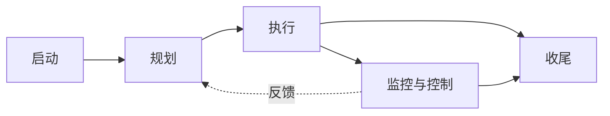
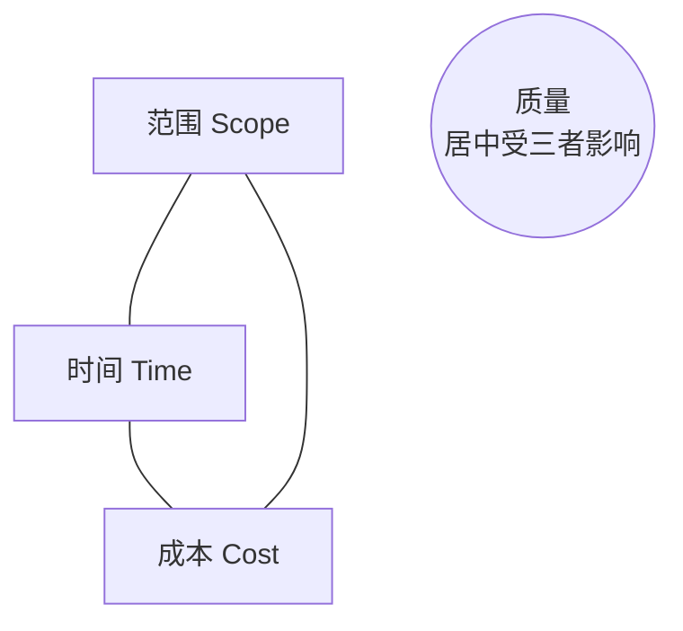

# 软件开发流程与模型(四十)项目管理PMBOK与PRINCE2

> [!abstract] 速览
> 软件开发也是"项目",需要项目管理。两大体系:**PMBOK**(PMI 的知识体系,偏"该懂哪些知识")与 **PRINCE2**(英国的方法,偏"该走哪些流程")。它们提供过程模型之上的**管理框架**——范围、进度、成本、风险、干系人。
> 一句话:**过程模型管"怎么做软件",项目管理管"怎么把项目带到成功"**;现代二者都已拥抱敏捷(PMBOK 第7版转向原则与价值交付)。本篇深入 PMBOK 过程组/知识域、PRINCE2 七要素、铁三角与敏捷融合。

## 1. 项目管理与软件开发

[[13.Scrum框架|Scrum]] 等是**开发过程**,PMBOK/PRINCE2 是**项目管理体系**——后者关注预算、合同、干系人、风险、采购等"开发之外但决定成败"的事。大型/合规项目尤其需要。

## 2. PMBOK:知识体系

**PMBOK(Project Management Body of Knowledge,PMI)** 传统上用**五大过程组 × 十大知识领域**组织。

| 五过程组 | 十知识领域 |
| --- | --- |
| 启动 / 规划 / 执行 / 监控 / 收尾 | 整合、范围、进度、成本、质量、资源、沟通、风险、采购、干系人 |

## 3. PMBOK 第七版的转向

> [!note]
> **PMBOK 第 7 版(2021)** 是重大转变:从"过程导向(五过程组)"转向 **12 条原则 + 8 个绩效域**,强调**价值交付**,并全面纳入**敏捷/混合**方法。这反映项目管理界对敏捷的接纳——不再是"瀑布式项目管理"的代名词。

## 4. PRINCE2:受控环境项目方法

**PRINCE2(PRojects IN Controlled Environments)** 是英国政府推广的项目管理方法,结构化为"7+7+7":

| 七原则 | 七主题 | 七流程 |
| --- | --- | --- |
| 持续业务论证、经验学习、角色职责明确、按阶段管理、例外管理、聚焦产品、剪裁 | 商业论证、组织、质量、计划、风险、变更、进度 | 项目启动、指导、初始化、阶段控制、产品交付管理、阶段边界管理、收尾 |

> PRINCE2 强调**按阶段管理 + 例外管理**(只有超出容差才上报),与门径管理思想相通。

## 5. PMBOK vs PRINCE2 vs 敏捷

| 维度 | PMBOK | PRINCE2 | [[13.Scrum框架\|敏捷]] |
| --- | --- | --- | --- |
| 性质 | 知识体系 | 方法/流程 | 开发框架 |
| 偏重 | "懂什么" | "怎么走流程" | "怎么交付价值" |
| 灵活性 | 中(v7 更敏捷) | 可剪裁 | 高 |

## 6. 铁三角(项目约束)

> 经典**铁三角**:范围、时间、成本三者相互制约,动一个必影响其余,质量居中。敏捷的做法常是**固定时间与成本、让范围浮动**(砍功能保工期),传统则常固定范围、让时间成本浮动。

## 7. 与敏捷的融合

- **PMI-ACP**:PMI 的敏捷认证;
- **Disciplined Agile(DA)**:PMI 收购,作为"过程工具箱"支持混合(见 [[19.混合模型与Water-Scrum-fall]]);
- PMBOK v7 / PRINCE2 Agile 都已支持敏捷/混合交付。

## 8. 优点与缺点

| 优点 | 缺点 |
| --- | --- |
| 系统覆盖项目全维度 | 重型,小项目用不上全套 |
| 适合大型/合规/多方项目 | 易官僚、文档重 |
| 通用、跨行业、认证认可 | 需剪裁,照搬会僵化 |

## 9. 真实案例:大型项目的管理 + 敏捷开发

某政府信息化项目:用 **PRINCE2** 管项目治理(商业论证、阶段评审、风险/采购),开发团队内部跑 **Scrum** 迭代。项目层有阶段门禁与汇报,团队层敏捷交付——典型的[[19.混合模型与Water-Scrum-fall|混合]]:**管理用 PRINCE2,开发用敏捷**。

## 10. 工具链

MS Project / Primavera(进度)、Jira(敏捷+项目)、风险登记册、干系人矩阵、挣值管理(EVM)工具。

## 11. 常见误区与面试要点

> [!warning] 易错点
> - **项目管理 = 瀑布?** 不。PMBOK v7、PRINCE2 Agile 都支持敏捷/混合。
> - **PMBOK = 流程?** v6 偏过程组,**v7 已转向原则+价值交付**。
> - **铁三角是什么?** 范围、时间、成本(质量居中)。
> - **敏捷怎么处理铁三角?** 常固定时间成本、让范围浮动。
> - **PRINCE2 的"例外管理"?** 只有超出容差才上报,降低微管理。
> - **项目管理 vs 过程模型?** 前者管项目成功(预算/风险/干系人),后者管怎么做软件。

## 12. 对常见说法的修正

> [!note] 修正清单
> 1. **"项目管理体系都是重瀑布"**——PMBOK v7 与 PRINCE2 Agile 已深度融合敏捷,这是过时印象。
> 2. **"敏捷不需要项目管理"**——小团队或许够,但大型/多方/合规项目仍需治理、预算、风险、干系人管理。

## 13. 一句话记忆

> **PMBOK**(知识体系,v7 转向原则+价值交付+敏捷) 与 **PRINCE2**(受控环境方法,7原则/主题/流程) 提供过程模型之上的**项目治理**;核心约束是**铁三角**(范围/时间/成本);现代二者都拥抱敏捷,常"管理用 PMBOK/PRINCE2、开发用敏捷"。

## 延伸阅读

- 混合落地:[[19.混合模型与Water-Scrum-fall]]
- 估算:[[37.软件估算方法]]
- 成熟度:[[39.CMMI能力成熟度模型]]
- 风险:[[08.螺旋模型]]
- 横向速查:[[46.模型对比速查大表]]

## 参考文献

1. PMI. *PMBOK Guide*（第 6、7 版）。
2. AXELOS. *Managing Successful Projects with PRINCE2*.
3. PMI. *Disciplined Agile*；*Agile Practice Guide*.

---

> ⬅️ [[39.CMMI能力成熟度模型]] ｜ 🏠 [[00.软件开发流程与模型总览]] ｜ [[41.配置管理与变更管理]] ➡️
