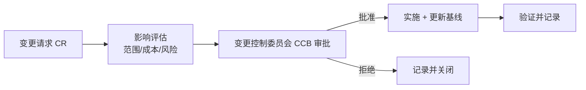

# 软件开发流程与模型(四十一)配置管理与变更管理

> [!abstract] 速览
> **软件配置管理（SCM, Software Configuration Management）** 系统化地管理软件的**所有产物及其变更**:代码、文档、依赖、环境、制品。核心活动:**配置标识、变更控制、状态记录、配置审计**。
> 一句话:**SCM 回答"任何时刻,系统由哪些版本的哪些东西组成、怎么变成这样的、能否复现/回退"**——它是可追溯、可复现、可回滚的基础,从古老的版本控制一直延伸到今天的 [[23.GitOps|GitOps]] 与基础设施即代码。本篇深入四活动、基线、变更控制流程与现代演进。

## 1. SCM 是什么

软件由海量不断变化的产物组成。没有 SCM,就会"这版谁改的?""线上跑的是哪个版本?""能回到上周吗?"全抓瞎。SCM 让一切**可标识、可控制、可追溯、可复现**。

## 2. 配置管理四大活动

| 活动 | 含义 |
| --- | --- |
| **配置标识** | 确定哪些是配置项、如何命名/版本化 |
| **变更控制** | 变更走评估-审批-实施(见第 5 节) |
| **状态记录** | 记录每个配置项的状态与历史 |
| **配置审计** | 核验实际与记录一致、基线完整 |

## 3. 版本控制(SCM 的核心工具)

**Git** 是现代版本控制的事实标准:分布式、分支廉价、完整历史。配合 [[25.Git分支工作流|分支策略]]管理协作。版本控制让"谁、何时、改了什么、为什么"一目了然。

## 4. 基线(Baseline)

**基线** = 某一时刻被正式评审、冻结的配置版本,作为后续工作的**稳定参照点**。如"需求基线""发布基线"。变更只能通过受控流程修改基线。

## 5. 变更控制流程

> **CCB(Change Control Board)** 评估变更的影响后决定批准与否。现代 DevOps 中,低风险变更常用**自动化门禁 + 评审**替代人工 CCB(见 [[31.ITIL与变更管理]])。

## 6. 制品与依赖管理

| 对象 | 管理方式 |
| --- | --- |
| 构建制品 | 制品库(Nexus/Artifactory)、版本化、签名 |
| 第三方依赖 | lockfile 锁版本、[[24.DevSecOps与供应链安全\|SCA 扫漏洞]]、SBOM |
| 容器镜像 | 镜像仓库、不可变标签 |

## 7. 环境配置:配置即代码

现代 SCM 延伸到**环境**:用**基础设施即代码(IaC,Terraform/Ansible)** 把环境配置也版本化,实现"环境可复现"。配置与代码分离(12-Factor),敏感信息用密钥管理(见 [[24.DevSecOps与供应链安全]])。

## 8. 与 CI/CD、GitOps 的关系

| 关系 | 说明 |
| --- | --- |
| [[21.持续集成与持续交付CICD\|CI/CD]] | 基于版本控制触发,产出版本化制品 |
| [[23.GitOps\|GitOps]] | 把**期望状态版本化存 Git**,是 SCM 思想在部署的极致 |
| 可追溯 | 提交→构建→制品→部署全链路可追 |

## 9. 可追溯性

SCM 支撑**端到端可追溯**:需求↔代码↔提交↔制品↔部署↔事故。安全攸关领域(见 [[04.V模型]] 的 RTM)对此有强制要求。

## 10. 真实案例:用 SCM 实现一键回滚

某团队线上出故障,因所有制品版本化 + 部署用 [[23.GitOps|GitOps]],运维只需 `git revert` 把期望状态退回上一基线,Operator 自动把集群校准回去——**几分钟回滚,且全程留痕可审计**。这正是 SCM(版本化+基线+可追溯)的价值。

## 11. 工具链

版本控制(Git)、制品库(Nexus/Artifactory/Harbor)、IaC(Terraform/Ansible)、配置中心(Consul/Apollo)、密钥(Vault)、变更管理(ServiceNow/Jira)。

## 12. 常见误区与面试要点

> [!warning] 易错点
> - **配置管理 = 用 Git?** Git 是核心工具,但 SCM 还含基线、变更控制、审计、制品/环境管理。
> - **基线是什么?** 被冻结的、作为参照的配置版本。
> - **CCB 必须人工?** 现代低风险变更用自动门禁+评审替代(见 [[31.ITIL与变更管理]])。
> - **配置即代码指什么?** 用 IaC 把环境也版本化、可复现。
> - **密钥能进版本库吗?** 不能,用密钥管理工具。
> - **SCM 四活动?** 标识、变更控制、状态记录、审计。

## 13. 对常见说法的修正

> [!note] 修正清单
> 1. **"有了 Git 就有了配置管理"**——版本控制只是 SCM 的一部分;基线、变更控制、制品/环境/依赖管理同样关键。
> 2. **"变更控制必须重流程"**——现代实践用自动化门禁让低风险变更快速通过,只对高风险走 CCB。

## 14. 一句话记忆

> **配置管理(SCM)** = 管好软件**所有产物及其变更**(代码/文档/依赖/环境/制品):四活动是**标识·变更控制·状态记录·审计**,以**版本控制+基线**为核心,延伸到**配置即代码**与 [[23.GitOps|GitOps]]——实现可追溯、可复现、可回滚。

## 延伸阅读

- 版本协作:[[25.Git分支工作流]]
- 声明式交付:[[23.GitOps]]
- 流水线:[[21.持续集成与持续交付CICD]]
- 变更治理:[[31.ITIL与变更管理]]
- 供应链:[[24.DevSecOps与供应链安全]]
- 横向速查:[[46.模型对比速查大表]]

## 参考文献

1. IEEE Std 828. *Configuration Management in Systems and Software Engineering*.
2. Berczuk, S. & Appleton, B. *Software Configuration Management Patterns*.
3. Humble, J. & Farley, D. *Continuous Delivery*（版本控制与基线）。

---

> ⬅️ [[40.项目管理PMBOK与PRINCE2]] ｜ 🏠 [[00.软件开发流程与模型总览]] ｜ [[42.精益创业LeanStartup与MVP]] ➡️
