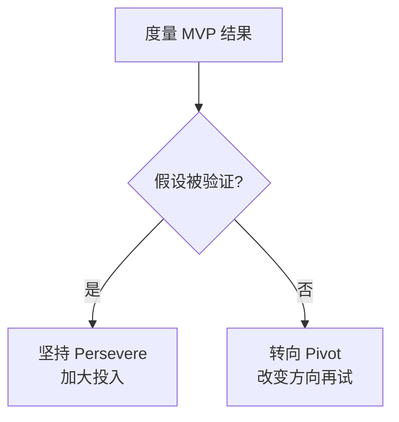

# 软件开发流程与模型(四十二)精益创业LeanStartup与MVP

> [!abstract] 速览
> **精益创业（The Lean Startup，Eric Ries）** 把 [[16.精益软件开发Lean|精益]]思想用于**高度不确定的新产品/创业**:用 **MVP(最小可行产品)** 做最小投入,通过 **构建-度量-学习(Build-Measure-Learn)** 循环快速验证假设,该坚持就坚持、该转向(Pivot)就转向。
> 一句话:**创业最大的浪费是"做出一个没人要的东西"**——精益创业用 MVP 和验证式学习,把"我以为用户要"变成"数据证明用户要"。本篇深入 BML 循环、MVP 类型、验证式学习与转向。

## 1. 精益创业要解决什么

传统是"憋大招"——花一年做个完美产品,上线才发现没人要,血本无归。精益创业反其道:**先用最小代价验证"该不该做、做什么"**,把不确定性逐步消除。

## 2. 构建-度量-学习循环(BML)

> 核心是**最小化这个循环的周转时间**——越快走完一圈,学到得越快、越省。

## 3. MVP:最小可行产品

**MVP(Minimum Viable Product)** = 能**验证核心假设**的最小产品,不是"残缺的产品",而是"**刚好能学到东西**的产品"。

> 与 [[05.原型模型|原型]]区别:原型多为澄清需求(常不可上线);MVP 是**投放真实市场、能交付价值、收集真实行为数据**的最小产品。

## 4. MVP 的种类(从轻到重)

| 类型 | 做法 | 验证什么 |
| --- | --- | --- |
| **落地页 Landing Page** | 做个页面看注册/点击 | 需求是否存在 |
| **冒烟测试 Smoke Test** | 假按钮测点击率 | 兴趣度 |
| **绿野仙踪 Wizard of Oz** | 前端真、后端人肉 | 用户体验是否买账 |
| **礼宾式 Concierge** | 纯手工服务少数用户 | 解决方案是否有效 |

## 5. 验证式学习(Validated Learning)

精益创业的"进度"不是"做了多少功能",而是**学到了多少被数据验证的东西**。每个 MVP 都是一次实验,产出的是**经验证的认知**,而非单纯的代码。

## 6. 转向还是坚持(Pivot or Persevere)

**转向(Pivot)** = 基于验证式学习,**有依据地改变战略方向**(换客户群/换问题/换商业模式),而非盲目坚持或放弃。

## 7. 创新核算(Innovation Accounting)

用**可执行指标**(而非虚荣指标)衡量创业进展。

| 指标类型 | 例 | 评价 |
| --- | --- | --- |
| **虚荣指标** | 总注册数、PV | 好看但骗人 |
| **可执行指标** | 留存率、转化率、单位经济 | 真实反映健康度 |

## 8. 与精益/敏捷/原型的关系

| 关系 | 说明 |
| --- | --- |
| [[16.精益软件开发Lean\|精益]] | 精益创业是精益思想在创业的应用(消除"做错"浪费) |
| [[13.Scrum框架\|敏捷]] | 敏捷高效"把东西做出来",精益创业先确保"做对的东西" |
| [[05.原型模型\|原型]] | 原型澄清需求,MVP 验证市场 |

## 9. 优点与缺点

| 优点 | 缺点 |
| --- | --- |
| 降低"做错东西"的风险 | 不适合需求已明确/合规重的项目 |
| 快速学习、数据驱动 | MVP 易被误解为"粗糙残品" |
| 省钱省时 | 过度 MVP 可能损害品牌 |

## 10. 真实案例:Dropbox 的视频 MVP

Dropbox 早期不确定"用户是否想要云同步"。他们没先花大力气做产品,而是**做了一个演示视频**(MVP),展示同步效果。视频发布后等待名单从 5 千暴涨到 7.5 万——**用最小成本验证了需求存在**,才放心投入开发。

## 11. 工具链

落地页(Carrd/Unbounce)、分析(Google Analytics/Mixpanel/Amplitude)、A/B 测试、用户访谈;开发用 [[09.快速应用开发RAD|低代码]]快速搭 MVP。

## 12. 常见误区与面试要点

> [!warning] 易错点
> - **MVP = 残缺产品?** 不。是"刚好能验证假设"的最小产品,要能交付价值/收集数据。
> - **MVP = 原型?** 原型澄清需求(不上线),MVP 投放真实市场。
> - **进度 = 做了多少功能?** 精益创业看**验证式学习**,不是功能数。
> - **Pivot = 失败?** 不。是基于数据**有依据地转向**。
> - **虚荣指标 vs 可执行指标?** 总注册数(虚荣) vs 留存/转化(可执行)。
> - **BML 循环优化什么?** 最小化周转时间,越快学越好。

## 13. 对常见说法的修正

> [!note] 修正清单
> 1. **"MVP 就是先做个简陋版"**——重点是"**可验证假设的最小集**",不是"砍成残品";有时一个视频/落地页就够。
> 2. **"创业靠执行力把功能做完"**——精益创业指出:**最大浪费是做出没人要的东西**;先验证再规模化。

## 14. 一句话记忆

> **精益创业** = 用 **MVP**(刚好能验证假设的最小产品)跑 **构建-度量-学习** 循环,以**验证式学习**消除"做出没人要的东西"这一最大浪费;数据说话,该 **Pivot(转向)** 就转向——它确保你"做对的东西",敏捷再把它高效做出来。

## 延伸阅读

- 思想源流:[[16.精益软件开发Lean]]
- 验证手段:[[05.原型模型]] · [[43.设计冲刺DesignSprint]]
- 需求规划:[[36.用户故事地图与影响地图]]
- 快速搭建:[[09.快速应用开发RAD]]
- 横向速查:[[46.模型对比速查大表]]

## 参考文献

1. Ries, E. *The Lean Startup*.
2. Blank, S. *The Four Steps to the Epiphany*（客户开发）。
3. Maurya, A. *Running Lean*.

---

> ⬅️ [[41.配置管理与变更管理]] ｜ 🏠 [[00.软件开发流程与模型总览]] ｜ [[43.设计冲刺DesignSprint]] ➡️
