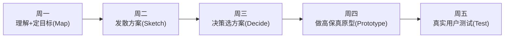

# 软件开发流程与模型(四十三)设计冲刺DesignSprint

> [!abstract] 速览
> **设计冲刺（Design Sprint）** 由 Google Ventures 的 Jake Knapp 创立,是一套 **5 天**的结构化流程,用来**快速验证一个大想法**:从理解问题到做出高保真原型、再到真实用户测试,**一周内就拿到"该不该做"的答案**,而不必花几个月开发后才发现错。
> 一句话:**用 5 天的工作坊,把"我们花几个月做出来再看市场反应"压缩成"周五就让 5 个用户告诉你答案"**——它是 [[42.精益创业LeanStartup与MVP|精益创业]]"快速验证"思想的高度结构化落地。本篇详解 5 天流程、与 Scrum Sprint 的区别。

## 1. 设计冲刺是什么

面对"该不该做这个大功能/新产品"的高风险决策,与其争论或直接开发,不如用一周**做原型 + 测真人**。设计冲刺把这件事**结构化为固定 5 天**,由跨职能小组(含决策者)全程参与。

## 2. 五天流程

| 天 | 主题 | 做什么 |
| --- | --- | --- |
| **周一** | 理解(Map) | 对齐长期目标、画问题地图、定本周聚焦点 |
| **周二** | 发散(Sketch) | 每人独立画解决方案草图 |
| **周三** | 决策(Decide) | 投票选出最有潜力的方案、画故事板 |
| **周四** | 原型(Prototype) | 做一个"看起来真"的高保真原型(只做表面) |
| **周五** | 测试(Test) | 约 5 个真实用户测试,观察记录 |

## 3. 关键技巧

| 技巧 | 说明 |
| --- | --- |
| **决策者在场** | 避免"做完才被否" |
| **独立发散再收敛** | 防止从众(类似计划扑克) |
| **原型只做表面** | 看起来真即可,不写真实后端(类似 [[05.原型模型\|绿野仙踪]]) |
| **5 个用户** | Nielsen:5 人能发现约 85% 可用性问题 |

## 4. 设计冲刺 vs Scrum 冲刺(区分)

| 维度 | 设计冲刺 Design Sprint | [[13.Scrum框架\|Scrum 冲刺]] |
| --- | --- | --- |
| 时长 | **固定 5 天** | 1~4 周 |
| 目的 | **验证想法**(该不该做) | 交付可用增量(把东西做出来) |
| 产出 | 原型 + 用户洞察 | 可工作软件 |
| 频率 | 按需(决策时) | 持续循环 |

> [!warning]
> 名字都叫"Sprint"但**完全不同**:设计冲刺是**一次性的验证工作坊**(产出原型+洞察),Scrum 冲刺是**持续的交付迭代**(产出可用软件)。别混淆。

## 5. 核心价值

> **用一周和几个原型的成本,买到"该不该投入几个月开发"的答案。** 把昂贵的"开发后试错"换成廉价的"开发前验证"——这与 [[08.螺旋模型|螺旋]]"用原型降风险"、[[42.精益创业LeanStartup与MVP|精益创业]]"验证式学习"一脉相承。

## 6. 与精益创业/原型的关系

| 关系 | 说明 |
| --- | --- |
| [[42.精益创业LeanStartup与MVP\|精益创业]] | 设计冲刺是其"快速验证"的结构化一周版 |
| [[05.原型模型\|原型]] | 周四产出的正是高保真原型 |
| [[35.需求工程流程\|需求]] | 周五的用户测试是强力的需求验证 |

## 7. 优点与缺点

| 优点 | 缺点 |
| --- | --- |
| 一周拿到验证,极快 | 需决策者 + 团队全周投入 |
| 低成本试错大想法 | 不适合小决策(杀鸡牛刀) |
| 跨职能对齐 | 原型非真实产品,结论需谨慎 |

## 8. 真实案例:一周毙掉一个大功能

某团队想做"社区 feed"大功能,预估三个月。先跑设计冲刺:周一定目标、周四做出可点高保真原型、周五找 5 个目标用户测。结果用户普遍困惑、兴趣寡淡——**团队果断放弃,省下三个月**。这正是设计冲刺的价值:**便宜地说"不"**。

## 9. 工具链

Miro/Mural(远程工作坊)、Figma(高保真原型)、用户测试工具(Maze/Lookback)、便利贴 + 白板(线下)。

## 10. 常见误区与面试要点

> [!warning] 易错点
> - **设计冲刺 = Scrum 冲刺?** 完全不同:前者一次性验证想法,后者持续交付软件。
> - **周四原型要做真后端?** 不。只做"看起来真"的表面。
> - **要测多少用户?** 约 5 个即可发现大部分问题。
> - **设计冲刺产出软件?** 不。产出**原型 + 用户洞察**。
> - **谁必须在场?** 决策者(避免做完被否)。
> - **适合所有决策吗?** 不。适合**高风险的大想法**,小决策不必。

## 11. 对常见说法的修正

> [!note] 修正清单
> 1. **"设计冲刺是 Scrum 的一种"**——只是同名,本质不同(验证工作坊 vs 交付迭代)。
> 2. **"原型测试通过=一定成功"**——它降低风险但非保证;原型非真实产品,仍需后续 MVP 验证市场。

## 12. 一句话记忆

> **设计冲刺** = Google 的 **5 天**工作坊(理解→发散→决策→原型→测试),用一周和一个高保真原型,**在开发前**就让 5 个真实用户告诉你"该不该做"——和 Scrum 冲刺同名但完全不同,是精益创业"快速验证"的结构化版本。

## 延伸阅读

- 验证思想:[[42.精益创业LeanStartup与MVP]]
- 原型手段:[[05.原型模型]]
- 风险驱动:[[08.螺旋模型]]
- 需求验证:[[35.需求工程流程]]
- 横向速查:[[46.模型对比速查大表]]

## 参考文献

1. Knapp, J., Zeratsky, J., Kowitz, B. *Sprint*（Google Ventures）。
2. Nielsen, J. *Why You Only Need to Test with 5 Users*.

---

> ⬅️ [[42.精益创业LeanStartup与MVP]] ｜ 🏠 [[00.软件开发流程与模型总览]] ｜ [[44.TeamTopologies团队拓扑]] ➡️
