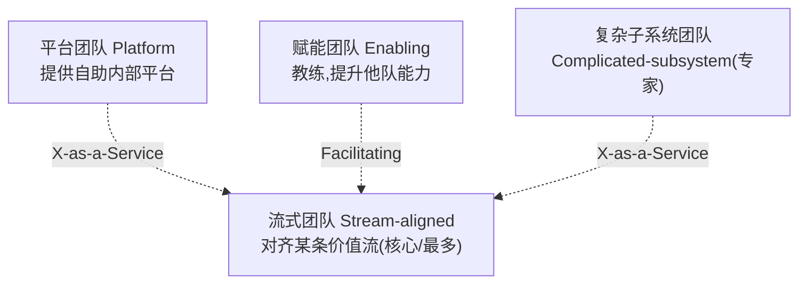

# 软件开发流程与模型(四十四)Team Topologies团队拓扑

> [!abstract] 速览
> **团队拓扑（Team Topologies，Matthew Skelton & Manuel Pais）** 研究"**怎么组织团队才能快速流动地交付软件**"。核心洞见来自**康威定律**:系统架构会复刻组织沟通结构。它提出 **4 种团队类型 + 3 种交互模式**,并以**降低认知负荷**为目标。
> 一句话:**想要好架构,先设计好团队结构(逆康威);让"流式团队"专注价值流,用平台/赋能团队为其减负**。本篇深入康威定律、四团队三交互与认知负荷,是 [[28.平台工程与内部开发者平台|平台工程]]的理论支撑。

## 1. 康威定律:组织即架构

> **康威定律**:"设计系统的组织,其产生的设计等价于组织的沟通结构。"

即:**团队怎么分,系统就怎么长**。三个团队各做一块,系统多半就是三个模块;沟通不畅的团队之间,接口必然别扭。

**逆康威机动(Inverse Conway Maneuver)**:反过来——**先按你想要的架构来组织团队**,从而"长出"理想架构。

## 2. 四种团队类型

| 团队类型 | 职责 | 例 |
| --- | --- | --- |
| **流式团队 Stream-aligned** | 对齐一条价值流,端到端交付(**主力,占比最高**) | 某产品/某业务线团队 |
| **平台团队 Platform** | 提供自助平台,为流式团队减负(见 [[28.平台工程与内部开发者平台]]) | IDP 团队 |
| **赋能团队 Enabling** | 教练角色,帮他队提升能力后退出 | 测试/DevOps 教练 |
| **复杂子系统 Complicated-subsystem** | 需深度专业知识的子系统 | 视频编解码、风控算法 |

## 3. 三种交互模式

| 模式 | 含义 | 何时用 |
| --- | --- | --- |
| **协作 Collaboration** | 两队紧密一起干 | 探索新领域、磨合期 |
| **即服务 X-as-a-Service** | 一队消费另一队的服务 | 边界清晰、要低耦合 |
| **促进 Facilitating** | 一队帮助另一队 | 赋能团队辅导 |

> 交互模式应**随时间演化**:新领域先 Collaboration,稳定后转 X-as-a-Service(降低长期沟通成本)。

## 4. 认知负荷(Cognitive Load)

团队拓扑的核心约束:**别让团队背负超过其认知能力的范围**。

| 认知负荷类型 | 含义 |
| --- | --- |
| 内在 | 任务本身难度 |
| 外在 | 环境/工具带来的额外负担(应消除) |
| 相关 | 真正有价值的思考 |

> 平台团队的使命就是**降低流式团队的外在认知负荷**(把基础设施复杂度收走),让其专注业务(相关负荷)。

## 5. 流式团队为核心

团队拓扑主张:**绝大多数应是流式团队**(直接交付用户价值),其余三类都是**为流式团队服务/减负**而存在。这扭转了传统"按职能分部门(前端组/后端组/DBA组)"导致的交接地狱(见 [[16.精益软件开发Lean|精益]]的交接浪费)。

## 6. 与平台工程、微服务的关系

| 关系 | 说明 |
| --- | --- |
| [[28.平台工程与内部开发者平台\|平台工程]] | 团队拓扑为其提供理论(平台团队/认知负荷) |
| 微服务 | 服务边界应匹配团队边界(康威定律) |
| [[17.规模化敏捷SAFe与LeSS\|规模化]] | 提供"怎么切团队"的视角 |

## 7. 优点与缺点

| 优点 | 缺点 |
| --- | --- |
| 把"组织设计"变成显式工具 | 重组团队成本高、阻力大 |
| 降低认知负荷、加快流动 | 需管理层支持 |
| 与架构对齐(逆康威) | 需持续演化交互模式 |

## 8. 真实案例:按价值流重组团队

某公司原按职能分(前端组/后端组/测试组),一个需求要跨三组交接、扯皮不断(康威定律的恶果)。重组为按业务线的**流式团队**(每队含前后端测试,端到端负责),并建**平台团队**提供 CI/CD 与环境自助。交接锐减、交付提速——**组织结构一变,架构与流动都顺了**。

## 9. 工具链

团队 API(描述团队职责与交互)、服务目录([[28.平台工程与内部开发者平台|Backstage]])、价值流图、依赖可视化。

## 10. 常见误区与面试要点

> [!warning] 易错点
> - **团队拓扑 = 组织架构图?** 不。它关注**团队类型 + 交互模式 + 认知负荷**与流动,而非汇报线。
> - **康威定律说什么?** 系统架构复刻组织沟通结构。
> - **逆康威机动?** 先按想要的架构组织团队。
> - **四种团队哪种最多?** **流式团队**(核心),其余为其服务。
> - **平台团队的使命?** 降低流式团队的认知负荷。
> - **交互模式要固定吗?** 不。应随成熟度演化(协作→即服务)。

## 11. 对常见说法的修正

> [!note] 修正清单
> 1. **"架构是技术问题,与组织无关"**——康威定律表明组织结构**直接决定**架构,二者必须协同设计。
> 2. **"按职能分组更专业"**——职能分组制造交接与认知割裂;团队拓扑主张以**端到端流式团队**为核心。

## 12. 一句话记忆

> **团队拓扑** = 用**康威定律**(组织即架构)指导组织设计:以**流式团队**为核心端到端交付,用**平台/赋能/复杂子系统**团队为其**降认知负荷**,交互用**协作/即服务/促进**三模式并随成熟度演化——它是 [[28.平台工程与内部开发者平台|平台工程]]的理论根基。

## 延伸阅读

- 平台落地:[[28.平台工程与内部开发者平台]]
- 消除交接:[[16.精益软件开发Lean]]
- 规模化:[[17.规模化敏捷SAFe与LeSS]]
- 文化:[[20.DevOps文化与体系]]
- 横向速查:[[46.模型对比速查大表]]

## 参考文献

1. Skelton, M. & Pais, M. *Team Topologies*.
2. Conway, M. (1968). *How Do Committees Invent?*（康威定律原文）。

---

> ⬅️ [[43.设计冲刺DesignSprint]] ｜ 🏠 [[00.软件开发流程与模型总览]] ｜ [[45.AI辅助开发流程]] ➡️
