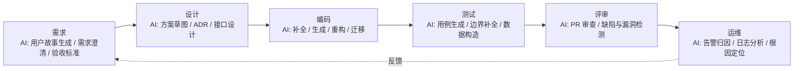
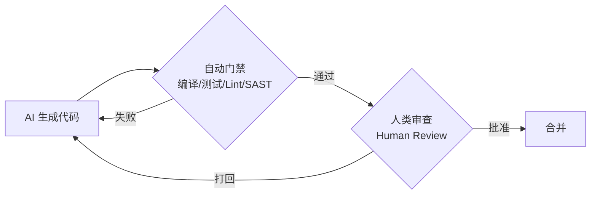

# 软件开发流程与模型(四十五)AI辅助开发流程

> [!abstract] 速览
> **AI 辅助开发**指把大语言模型（LLM）与 **AI 编码代理（Coding Agent）** 嵌入软件开发全流程——从需求澄清、设计、编码、测试，到评审与运维。它不是某一种"过程模型"，而是一层**贯穿所有模型的能力**：瀑布、敏捷、DevOps 都能被 AI 增强。
> 关键转变：从 **L1 行内补全** → **L2 对话式生成** → **L3 自主代理**（能读写文件、跑命令、多步完成任务，如 Claude Code、Cursor Agent）→ **L4 端到端自主**（演进中）。
> 一句话：**AI 把"人写代码、工具检查"变成"人定意图与边界、AI 执行、人审结果"——工程判断、架构决策与质量门禁的重要性不降反升。** 本篇覆盖嵌入点、成熟度、工作流模式、上下文工程、风险治理与可落地配置，并对"AI 必然提速 / 取代程序员"做平衡修正。

## 1. 为什么 AI 改变的是"流程"而非只是"工具"

传统工具（编译器、Lint、IDE）是**确定性**的；AI 是**概率性**的——它会给出"看似正确"的产物，因此流程必须新增一道**"人在环路(Human-in-the-loop)"的验证关**。

- 过去：人是**生产者**，工具是**检查者**。
- 现在：人逐渐成为**意图定义者 + 审查者**，AI 成为**生产者**。
- 这要求流程显式回答：**AI 在哪些环节介入？谁来审？用什么门禁兜底？**

## 2. AI 嵌入 SDLC 全流程



每个阶段都有"AI 介入点"，但**最终决策权与责任仍在人**。

## 3. AI 辅助的成熟度分层

| 层级 | 名称 | 能力 | 代表形态 |
| --- | --- | --- | --- |
| **L1** | 补全 Completion | 行内 / 单行 / 整段补全 | 早期 GitHub Copilot |
| **L2** | 对话 Chat | 对话式问答、生成、解释、重构建议 | ChatGPT / Claude 网页版 |
| **L3** | **代理 Agentic** | **多步自主**：读写文件、跑命令、调工具、自我验证 | **Claude Code、Cursor Agent、Windsurf** |
| **L4** | 自主 Autonomous | 端到端接管任务，人类只设边界与验收 | 演进中（受可靠性限制） |

> 2024—2026 的主旋律是 **L3 代理化**：AI 不再只"提示下一行"，而是能**接一个任务、自己规划并执行多步**。本对话所在的 Claude Code 即 L3 代理。

## 4. 新的工作流模式

| 模式 | 做法 | 适用 |
| --- | --- | --- |
| **规格驱动 Spec-Driven** | 先写清晰 spec / 计划，AI 据此实现 | 复杂任务，降低跑偏 |
| **规划-执行-审查 Plan-Execute-Review** | AI 先出计划 → **人确认** → 执行 → 人审 | 高风险改动 |
| **AI 结对 Pair** | 人主导、AI 副驾，实时补全与建议 | 日常编码 |
| **AI 评审机器人 PR Bot** | 每个 PR 自动跑 AI 审查，给修改建议 | 团队协作 |
| **多代理编排 Multi-Agent** | 多个 AI 并行分工（探索 / 实现 / 验证） | 大规模迁移、审计 |

> [!tip]
> 任务越复杂，越要**前置"意图与计划"**——这与 [[35.需求工程流程|需求工程]] 和 [[03.瀑布模型|"先想清楚"]] 的智慧一脉相承：**给 AI 模糊输入，得模糊产出。**

## 5. 上下文工程：规则文件与项目记忆

代理质量高度依赖**喂给它的上下文**。业界已形成"**规则文件 / 项目记忆**"约定——把团队规范沉淀成文件，让 AI 每次自动遵循：

- `CLAUDE.md`（Claude Code）、`.cursorrules`（Cursor）、`AGENTS.md`（通用约定）等。
- 内容：编码风格、目录约定、禁用项、测试与提交规范、领域术语。

```markdown
# 项目 AI 协作规则（CLAUDE.md / .ai/rules.md 示例）
- 语言：注释与文档用中文；代码标识符用英文
- 测试：新增逻辑必须配单元测试，覆盖率 ≥ 80%
- 安全：禁止硬编码密钥；所有外部输入必须校验
- 依赖：不得擅自引入新依赖，需先在 PR 说明理由
- 提交：遵循 Conventional Commits（feat/fix/docs...）
- 边界：禁止修改 `legacy/` 目录，除非显式指示
```

> 这就是"**上下文工程(Context Engineering)**"：与其每次重复叮嘱，不如把规范固化为模型可读的记忆。

## 6. 人在环路与质量门禁

AI 的概率性决定了**必须有兜底门禁**。把 AI 产物当作"初级工程师的 PR"对待：



兜底层包括：**类型检查、单元 / 集成测试（见 [[32.软件测试流程与测试金字塔]]）、静态安全扫描（见 [[24.DevSecOps与供应链安全]]）、强制 Code Review（见 [[26.代码评审流程]]）**。

## 7. 风险与治理

| 风险 | 说明 | 缓解 |
| --- | --- | --- |
| **幻觉 / 隐性错误** | 编造 API、看似正确实则错 | 人审 + 测试 + 类型检查 + 文档核对 |
| **安全漏洞** | 生成不安全代码（注入、弱加密） | SAST/DAST、安全门禁（[[24.DevSecOps与供应链安全]]） |
| **许可证 / IP** | 训练数据版权、代码溯源不清 | 许可证扫描、企业版数据隔离 |
| **数据泄露** | 把私有代码 / 密钥发给外部模型 | 私有部署、脱敏、企业策略与审计 |
| **质量漂移 / 技术债** | 大量生成低质代码堆积 | 严守 DoD、重构、架构守护 |
| **过度依赖 / 技能退化** | 开发者丧失基础判断力 | AI 作副驾而非主驾、持续培训 |

## 8. 对研发度量(DORA)的影响

AI 对 [[38.软件度量DORA与SPACE|DORA 四指标]] 的影响**并非单向利好**：

- ✅ 可能提升**部署频率**与**变更前置时间**（写得更快）。
- ⚠️ 若放松审查，**变更失败率**与**恢复时间**可能恶化（返工、引入隐患）。

> [!warning] 对"AI 必然提速"的修正
> METR 在 2025 年的一项随机对照实验发现：**资深开发者在自己熟悉的大型代码库中使用 AI，完成任务反而略慢**（尽管他们主观感觉更快）。这说明 **AI 的收益高度依赖场景**——新代码、样板、陌生技术栈收益大；成熟代码库的精细修改未必。**别把"个体感觉快"等同于"团队交付更快"**，要用 DORA / [[38.软件度量DORA与SPACE|SPACE]] 实测。

## 9. 工具链与落地示例

**工具谱系**：编码代理（Claude Code、Cursor、Windsurf、GitHub Copilot）、PR 审查（CodeRabbit、Copilot Review）、测试生成、AI 运维（告警归因）。

**在 CI 中加一道 AI 评审（GitHub Actions 片段，示意）：**

```yaml
name: AI Code Review
on: [pull_request]
jobs:
  ai-review:
    runs-on: ubuntu-latest
    steps:
      - uses: actions/checkout@v4
      - name: Run AI review on the diff
        env:
          API_KEY: ${{ secrets.AI_API_KEY }}
        run: |
          # 对 PR diff 运行 AI 审查，按规则文件给建议，高危问题则失败
          ai-review --base "${{ github.base_ref }}" \
                    --rules .ai/rules.md \
                    --fail-on high
```

> 注意：AI 评审是**补充**而非替代人工评审；它擅长抓常见缺陷与风格问题，但架构与业务正确性仍需人判断。

## 10. 常见误区与面试要点

> [!warning] 易错点
> - **AI 会取代程序员吗？** 短期内是**改变角色**（从"写"到"定义意图 + 审查"），而非取代——需求理解、架构权衡、责任归属仍需人。
> - **AI 生成的代码能直接合并吗？** 不能。必须过**测试 + 人审 + 安全门禁**。
> - **用了 AI 就一定更快？** 不一定（见第 8 节）。收益依赖任务与代码库成熟度。
> - **"Vibe Coding"（凭感觉让 AI 写）能上生产吗？** 适合原型 / 探索；生产代码仍需严谨流程与门禁。
> - **上下文越多越好？** 不。无关上下文会稀释注意力，**精准相关**比"大而全"更重要。

## 11. 对常见说法的修正

> [!note] 修正清单
> 1. **"10x 生产力"被夸大**：宏观团队层面的提速远小于个体宣传，且高度依赖场景（METR 2025）。
> 2. **AI ≠ 去流程**：恰恰相反，AI 让"清晰意图、计划、门禁、可追溯"更重要——流程是 AI 的安全带。
> 3. **AI 代理 ≠ 自主可信**：L3 代理强大但仍会出错，**人类监督边界**不可省。

## 12. 一句话记忆

> **AI 辅助开发** = 把 AI 当成"不知疲倦但需复核的初级工程师"：你负责**说清要什么、划定边界、审查结果**，它负责**快速产出初稿**——流程的重心从"写代码"上移到"定义意图与守住质量门禁"。

## 延伸阅读

- 质量兜底：[[32.软件测试流程与测试金字塔]] · [[26.代码评审流程]] · [[24.DevSecOps与供应链安全]]
- 效能度量：[[38.软件度量DORA与SPACE]]
- 上游意图：[[35.需求工程流程]] · [[36.用户故事地图与影响地图]]
- 工程载体：[[21.持续集成与持续交付CICD]] · [[28.平台工程与内部开发者平台]]
- 横向速查：[[46.模型对比速查大表]]

## 参考文献

1. DORA. *Accelerate State of DevOps Report*（含 AI 影响章节，2024—2025）。
2. METR (2025). *Measuring the Impact of Early-2025 AI on Experienced Open-Source Developer Productivity*.
3. Anthropic. *Claude Code 文档*；Cursor / GitHub Copilot 官方文档。
4. Fowler, M. 等关于 LLM 辅助开发与上下文工程的工程实践讨论。

---

> ⬅️ [[44.TeamTopologies团队拓扑]] ｜ 🏠 [[00.软件开发流程与模型总览]] ｜ [[46.模型对比速查大表]] ➡️
