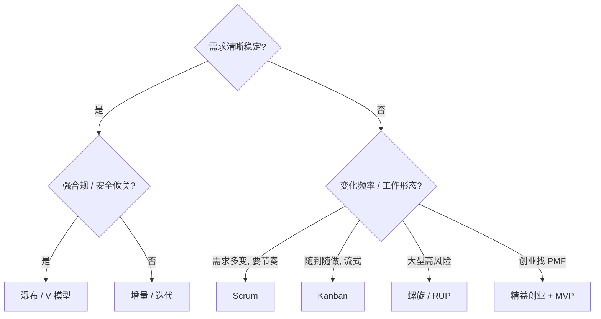

# 软件开发流程与模型(四十六)模型对比速查大表

> [!abstract] 速览
> 本篇是全系列的**一页速查（Cheat-Sheet）**：把经典过程模型、敏捷方法、DevOps 发布策略、测试与度量集中成横向对照表，外加一棵**选型决策树**。适合面试前快速过、选型时快速查。每个条目都链到对应详解篇。

## 1. 经典过程模型横向大表

| 模型 | 核心思想 | 迭代 | 反馈速度 | 文档量 | 需求灵活性 | 风险处理 | 适用 | 主要缺点 |
| --- | --- | --- | --- | --- | --- | --- | --- | --- |
| [[03.瀑布模型\|瀑布]] | 线性顺序、阶段评审 | ✗ | 慢 | 重 | 低 | 弱 | 需求稳定 / 合规 | 反馈太晚 |
| [[04.V模型\|V 模型]] | 开发↔测试一一镜像 | ✗ | 慢 | 重 | 低 | 中（验证强） | 安全攸关 | 仍僵硬 |
| [[05.原型模型\|原型]] | 先做原型澄清需求 | 部分 | 快（早期） | 中 | 中 | 中 | 需求模糊 | 易演变失控 |
| [[06.增量模型\|增量]] | 分批交付可用增量 | 部分 | 中 | 中 | 中 | 中 | 核心先上线 | 架构需前瞻 |
| [[07.迭代模型\|迭代]] | 多轮精化同一产品 | ✓ | 中 | 中 | 中高 | 中 | 逐步完善 | 需良好管理 |
| [[08.螺旋模型\|螺旋]] | 风险驱动 + 原型 | ✓ | 中 | 重 | 中 | **强** | 大型高风险 | 成本高、复杂 |
| [[09.快速应用开发RAD\|RAD]] | 构件复用 + 工具加速 | ✓ | 快 | 轻 | 高 | 中 | 超短周期 | 依赖工具 / 构件 |
| [[10.统一过程RUP\|RUP]] | 用例驱动 + 架构中心 | ✓ | 中 | 重 | 中 | 强 | 大型企业 | 重量级 |

## 2. 敏捷与精益方法对比

| 方法 | 节奏 | 角色 | 核心实践 | WIP 限制 | 核心度量 | 适用 |
| --- | --- | --- | --- | --- | --- | --- |
| [[13.Scrum框架\|Scrum]] | 固定冲刺（迭代） | PO / SM / Dev | 5 事件 3 工件 | 间接 | 速度 Velocity | 产品迭代 |
| [[14.看板方法Kanban\|Kanban]] | 持续流动 | 不规定 | 可视化 + WIP + 拉动 | **显式** | 周期时间 / 吞吐量 | 流式 / 运维 |
| [[15.极限编程XP\|XP]] | 短迭代 | 教练等 | TDD / 结对 / CI / 重构 | — | — | 工程质量要求高 |
| [[16.精益软件开发Lean\|Lean]] | 价值流 | — | 消除浪费 / 价值流图 | — | 流动效率 | 流程优化 |
| Scrumban | 混合 | 灵活 | Scrum 结构 + Kanban 流 | 显式 | 混合 | 过渡 / 维护团队 |
| [[17.规模化敏捷SAFe与LeSS\|SAFe / LeSS]] | 规模化 | 多层 / 精简 | 多团队协同 | — | — | 大型组织 |

## 3. 计划驱动 vs 敏捷 vs 混合

| 维度 | 计划驱动（瀑布 / V） | 敏捷（Scrum / XP / Kanban） | 混合 Hybrid |
| --- | --- | --- | --- |
| 需求 | 前期冻结 | 持续演进 | 关键里程碑锁定 + 内部迭代 |
| 交付 | 末期一次 | 每迭代增量 | 阶段 + 迭代 |
| 文档 | 重 | 轻 | 中 |
| 反馈 | 慢 | 快 | 中 |
| 治理 | 阶段门禁 | 经验主义 | 门禁 + 迭代 |
| 典型 | 国防 / 医疗 | 互联网 / 产品 | 大型企业转型期 |

详见 [[11.过程模型选型与Cynefin决策]] 与 [[19.混合模型与Water-Scrum-fall]]。

## 4. 选型决策树

**场景 → 推荐速查：**

| 场景 | 推荐 |
| --- | --- |
| 需求稳定、合规审计 | [[03.瀑布模型\|瀑布]] / [[04.V模型\|V]] |
| 安全攸关（医疗 / 航空 / 汽车） | [[04.V模型\|V 模型]] |
| 需求模糊、需探索 | [[05.原型模型\|原型]] / [[07.迭代模型\|迭代]] / [[13.Scrum框架\|Scrum]] |
| 大型高风险 | [[08.螺旋模型\|螺旋]] / [[10.统一过程RUP\|RUP]] |
| 快速试错的互联网产品 | [[13.Scrum框架\|Scrum]] / [[14.看板方法Kanban\|Kanban]] + [[21.持续集成与持续交付CICD\|CI/CD]] |
| 运维 / 支持 / 随到随做 | [[14.看板方法Kanban\|Kanban]] |
| 多团队协作 | [[17.规模化敏捷SAFe与LeSS\|SAFe / LeSS]] |
| 工程质量要求极高 | [[15.极限编程XP\|XP]] 实践 |
| 创业 / 找产品市场契合 | [[42.精益创业LeanStartup与MVP\|精益创业 + MVP]] |

## 5. DevOps 发布与部署策略速查

| 策略 | 思路 | 回滚速度 | 适用 |
| --- | --- | --- | --- |
| **蓝绿 Blue-Green** | 两套环境瞬时切换 | 快（切回旧环境） | 需快速回滚 |
| **金丝雀 Canary** | 小流量灰度逐步放量 | 快 | 风险可控的放量 |
| **滚动 Rolling** | 逐批替换实例 | 中 | 资源节省 |
| **特性开关 Feature Flag** | 代码级开关控制功能 | 极快（关开关） | 解耦"发布"与"上线" |

详见 [[27.发布与部署策略]]。

## 6. 测试与度量速查

**测试分层（[[32.软件测试流程与测试金字塔|测试金字塔]]）**：单元（多、快）> 集成（中）> 端到端 E2E（少、慢）。

| 方法 | 口诀 | 详见 |
| --- | --- | --- |
| TDD | 红 → 绿 → 重构 | [[33.测试驱动开发TDD]] |
| BDD | Given - When - Then | [[34.行为驱动开发BDD]] |

**DORA 四指标（[[38.软件度量DORA与SPACE|研发效能]]）**：

| 指标 | 含义 | 方向 |
| --- | --- | --- |
| 部署频率 | 多久发一次 | 越高越好 |
| 变更前置时间 | 提交→上线耗时 | 越短越好 |
| 变更失败率 | 发布致故障比例 | 越低越好 |
| 故障恢复时间 (MTTR) | 出事→恢复耗时 | 越短越好 |

## 7. 一句话记忆（全系列浓缩）

> **需求越稳越靠左（瀑布 / V），越变越靠右（Scrum / Kanban）；不确定就先原型 / 迭代试探，高风险就螺旋；工程靠 DevOps 流水线兜底，质量靠测试金字塔与门禁，效能拿 DORA 量——而 AI 是贯穿全程的加速器，但要人审兜底。**

## 延伸阅读

- 完整地图：[[00.软件开发流程与模型总览]]
- 选型详解：[[11.过程模型选型与Cynefin决策]]
- 术语对照：[[47.中英术语表]]

---

> ⬅️ [[45.AI辅助开发流程]] ｜ 🏠 [[00.软件开发流程与模型总览]] ｜ [[47.中英术语表]] ➡️
