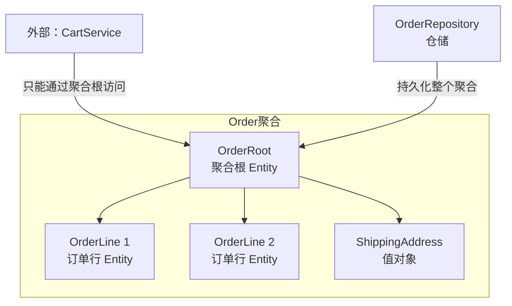
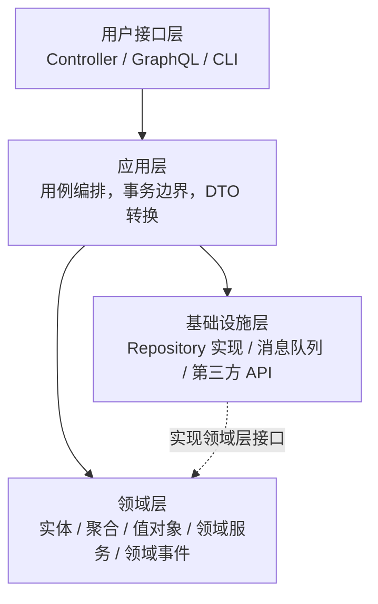

# 软件开发流程与模型（48）· 领域驱动设计 DDD

> [!abstract] TL;DR
> **领域驱动设计（Domain-Driven Design，DDD）** 由 **Eric Evans** 在 2003 年《蓝皮书》中系统提出，核心主张是：**软件的复杂性根源在于领域本身的复杂性**，而非技术实现。DDD 将开发重心转移到对**业务领域的深度建模**，通过**统一语言（Ubiquitous Language）** 消除开发者与领域专家之间的沟通鸿沟，通过**限界上下文（Bounded Context）** 划定模型边界，再用**聚合（Aggregate）、实体（Entity）、值对象（Value Object）、领域事件（Domain Event）** 等战术元素将领域知识精确编码进代码。DDD 并非银弹，它专为**复杂业务领域**（电商交易核心、保险精算、供应链调度等）设计，CRUD 型简单系统引入 DDD 只会增加负担。

## 概述与定位

**DDD 是什么？** 它是一套面向**复杂业务系统**的软件设计哲学与实践体系。Eric Evans 在 2003 年出版的《Domain-Driven Design: Tackling Complexity in the Heart of Software》（业界称"蓝皮书"）中首次系统阐述，2013 年 Vaughn Vernon 的《Implementing Domain-Driven Design》（"红皮书"）进一步深化了实践层面的指导。

**DDD 解决的核心问题**：传统软件开发中，代码往往以**技术层**（Controller/Service/DAO）为中心组织，业务逻辑散落在 Service 方法中，形成所谓的**贫血模型**。业务专家讲"账单结算"，代码里却是 `BillingService.processBillingTask()`，两套语言对不上，导致需求传递失真、代码腐化加速。DDD 的答案是：**让代码说领域的语言，让领域的语言活在代码里**。

**DDD 的两个核心层次**：

| 层次 | 关注点 | 核心工具 |
| --- | --- | --- |
| **战略设计（Strategic Design）** | 系统整体边界划分、上下文间协作 | 统一语言、限界上下文、上下文映射、子域划分 |
| **战术设计（Tactical Design）** | 单个上下文内的领域模型实现 | 实体、值对象、聚合、领域事件、仓储、工厂、领域服务 |

DDD 的适用场景判断三步法：① 业务规则是否复杂且多变？② 领域专家能否长期参与？③ 系统生命周期是否足够长（值得投入建模成本）？三者都为"是"时，DDD 才值得引入。

## 原理与机制

### 统一语言（Ubiquitous Language）

统一语言是 DDD 的**思想基石**。它要求在某个限界上下文内，开发者、产品经理、业务专家使用**同一套术语体系**——这套术语不仅出现在需求文档和会议中，还要**一字不差地映射到代码**（类名、方法名、变量名）。

举例：电商领域若业务专家把"下单"分为"预占库存"和"确认支付"两步，代码就应该有 `Order.reserveInventory()` 和 `Order.confirmPayment()`，而不是一个模糊的 `OrderService.createOrder()`。统一语言不是一次性协商，而是需要在**持续沟通**中不断精炼——每当发现团队成员对同一术语理解不同，就是统一语言需要更新的信号。

### 限界上下文（Bounded Context）

**限界上下文**是 DDD 最重要的战略工具，它明确划定**领域模型的有效边界**。同一个词在不同上下文中可以有完全不同的含义：电商系统中"商品（Product）"在**商品目录上下文**中包含描述、图片、分类；在**仓储上下文**中只关心库存位置和数量；在**订单上下文**中仅关心价格和购买限制。强行统一这三个"商品"只会让模型臃肿、耦合严重。

限界上下文的边界通过以下方式体现：
- **统一语言的边界**：上下文之间即使使用同名概念，含义也可不同
- **技术边界**：独立的代码库、独立的数据库 Schema、独立的部署单元（与微服务自然对齐）
- **团队边界**：通常一个团队负责一个或少数几个上下文（参见 [[44.TeamTopologies团队拓扑]]）

### 上下文映射（Context Map）

上下文映射描述多个限界上下文之间的**协作关系与集成模式**。Eric Evans 定义了九种关系模式：

| 模式 | 缩写 | 含义 |
| --- | --- | --- |
| **合作关系 Partnership** | — | 两个团队协同演进，成功与失败捆绑在一起 |
| **共享内核 Shared Kernel** | SK | 两个上下文共享同一段代码/模型，需协商变更 |
| **客户-供应商 Customer-Supplier** | C/S | 下游(客户)对上游(供应商)的需求有影响力；上游按计划交付 |
| **顺从者 Conformist** | CF | 下游完全遵从上游模型，无力谈判（如使用第三方平台） |
| **防腐层 Anti-Corruption Layer** | ACL | 下游在自己侧建翻译层，隔离上游模型的污染 |
| **开放主机服务 Open Host Service** | OHS | 上游发布协议/API 供多方接入 |
| **发布语言 Published Language** | PL | 上游定义通用交换格式（如 XML Schema、Protobuf），常与 OHS 搭配 |
| **各行其道 Separate Ways** | SW | 两个上下文决定不集成，各自独立解决问题 |
| **大泥球 Big Ball of Mud** | BBM | 现实中混乱的遗留系统，标注出来以防止其污染新设计 |

### 子域划分

子域（Subdomain）是**业务问题空间**的划分，限界上下文是**解决方案空间**的划分。两者对应但不强制一一对应。子域分三类：

- **核心域（Core Domain）**：企业竞争优势所在，如电商的推荐算法、风控模型——投入最优秀的团队，自研
- **支撑域（Supporting Subdomain）**：支持核心域运作但无法买到现成产品的业务，如特定行业的报表逻辑——可外包或次优人力
- **通用域（Generic Subdomain）**：行业通用能力，如用户认证、邮件通知——直接采购 SaaS 或开源方案

## 结构/算法/伪代码详解

本章聚焦**战术设计**的核心元素，以**电商订单**场景贯穿说明。

### 实体（Entity）

实体具有**唯一标识（Identity）**，其生命周期内标识不变、状态可变。判断标准：两个属性完全相同的对象，如果业务上需要区分（如两张同额订单），就是实体。

```java
// 实体：有唯一 ID，状态随业务流程演变
public class Order {
    private final OrderId id;          // 不可变的唯一标识
    private OrderStatus status;        // 状态可变
    private Money totalAmount;

    public void confirmPayment(PaymentInfo payment) {
        if (this.status != OrderStatus.PENDING_PAYMENT) {
            throw new DomainException("只有待支付订单才能确认支付");
        }
        this.status = OrderStatus.PAID;
        // 发布领域事件
        DomainEvents.publish(new OrderPaidEvent(this.id, payment));
    }
}
```

### 值对象（Value Object）

值对象**没有标识**，由其**属性值定义相等性**，且应设计为**不可变（Immutable）**。金额、地址、坐标、颜色等都是典型值对象。

```java
// 值对象：无 ID，按值比较，不可变
public final class Money {
    private final BigDecimal amount;
    private final Currency currency;

    public Money add(Money other) {
        if (!this.currency.equals(other.currency)) {
            throw new DomainException("不同币种不能直接相加");
        }
        // 返回新对象，自身不变
        return new Money(this.amount.add(other.amount), this.currency);
    }
}
```

### 聚合与聚合根（Aggregate & Aggregate Root）

聚合是一组**有内在一致性约束**的对象群，聚合根是其**唯一对外入口**。外部对象只能持有聚合根的引用，不能直接操作聚合内部的成员实体或值对象。聚合的边界要根据**事务一致性需求**划定——一个事务只应修改一个聚合（跨聚合靠最终一致性）。



聚合设计四原则：
1. **通过 ID 引用其他聚合**（不是对象引用），防止级联修改
2. **聚合内强一致性，聚合间最终一致性**
3. **聚合要小**——包含的成员越多，并发冲突越多
4. **聚合根控制不变量**——所有业务规则的守卫

### 领域事件（Domain Event）

领域事件记录**领域中发生过的重要事情**，命名用过去时（`OrderPaid`、`InventoryReserved`）。它是实现**聚合间解耦**和**最终一致性**的核心手段，也是与事件风暴（[[49.事件风暴EventStorming]]）的接口点。

```java
// 领域事件：不可变，记录过去发生的事
public class OrderPaidEvent {
    private final OrderId orderId;
    private final Money paidAmount;
    private final Instant occurredOn;  // 事件发生时刻，不可变
}
```

### 仓储（Repository）

仓储提供对**聚合的持久化抽象**，让领域层代码感知不到数据库存在。接口定义在领域层，实现在基础设施层——这是依赖倒置原则的直接体现。

```java
// 接口在领域层
public interface OrderRepository {
    Order findById(OrderId id);
    void save(Order order);
}

// 实现在基础设施层（如 JPA/MyBatis 实现）
public class JpaOrderRepository implements OrderRepository { ... }
```

### 工厂（Factory）

工厂负责**复杂聚合或对象的创建逻辑**，将创建细节从业务逻辑中剥离。当聚合的构造涉及多步验证或需要其他领域对象参与时，工厂优于在聚合根内写大量构造代码。

### 领域服务（Domain Service）

当某个业务操作**天然不属于任何实体或值对象**时（如"转账"需要同时操作两个账户聚合），将其放进领域服务。领域服务应是**无状态的**，且命名要体现业务语义（`TransferService`，而非 `AccountManager`）。

## 工具视角与实战

### 分层架构与六边形/洋葱架构

DDD 传统上采用**四层架构**：



**领域层是核心**，它不依赖任何其他层（包括基础设施层），其他层围绕领域层构建。更现代的 **六边形架构（Hexagonal Architecture / Ports & Adapters）** 和 **洋葱架构（Onion Architecture）** 是同一思想的不同表述：

- **端口（Port）**：领域层对外声明的接口（如 `OrderRepository`）
- **适配器（Adapter）**：具体技术实现（如 `JpaOrderRepository`）

六边形架构让领域模型可以被任意驱动（REST、消息队列、CLI 测试），且可在不启动数据库的情况下对领域逻辑做单元测试——这是 DDD 代码可测试性的核心来源。

### 防腐层（Anti-Corruption Layer，ACL）

防腐层是集成遗留系统或第三方服务时的**关键保护手段**。当外部系统的模型与本地领域模型差异较大时，直接依赖外部模型会让外部的设计决策"污染"本地模型。ACL 在本地上下文边界处建立翻译/适配层：

```
外部系统 API（混乱的老模型）
        ↓
   [Translator / Adapter]   ← 防腐层
        ↓
本地领域模型（干净的 DDD 模型）
```

实践上，ACL 通常由以下部分组成：
- **门面（Facade）**：简化外部 API 的调用接口
- **翻译器（Translator）**：在两套模型之间转换数据结构
- **适配器（Adapter）**：处理协议差异（REST vs gRPC vs 消息）

### 贫血模型 vs 充血模型

| 维度 | 贫血模型（Anemic Domain Model） | 充血模型（Rich Domain Model） |
| --- | --- | --- |
| **业务逻辑位置** | 全在 Service 层 | 在实体/聚合内部 |
| **对象职责** | 只有 getter/setter，是数据容器 | 对象主动执行业务行为 |
| **领域专家可读性** | 低——逻辑散落在大量 Service 中 | 高——代码即领域语言 |
| **典型问题** | 逻辑重复、Service 膨胀、数据校验散落 | 学习曲线陡、重构成本高 |
| **适用场景** | 简单 CRUD、快速原型 | 复杂业务规则、长生命周期系统 |

DDD 倡导充血模型，但**充血模型不意味着把所有逻辑塞进实体**——跨聚合的协调逻辑放领域服务，持久化放仓储，用例编排放应用层，各司其职。

### DDD 与微服务边界

**限界上下文（BC）是微服务拆分的天然边界**。每个 BC 有自己的统一语言、独立的数据模型，天然符合微服务的"高内聚、低耦合"原则。实践建议：

1. **先做 DDD 战略设计，再决定微服务边界**——反过来按技术拓扑拆服务，往往造成 BC 撕裂
2. **一个微服务 = 一个 BC 或一个 BC 的一部分**，避免 BC 跨服务（会让事务一致性变得困难）
3. **上下文映射关系**决定服务间通信方式：Customer-Supplier 可用同步调用；事件发布/订阅适合实现最终一致性

团队组织层面，参见 [[44.TeamTopologies团队拓扑]] 的 Stream-Aligned Team 概念——每个流对齐团队负责一个核心 BC，这是 DDD 与现代团队拓扑的最佳实践交汇点。

### DDD 与事件风暴的协作关系

**事件风暴（[[49.事件风暴EventStorming]]）** 是 DDD 战略设计的**前置发现工具**。典型流程是：

```
事件风暴（全局 Big Picture）
    → 识别出核心领域事件与业务流程
        → 发现 Bounded Context 边界（自然分组）
            → 细化战术设计（聚合、实体、值对象）
```

事件风暴产出的**领域事件**直接映射为 DDD 战术设计中的 `Domain Event`；识别出的**命令（Command）** 对应聚合方法；**热点（Hotspot）** 指向业务规则争议点，是深化建模的优先区域。

## 安全性与正确使用

### 常见误区一：把 DDD 当技术框架

DDD 首先是**设计哲学**，不是某个 Maven 依赖或框架。引入 `spring-ddd-starter` 之类的库不等于在做 DDD。真正的 DDD 要从**与领域专家的深度对话**开始，而非从代码架构开始。

### 常见误区二：过度拆分聚合

聚合越小越好是常见的误解。聚合的边界应由**业务不变量**决定，而非追求技术上的"最小化"。若频繁因聚合边界问题做最终一致性补偿，说明边界划错了。

### 常见误区三：把应用层逻辑放进领域层

应用层负责**用例编排**（开启事务、调用仓储、发布事件），领域层负责**业务规则**。把数据库事务、HTTP 调用放进实体，是破坏领域层纯洁性的常见错误。

### 常见误区四：全站 DDD

DDD 的成本是真实的：更长的建模时间、更陡的学习曲线、更多的代码量（相比 CRUD 脚手架）。对于简单的配置管理、通知服务、报表导出等通用域，直接用 ActiveRecord 或简单的 Service+DAO 即可。**DDD 的价值与业务复杂度成正比**。

### 反模式：统一语言形同虚设

最常见的反模式是花时间举办了几次事件风暴、画了几张 Context Map，但日常开发仍用"userInfo"、"bizData"这类技术味十足的命名。统一语言必须被**代码执行**，否则只是墙上装饰。

### 落地检查清单

- [ ] 团队内部（含产品/业务）是否有定期维护的术语表？
- [ ] 类名/方法名是否能在不看注释的情况下被业务专家理解？
- [ ] 聚合边界是否经过了"并发冲突"视角的审查？
- [ ] 基础设施层是否有明确隔离（领域层不依赖 ORM 注解）？
- [ ] 上下文边界是否在架构决策记录（ADR）中明确说明？

## 小结

DDD 的核心价值在于建立了一套**业务语言与代码模型双向对齐**的方法论。战略设计（统一语言、限界上下文、上下文映射、子域划分）解决了**宏观拆分**的问题；战术设计（实体、值对象、聚合、领域事件、仓储、工厂、领域服务）解决了**微观建模**的问题；防腐层解决了**遗留系统集成**的问题；充血模型解决了**领域逻辑归属**的问题。

DDD 不是所有项目都需要的，但对于复杂的、长生命周期的核心业务系统，它是目前最成熟的应对复杂性的设计体系。与微服务结合（BC 即服务边界）、与事件风暴结合（先发现再设计），DDD 已成为现代分布式系统设计的核心方法论之一。

## 相关阅读

- 战略层前置工具：[[49.事件风暴EventStorming]]
- 团队与边界对齐：[[44.TeamTopologies团队拓扑]]
- 需求发现层：[[35.需求工程流程]]
- 系统架构可视化：[[50.C4架构模型]]
- 横向对比：[[46.模型对比速查大表]]

---

> ⬅️ [[47.中英术语表]] ｜ 🏠 [[00.软件开发流程与模型总览]] ｜ [[49.事件风暴EventStorming]] ➡️
