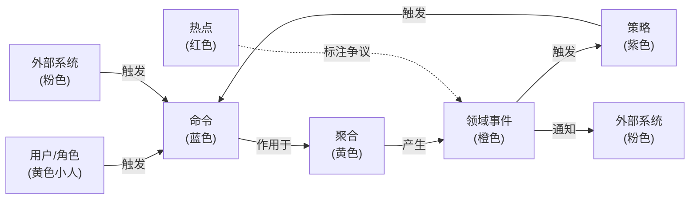
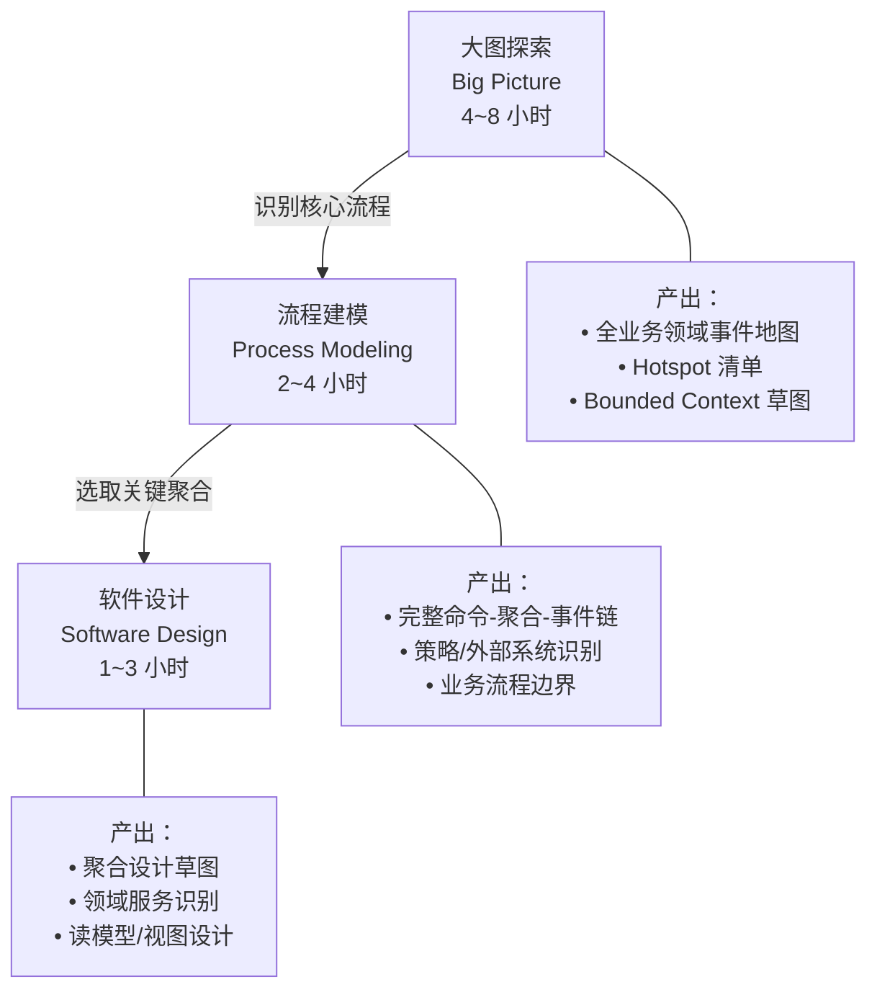

# 软件开发流程与模型（49）· 事件风暴 Event Storming

> [!abstract] TL;DR
> **事件风暴（Event Storming）** 由意大利软件顾问 **Alberto Brandolini** 在 2013 年前后提出，是一种以**便利贴**为媒介、让领域专家与开发者**平等协作探索业务领域**的工作坊技法。它的核心思路是：**先铺领域事件（过去时），再反向追溯命令和聚合**，在一面足够大的白墙上快速构建出整个业务流程的可视化地图。事件风暴有三个递进层次：**大图探索（Big Picture）** 用于整体领域发现，**流程建模（Process Modeling）** 用于细化关键流程，**软件设计（Software Design）** 用于直接映射到 DDD 战术元素。它是 [[48.领域驱动设计DDD]] 战略设计的最佳**前置发现手段**，能在数小时内对齐多方认知、识别限界上下文边界，也是微服务拆分的重要输入。

## 概述与定位

### 起源与背景

Brandolini 在 2013 年的博客和演讲中首次公开介绍了事件风暴，随后在《Introducing EventStorming》（2019，Leanpub）中系统整理。它的灵感部分来自**敏捷回顾**（强调协作与可视化）和 **DDD**（以领域事件为核心语言），但比传统的需求分析工作坊更**快速、更直觉**。

传统需求分析的痛点在于：业务专家有知识但不懂技术，开发者懂技术但没有领域深度，UML 类图让非技术人员望而却步，用户故事粒度太细看不到全局。事件风暴的解决方案是：**找一面大墙，人人都能贴便利贴，领域事件是唯一的"共同语言"**——业务专家立刻能参与（因为讲的是"发生了什么"），开发者也能从中提取设计信号。

### 核心价值主张

事件风暴提供了三项传统工具难以同时满足的价值：

1. **速度**：一个 4~8 小时的大图工作坊，可以覆盖数周文档撰写才能达到的共识深度
2. **全员参与**：同一个房间内，CTO、产品经理、业务专家、架构师、开发者面对同一面墙，**没有旁观者**
3. **冲突显式化**：便利贴的颜色系统让**热点（Hotspot）** 立即可见——红色便利贴标注的问题，就是团队认知不一致或业务规则模糊的地方

## 原理与机制

### 核心元素与颜色约定

事件风暴使用严格的颜色编码（物理工作坊用真实便利贴，线上用 Miro/Mural 等工具的数字便利贴）：

| 颜色 | 元素 | 命名约定 | 说明 |
| --- | --- | --- | --- |
| **橙色** | **领域事件（Domain Event）** | 过去时动词，如"订单已创建" | 核心元素，整个工作坊围绕它展开 |
| **蓝色** | **命令（Command）** | 主动语气，如"创建订单" | 触发事件的用户意图或系统指令 |
| **黄色（大）** | **聚合（Aggregate）** | 名词，如"订单" | 命令作用于聚合，聚合产生事件 |
| **粉色/红色** | **外部系统（External System）** | 名词，如"支付网关" | 不在本系统内的外部服务 |
| **紫色** | **策略/流程（Policy）** | "当…发生时，…" | 事件触发的自动响应逻辑 |
| **红色（小）** | **热点（Hotspot）** | 问句或感叹，如"这里逻辑不清楚？" | 团队存在争议或不确定的地方 |
| **黄色（小人）** | **用户/角色（Actor）** | 角色名称，如"买家"、"仓管员" | 触发命令的人 |
| **绿色** | **读模型/视图（Read Model）** | 名词，如"订单详情页" | 用户执行命令前看到的信息 |

**颜色纪律是工作坊的基础**。所有参与者在开始前需要统一认知——错误的颜色使用会让工作坊失去精度。

### 元素间的因果关系

事件风暴元素之间的基本因果链是：



这条链条（命令 → 聚合 → 领域事件 → 策略 → 命令）形成**事件驱动的业务循环**，也是最终软件架构中事件总线/消息队列的设计来源。

### 时间线原则

事件风暴的独特之处在于**时间轴**：所有便利贴沿时间从左到右铺排，反映业务流程的自然顺序。这个空间排布让参与者能够：
- 直观看到**业务流程的全貌**（谁先谁后）
- 发现**流程中的断层**（事件之后没有命令跟进，说明流程有缺口）
- 识别**并行流程**（多条事件链同时推进，如支付流程与库存锁定流程）

## 结构/算法/伪代码详解

### 三个层次（Big Picture → Process Modeling → Software Design）

事件风暴不是单一工作坊，而是**三个递进深度层次**的工具集：



**层次一：大图探索（Big Picture）**

参与者：尽可能广泛邀请，包括业务专家、产品经理、架构师，甚至 C 级高管。目标不是精确，而是**发现未知的未知**（未被讨论过的业务流程、被认为"理所当然"的隐性规则）。

流程：
1. 主持人介绍橙色便利贴（领域事件）的写法
2. 所有人独立/分组贴事件，**不讨论，直接贴**（避免少数人垄断话语权）
3. 主持人将事件排列在时间轴上，重复的合并，矛盾的保留
4. 团队一起讨论，用红色热点标注争议
5. 识别自然聚类，**这些聚类往往就是 Bounded Context 的候选边界**

**层次二：流程建模（Process Modeling）**

参与者：聚焦在某个特定核心流程，邀请相关业务专家和开发者。目标是**精确描述业务流程的每一步**，识别所有规则和边界条件。

在大图基础上增加：命令（蓝色）、用户/角色（黄色小人）、策略（紫色）、外部系统（粉色）。形成完整的 `用户 → 命令 → 聚合 → 事件 → 策略 → 命令` 循环。

**层次三：软件设计（Software Design）**

参与者：主要是开发团队，可邀请业务专家参与验证。目标是将流程建模的成果**直接映射到软件模型**。

在流程建模基础上增加：聚合细化（实体/值对象的划分）、读模型（视图/查询模型）、API 边界。此阶段的产出可以直接作为 DDD 战术设计的起点。

### 工作坊流程详解

**准备阶段（工作坊前）**：
- 确保足够大的空间（至少 4~5 米长的白墙，或线上无限画布）
- 准备充足的彩色便利贴和马克笔（笔要够粗，远处也能看到）
- 主持人（通常是 DDD 教练）提前了解业务背景，准备"种子事件"以启动讨论
- 明确工作坊的范围边界（"我们今天只讨论结账流程"）

**执行阶段**：

```
阶段 1：混沌探索（30 分钟）
  → 所有人独立贴领域事件（橙色），不排序不讨论
  → 目标：最大化多样性，让所有人的认知都上墙

阶段 2：时间线排序（45 分钟）
  → 主持人带领将事件按时间左→右排列
  → 发现重复（合并）、缺口（补充）、矛盾（贴热点）

阶段 3：增加命令和用户（Big Picture 止步于此）
  → 为每个事件找到对应的命令（蓝色）
  → 为命令找到触发它的用户/角色（黄色小人）

阶段 4：识别聚合（Process Modeling 层）
  → 在命令和事件之间插入聚合（黄色）
  → 命令作用于聚合，聚合产生事件

阶段 5：策略与外部系统
  → 识别事件触发的自动响应（紫色策略）
  → 标注与外部系统的交互（粉色）

阶段 6：热点回顾与分组
  → 集中处理热点便利贴（澄清或记录待办）
  → 观察事件聚类，讨论 Bounded Context 划分
```

**收尾阶段**：照相/截图存档，将热点转化为 Issue，将 BC 划分方案记录到 ADR（架构决策记录）。

## 工具视角与实战

### 线下工具

**物理工作坊**仍是事件风暴最强形式，因为：
- 站立移动的肢体参与感增强专注度
- 便利贴的物理操作（移动、撕下、重贴）比拖拽数字元素更自然
- 所有人站在同一面墙前，天然消除"屏幕分割注意力"问题

所需材料：橙/蓝/黄/粉/紫/红六色便利贴（3×3 英寸）、粗头马克笔（Sharpie）、足够长的白纸卷（铺满整面墙）或可直接在白板上贴。

### 线上工具

疫情后线上协作需求增加，主流工具：

| 工具 | 优势 | 适用场景 |
| --- | --- | --- |
| **Miro** | 无限画布，有专用事件风暴模板，实时多人协作 | 分布式团队首选 |
| **Mural** | 类似 Miro，有更多引导式工作坊模板 | 工作坊引导经验较少的团队 |
| **Lucidcraft** | 与 Confluence/JIRA 集成好 | 已深度使用 Atlassian 生态的团队 |
| **FigJam** | 与 Figma 无缝衔接 | 产品/设计主导的团队 |

线上工作坊的挑战：参与感下降（摄像头关闭、多任务）、协调成本更高（主持人需要更主动）。**建议**：线上工作坊拆成多个短节（每节 90 分钟），强制开摄像头，用计时器控制节奏。

### 与 DDD 的协作实践路径

事件风暴是 DDD 的前置发现手段，而非替代品。两者的典型协作路径：

1. **事件风暴 Big Picture**（1~2 天）→ 输出：BC 候选列表、核心域识别
2. **DDD 战略设计讨论**（2~4 小时）→ 输出：BC 划分确认、上下文映射
3. **事件风暴 Process Modeling**（针对核心 BC，半天）→ 输出：精确流程图
4. **DDD 战术设计**（开发团队，若干次）→ 输出：聚合设计、实体/值对象识别
5. **事件风暴 Software Design**（可选，与战术设计并行）→ 输出：读模型设计

### 微服务拆分中的应用

事件风暴输出的**自然聚类**（Cluster）是微服务拆分的重要参考。识别方法：

- **事件密度**：事件紧密的区域（高频交互）倾向于是同一个 BC
- **数据一致性需求**：频繁在同一事务内一起变更的事件，背后实体应在同一服务
- **热点边界**：两个区域之间频繁出现热点（因为模型定义不清），往往就是 BC 边界
- **团队认知边界**：不同的业务专家只能描述自己那部分流程，天然揭示了 BC

注意：**事件风暴识别的是 BC 候选**，最终拆分决策还需结合团队规模（参见 [[44.TeamTopologies团队拓扑]]）、数据治理要求、技术成熟度等因素综合判断。

## 安全性与正确使用

### 常见误区一：把事件风暴当文档工具

事件风暴的价值在于**过程**（对话、冲突、共识），不在于产出的那张图。工作坊结束后的便利贴照片只是记录，它不会自动变成需求文档或设计文档。若团队只把它当成"画一张好看的流程图"，就完全失去了它的意义。

### 常见误区二：没有真正的业务专家参与

"开发团队内部做事件风暴"不是真正的事件风暴——它变成了技术团队的头脑风暴。**没有领域专家，就没有统一语言的诞生**。若业务专家很难参与（时间冲突、不在同一地点），这本身就是一个需要解决的组织问题，而不是用更多技术替代品绕过的问题。

### 常见误区三：热点全部现场解决

热点（红色便利贴）代表**不确定性**，不是缺陷。试图在工作坊现场解决所有热点会让工作坊失控、时间超支。正确做法是：工作坊内**标注**热点，会后**安排专项讨论**解决。

### 常见误区四：只做 Big Picture，从不深化

Big Picture 工作坊之后，团队感到"豁然开朗"，但若没有跟进的 Process Modeling 和战术设计，这种清晰感会在两周内消散。事件风暴必须与后续的 DDD 设计工作形成**闭环**，否则只是昙花一现的对齐活动。

### 反模式：由一个人主导贴便利贴

工作坊中若 CTO 或高级架构师率先大量贴便利贴，其他人会陷入"追认"模式，工作坊退化为"专家演讲 + 旁观者验证"。主持人的职责之一是**打破权威效应**：明确告知所有人"这里没有错误答案"，并通过分组、计时、强制轮流发言等机制保障多样性。

### 落地检查清单

- [ ] 是否邀请了真正的业务/领域专家（而非仅有产品经理）？
- [ ] 工作坊空间是否足够大（可容纳全员站立移动）？
- [ ] 主持人（Facilitator）是否有经验，或进行了准备培训？
- [ ] 热点是否在会后形成了 Issue 并分配了负责人？
- [ ] Big Picture 的输出是否被用于后续的 DDD 战略设计，还是停留在墙上？
- [ ] 线上工作坊是否控制了每节长度（≤90 分钟），避免疲劳？

## 小结

事件风暴以**领域事件**为通用语言，打破了业务专家与开发者之间的知识壁垒，以**极低的工具成本**（便利贴+白墙）实现了**极高密度**的领域知识提取与团队对齐。它的三个层次（大图探索→流程建模→软件设计）提供了从战略到战术的完整发现路径，与 DDD 形成了最佳实践组合——事件风暴负责"发现"，DDD 负责"精确建模"。

在微服务盛行的时代，事件风暴提供了一种**人本主义**的服务边界识别方法：不是从技术拓扑拆分，而是从**业务流程的自然聚类**划定边界。这使得最终的服务划分能够真正反映业务能力，而非技术团队的历史分工或基础设施的技术限制。

## 相关阅读

- 核心配套方法：[[48.领域驱动设计DDD]]
- 需求发现与分析：[[35.需求工程流程]]
- 团队与服务边界：[[44.TeamTopologies团队拓扑]]
- 架构可视化：[[50.C4架构模型]]
- 横向对比：[[46.模型对比速查大表]]

---

> ⬅️ [[48.领域驱动设计DDD]] ｜ 🏠 [[00.软件开发流程与模型总览]] ｜ [[50.C4架构模型]] ➡️
