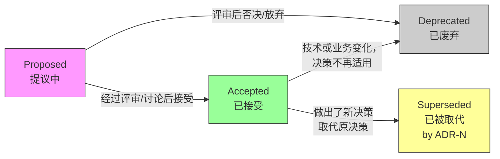

# 软件开发流程与模型（51）· 架构决策记录 ADR

> [!abstract] TL;DR
> **ADR（Architecture Decision Record，架构决策记录）** 是以结构化文档记录"为什么做出这个架构决策"的实践，核心模板由 **Michael Nygard** 提出（Title/Status/Context/Decision/Consequences），现代变体为 **MADR**（Markdown ADR，含备选方案与利弊权衡）。ADR 存放在代码仓库内（`docs/adr/`），与代码同版本演进，状态从 `Proposed` 流转至 `Accepted`、`Deprecated` 或 `Superseded by ADR-N`。它解决的是团队"**组织失忆**"问题：半年后没人记得为什么选 Kafka 而不是 RabbitMQ，而 ADR 就是那份"决策日志"。

## 概述与定位

### 架构决策的"组织失忆"问题

每个经历过团队成员更迭的项目都面临同一个困境：新成员问"为什么要用微服务？"，老成员说"当时就这么决定的"；问"为什么数据库选了 MongoDB？"，答案是"好像是某个已离职的架构师决定的"。关键架构决策没有被记录，只存在于少数核心成员的脑海中，一旦他们离开，这些"为什么"就永久消失了——团队不得不重新讨论已经讨论过的问题，甚至走回头路。

这就是 **ADR 要解决的核心问题：对抗团队的组织失忆（Organizational Memory Loss）**。

ADR 不记录"做了什么"（这是代码本身的职责），也不记录"怎么做"（这是设计文档的职责），而是专门记录"**为什么这么做，当时考虑了哪些选项，做出了什么权衡**"。

### ADR 的起源与发展

**Michael Nygard** 在 2011 年发表博客文章《Documenting Architecture Decisions》，提出了最经典的五段式 ADR 模板，奠定了 ADR 作为实践的基础。此后社区在此基础上发展出多种变体：

- **MADR（Markdown Architectural Decision Records）**：由 Michael Plöd 等人维护，增加了结构化的备选方案分析和利弊权衡，更适合现代敏捷团队。
- **Y-Statements**：更简洁的单句格式，适合快速记录低风险决策。
- **RFC（Request for Comments）**：大型开源社区的重量级变体，适合跨团队的重大决策。

ADR 的价值被越来越多的工程团队认可，现已成为现代软件工程中文档化实践的重要组成部分，与 C4 模型（见 [[50.C4架构模型]]）、AI 辅助开发（见 [[45.AI辅助开发流程]]）等实践深度结合。

## 原理与机制

### Michael Nygard 原始模板

最经典的 ADR 由五个部分组成：

**Title（标题）**：简短描述这个决策，通常以名词短语或动词短语表达，如"ADR-001：使用 PostgreSQL 作为主数据库"或"ADR-007：采用 JWT 替代 Session Cookie 进行用户认证"。编号是必须的（`ADR-NNN`），便于在其他文档中引用（"这个决策后来被 ADR-012 取代"）。

**Status（状态）**：当前决策处于哪个生命周期阶段。状态的可选值及其含义将在后文状态生命周期章节详细讨论。

**Context（背景/上下文）**：解释**是什么情况导致了这个决策需要被做出**。这部分应该描述驱动力（Forces）——技术约束、业务需求、团队现状、时间压力等。好的 Context 不是中立的陈述，而是真实反映当时面临的压力和约束，让未来的读者能够重建决策时的处境。

**Decision（决策）**：**我们决定做什么**。用主动语态、简洁明确地陈述决策内容。不需要在这里论证理由（理由在 Context 中已经铺垫），但应该清楚到足以让人知道"做了什么"。

**Consequences（后果/影响）**：这个决策带来的**所有影响**——包括正面的、负面的和中性的。好的 Consequences 部分会诚实地列出权衡，承认决策的代价，而不是只写优点。例如：
- 正面：简化了认证逻辑，无状态服务易于横向扩展
- 负面：需要处理 token 刷新逻辑，无法服务端主动吊销 token（需要黑名单机制）
- 中性：需要团队学习 JWT 的使用规范

### MADR 模板（现代扩展版）

**MADR（Markdown ADR）** 在 Nygard 模板基础上增加了结构化的备选方案分析，更符合现代工程决策的严谨性要求。MADR 的核心扩展是 **Considered Options** 和 **Decision Outcome**：

```markdown
# ADR-012：选择消息队列技术

## 状态

已接受（Accepted）

## 背景与问题陈述

订单服务与通知服务需要解耦，订单完成后需要异步触发短信/邮件/Push通知。
系统预计峰值 QPS 约 5000，通知可接受最终一致性，但不能丢消息。

## 备选方案

- **方案 A**：Kafka
- **方案 B**：RabbitMQ
- **方案 C**：Redis Streams
- **方案 D**：数据库轮询（Outbox Pattern）

## 决策结果

选择 **Kafka**，因为……

### 各方案利弊

**方案 A：Kafka**
- 优：高吞吐、消息持久化、支持消费者回放、生态成熟
- 劣：运维复杂，团队学习曲线陡峭；小团队维护 Kafka 集群成本偏高

**方案 B：RabbitMQ**
- 优：配置简单，团队已有使用经验；AMQP 协议成熟
- 劣：消息不支持回放（Replay），吞吐量低于 Kafka

**方案 C：Redis Streams**
- 优：已有 Redis 基础设施，无需引入新中间件
- 劣：持久化可靠性弱于专业 MQ，功能较简单

**方案 D：数据库轮询（Outbox Pattern）**
- 优：无需额外中间件，实现简单
- 劣：轮询给数据库增加压力，延迟较高

## 后果

- 需要搭建 Kafka 集群并投入运维资源（预计 3 人/天初始投入）
- 团队需要完成 Kafka 内部培训
- 未来支持消息回放场景成本降低
- 如果流量增长，Kafka 的横向扩展能力提供了充足余量
```

MADR 的关键改进在于**记录被否决的方案及其否决理由**——这防止了一个常见的反模式：六个月后有人提议"我们改用 RabbitMQ 吧"，然后团队又重新讨论一遍已经讨论过的问题。有了 MADR，新成员可以直接看到"我们考虑过 RabbitMQ，否决原因是……"，避免无效的重复讨论。

### 状态生命周期

ADR 的状态不是静态的，它会随着项目演进而流转：



**Proposed（提议中）**：ADR 已起草，正在讨论或等待评审，尚未正式接受。对于重大决策，建议设置评审截止日期并在 ADR 中注明。

**Accepted（已接受）**：团队已达成共识，决策生效，相关实现应遵循此决策。这是 ADR 的"正常状态"。

**Deprecated（已废弃）**：决策曾经有效，但现在不再适用——可能是因为业务场景已经改变（"当时选 MongoDB 是因为数据结构不确定，现在结构稳定了"），也可能是因为技术本身已被废弃。注意：Deprecated 不等于被另一个决策替代，它表示决策自然终止。

**Superseded by ADR-N（已被 ADR-N 取代）**：做出了新决策，明确取代了当前 ADR。这是最常见的演进方式——ADR-007 规定"使用 JWT"，ADR-023 规定"改用 OAuth2 + PKCE"，则 ADR-007 的状态变为 `Superseded by ADR-023`，ADR-023 也应注明"这个决策取代了 ADR-007"。

**状态链的重要性**：完整的状态链让团队能够追溯一个决策的演化历史——"我们在 ADR-007 用了 JWT，ADR-023 改成了 OAuth2，现在是 ADR-031 引入了 PKCE 增强安全性"，这个完整的演化脉络是宝贵的组织知识。

## 结构/算法/伪代码详解

### ADR 文件命名与组织约定

ADR 通常存放在代码仓库的 `docs/adr/` 目录下，文件命名遵循：

```
docs/adr/
├── 0001-use-postgresql-as-primary-database.md
├── 0002-adopt-microservices-architecture.md
├── 0003-use-jwt-for-authentication.md
└── 0023-switch-to-oauth2-pkce.md
```

编号应**固定且连续**（用零补齐到 4 位），即使某个 ADR 被废弃，其编号也不应被复用——这保证了引用关系的稳定性（"见 ADR-0007" 永远指向同一个文件）。

### 一份完整的 MADR 示例（含所有字段）

```markdown
---
status: "Accepted"
date: 2026-07-02
decision-makers: [架构师张三, 后端负责人李四]
consulted: [DBA王五]
informed: [前端团队, DevOps团队]
---

# ADR-0015：采用 CQRS 模式分离读写路径

## 背景与问题陈述

报表查询服务的 P99 延迟已达 2s，根本原因是复杂聚合查询与高频写入共用同一数据库
实例，写入锁争用影响读性能。需要在不重构写入路径的前提下，优化查询性能。

## 备选方案

- **方案 A**：引入只读副本（Read Replica）
- **方案 B**：CQRS + 独立查询视图（Elasticsearch）
- **方案 C**：分库分表

## 决策结果

选择**方案 B：CQRS + Elasticsearch**，理由是……

### 各方案利弊

**方案 A：只读副本**
- 优：改造成本最低，DBA 熟悉此方案
- 劣：只读副本查询能力受限于主库 Schema，复杂聚合仍有瓶颈

**方案 B：CQRS + Elasticsearch**
- 优：查询性能彻底解耦，Elasticsearch 擅长全文检索和聚合
- 劣：引入最终一致性，需要处理同步延迟；运维复杂度增加

**方案 C：分库分表**
- 优：物理层面解决写入扩展性
- 劣：对当前问题（读性能）无直接帮助，改造成本最高

## 后果

- **正面**：报表查询性能预期提升 10x，与写入路径彻底解耦
- **负面**：数据同步延迟约 1~2s，报表存在轻微滞后
- **负面**：团队需要学习 Elasticsearch 运维，初期约 5 人/天培训成本
- **中性**：需要建立数据同步管道（使用 Debezium CDC），作为基础设施组件维护
```

### 轻量 ADR（Y-Statements 格式）

对于低风险、低争议的决策，可以使用更简洁的 **Y-Statements** 格式：

```
在 [背景] 的情况下，面对 [需要解决的问题]，
我们决定采用 [方案A]，而非 [方案B]，
以达成 [正面结果]，接受 [负面影响/权衡]。
```

例如：
> 在前端需要与后端通信的情况下，面对接口文档同步问题，
> 我们决定采用 OpenAPI Spec + 代码生成，而非手写 API 文档，
> 以达成接口类型安全和文档自动化，接受需要维护 OpenAPI 定义文件的额外工作。

## 工具视角与实战

### adr-tools：命令行工具

**adr-tools** 是最经典的 ADR 命令行工具（Michael Nygard 模板），提供：
- `adr new "决策标题"` — 创建新 ADR，自动分配编号
- `adr link` — 在 ADR 之间建立引用链接
- `adr generate toc` — 自动生成 ADR 目录索引

```bash
# 初始化 ADR 目录
adr init docs/adr

# 创建新 ADR
adr new "使用 Kafka 作为消息队列"

# 创建新 ADR 并标记取代某个旧 ADR
adr new -s 7 "改用 OAuth2 + PKCE 进行认证"
```

### Log4brains：可视化 ADR 浏览器

**Log4brains** 是更现代的工具，在 adr-tools 基础上提供：
- 本地 Web 界面浏览所有 ADR
- 支持 MADR 格式
- 可导出静态站点，适合嵌入团队文档网站
- 与 CI/CD 集成，自动部署更新后的 ADR 站点

```bash
# 初始化
npx log4brains init

# 本地预览
npx log4brains preview

# 创建新 ADR
npx log4brains adr new
```

### adr-manager：VS Code 扩展

**adr-manager** 是 VS Code 插件，提供图形化界面管理 ADR，适合不习惯命令行的团队成员参与架构决策讨论。

### 与 CI/CD 集成

将 ADR 纳入 CI 流水线的常见实践：

1. **格式校验**：用 `markdownlint` 或自定义脚本检查 ADR 文件格式是否符合模板规范
2. **链接检查**：验证 ADR 中引用的其他 ADR 编号是否存在
3. **状态一致性检查**：如果一个 ADR 被标记为 `Superseded by ADR-N`，检查 ADR-N 是否存在并处于 Accepted 状态
4. **自动发布**：PR 合入后，自动构建并部署 Log4brains 站点到团队文档系统

### 在 PR 评审中集成 ADR

将 ADR 的创建/更新与代码 PR 绑定是最佳实践之一：当 PR 引入重大架构变更时，PR 描述中应链接对应的 ADR（"此 PR 实现 ADR-0015 决策，引入 CQRS 模式"）。这样代码审查和架构决策审查可以同时进行，确保"代码与决策对齐"。

### AI 辅助写 ADR

随着 AI 辅助开发工具的普及（见 [[45.AI辅助开发流程]]），AI 可以作为 ADR 撰写的辅助工具：

- **起草 Context 部分**：将代码库的相关代码段、技术约束喂给 AI，让 AI 帮助描述决策背景
- **生成备选方案**：AI 可以基于已知的技术选型，生成初步的备选方案列表及优劣分析
- **检查 Consequences 完整性**：AI 可以指出"这个决策还有你没提到的影响：..."

AI 生成的 ADR 草稿需要人工审核，确保反映真实的团队上下文和约束，而非通用的技术描述。

## 安全性与正确使用

### 正确落地：什么值得写 ADR

**不是所有决策都值得写 ADR**。ADR 的适用范围：

| 情况 | 建议 |
| --- | --- |
| 重大技术选型（数据库、消息队列、框架） | 必须写 ADR |
| 影响多个团队/服务的架构决策 | 必须写 ADR |
| 有显著权衡、存在争议的决策 | 强烈建议写 ADR |
| 推翻或修改已有重要决策 | 必须写 ADR（Superseded 链） |
| 小范围实现细节（某个函数的算法选择） | 不需要 ADR，代码注释即可 |
| 团队内部已有明确共识的惯例 | 不需要 ADR，放入团队 Coding Guide |

### 误区：ADR 变成审批关卡

一个常见的组织反模式是：将 ADR 演变成官僚式的审批流程——写 ADR 需要等待多个委员会签字，导致团队为了绕过流程而不写 ADR，最终适得其反。

ADR 应该是**轻量的**：写一份 ADR 的时间应该与讨论这个决策的时间大致相当，而不是成为独立的行政负担。如果 ADR 流程变得繁重，应该简化模板（用 Y-Statements 格式）或缩短审批链。

### 误区：只记录"好"的决策

ADR 不是功劳簿，也不是用来展示决策英明的。**失败的决策、被取代的决策同样有记录价值**——它们告诉后来者"这条路我们走过，行不通，原因是……"。状态为 Deprecated 或 Superseded 的 ADR 不应被删除，而应完整保留。

### 轻量与重量的权衡

ADR 实践本身也存在轻重之分，应根据团队规模和决策重要性选择：

| 维度 | 轻量 ADR | 重量 ADR |
| --- | --- | --- |
| 模板 | Nygard 五段式 / Y-Statements | MADR（含完整备选方案分析）|
| 审批流程 | PR review（2 人同意即可） | 架构评审会 + 多利益相关方签字 |
| 适用场景 | 单团队决策，影响范围明确 | 跨团队决策，影响全局架构 |
| 编写时间 | 15~30 分钟 | 数小时至数天 |

### 与 C4 模型的配合关系

C4 模型（见 [[50.C4架构模型]]）描述架构的**现状**（是什么），ADR 记录架构的**演化历史**（为什么变成这样）。两者是互补而非替代关系：

- C4 Container 图展示"现在有哪些服务"，ADR 解释"为什么从单体演化为微服务"
- C4 Component 图展示"认证组件的结构"，ADR 解释"为什么从 Session 改为 JWT，又为什么从 JWT 改为 OAuth2"
- 在 Structurizr DSL 中，可以在模型描述中直接引用 ADR 编号（`decision "ADR-0003" ...`），实现 C4 模型与 ADR 的链接

理想状态是：每一个在 C4 图中值得注意的设计选择，都有对应的 ADR 可以解释"为什么"。

### 与配置管理的关系

ADR 与配置管理（见 [[41.配置管理与版本控制]]）的核心共同点是**历史可追溯性**——配置管理保证代码变更可追溯，ADR 保证决策变更可追溯。两者都依赖 Git 版本控制作为基础设施，都将"变更"视为一等公民而非异常情况。

## 小结

ADR 是一种轻量但高价值的架构实践，用结构化文档记录"为什么这么做"，对抗团队的组织失忆。Nygard 五段式（Title/Status/Context/Decision/Consequences）提供了简洁的入门模板；MADR 增加了备选方案分析，适合需要更高严谨性的决策。ADR 存放于代码仓库内，通过状态机（Proposed → Accepted → Deprecated/Superseded）管理生命周期，实现决策的完整演化追踪。与 C4 模型配合，前者描述架构现状，后者解释决策理由，共同构成完整的架构知识体系。实践要点：保持轻量、与代码 PR 绑定、诚实记录权衡与失败决策、状态链完整。

## 相关阅读

- [[50.C4架构模型]] — C4 图描述架构现状，ADR 记录决策理由，两者互补
- [[45.AI辅助开发流程]] — AI 辅助起草 ADR 的结合实践
- [[00.软件开发流程与模型总览]] — 本系列全局索引

---

> ⬅️ [[50.C4架构模型]] ｜ 🏠 [[00.软件开发流程与模型总览]] ｜ [[52.契约测试ContractTesting]] ➡️
