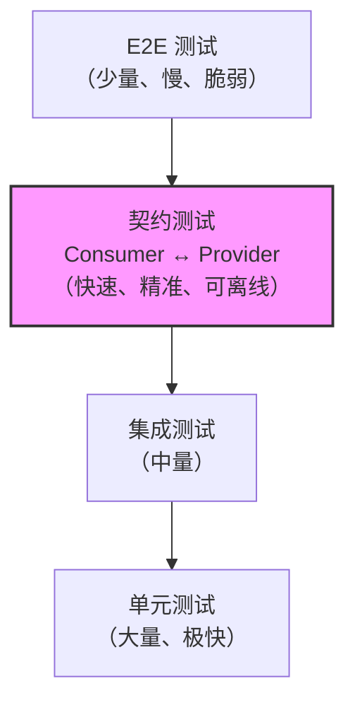
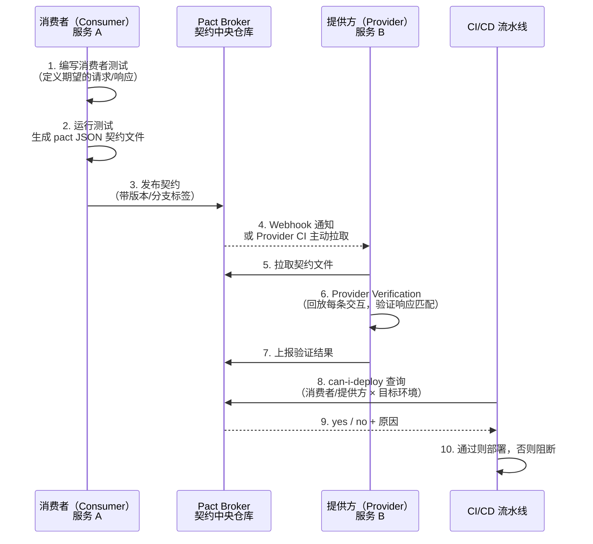

# 软件开发流程与模型（52）· 契约测试 Contract Testing

> [!abstract] TL;DR
> **契约测试（Contract Testing）** 是一种专为**分布式系统与微服务架构**设计的测试方式，核心思想是：**在服务边界处用"契约"文件代替真实依赖**，让消费者（Consumer）和提供方（Provider）各自独立验证——消费者端生成描述"我期望对方返回什么"的契约文件，提供方端回放这份契约并确认自己真的能满足它。
> 与端到端测试相比，契约测试**速度快（秒级）、故障定位精准（立即知道是谁破坏了接口）、无需共享测试环境**。主流实现是 **Pact 框架**；配合 **Pact Broker** 可构建完整的"消费者生成契约 → 集中存储 → 提供方验证 → `can-i-deploy` 部署门禁"流水线。在测试金字塔中，契约测试填补了单元测试与慢速集成测试之间的空白，是现代微服务 CI/CD 流水线中不可或缺的一环。

## 概述与定位

### 微服务架构下集成测试的困境

微服务把单体应用拆解为数十甚至数百个独立部署的小服务，每个服务通过 HTTP REST、gRPC、消息队列或 GraphQL 对外暴露接口。这种拆解带来了弹性与可独立演进的好处，但也引入了**服务间契约漂移（Interface Drift）** 的风险——提供方悄悄修改了响应字段的类型或名称，消费者在生产环境才察觉崩溃。

传统的应对方案有两种：

1. **端到端集成测试（E2E）**：启动所有相关服务，用真实网络调用跑完整个场景。可靠但极其昂贵——部署时间、环境维护、测试数据准备、脆弱的网络抖动，使 E2E 测试套件动辄耗费数十分钟甚至数小时，且一旦失败往往难以定位是哪个服务出了问题。
2. **隔离的单元测试 + Mock**：每个服务用 Mock 隔离依赖，跑得很快，但 Mock 的行为是**开发者臆测的**，与真实提供方实现之间没有任何约束——提供方改了接口，消费者侧的 Mock 依然绿色通过，直到真正联调才暴露问题。

契约测试正是为了**填补这两种极端之间的空白**。它的核心承诺是：

- 比 E2E 测试**快几个数量级**（无需启动真实服务）；
- 比纯粹的 Mock 测试**更可靠**（Mock 的内容来自消费者的期望并被提供方显式验证）；
- **精准定位破坏方**：当验证失败，立即知道是提供方不满足某消费者的期望，而不是模糊的"联调失败"。

### 在测试金字塔中的位置

参见 [[32.软件测试流程与测试金字塔]]，测试金字塔从底到顶依次是：单元测试（多、快、廉）→ 集成测试（中）→ E2E 测试（少、慢、昂贵）。契约测试**插入在集成测试层**，与传统集成测试的关键区别在于：传统集成测试需要真实运行双方，契约测试只需要契约文件——它是对服务边界的**轻量级、可版本化的形式化描述**。



### 契约测试与 DevSecOps 的关联

在 [[24.DevSecOps与供应链安全]] 的视角下，契约测试还承担着**接口完整性验证**的角色——当提供方发布新版本时，通过 `can-i-deploy` 门禁检查，可以在代码合并阶段就阻止破坏性变更进入主干，是"左移（Shift Left）"思想在服务间 API 安全方面的具体落地。

---

## 原理与机制

### 消费者驱动契约（Consumer-Driven Contract，CDC）

CDC 是契约测试最主流的方向，由 ThoughtWorks 在 2006 年前后系统化提出。其核心逆转了传统"提供方定义接口，消费者遵从"的思路，改为：

> **消费者定义它对提供方的最小期望，提供方承诺满足这些期望。**

这一逆转意义深远：

- **消费者只声明它实际使用的字段**，而非提供方的完整响应结构。提供方可以在不破坏任何消费者的前提下添加新字段，实现**无破坏性演进（Non-Breaking Evolution）**。
- **每个消费者独立形成一份契约**，提供方可以看到"谁依赖了我的哪些字段"，从而有充分信息决定是否可以安全删除某个字段。
- 契约文件是**机器可读的 JSON/YAML 文档**，可被版本控制，可被 CI 流水线消费。

#### CDC 完整流程



### 契约文件的结构剖析

Pact 生成的契约文件（`.json`）本质上是一组**交互（Interactions）**的集合，每条交互描述：

- **描述（description）**：这条交互的语义名称，如 `"GET /users/123 returns user details"`。
- **提供方状态（providerState）**：提供方在响应本次请求前应处于的状态，如 `"user 123 exists"`。这是测试数据的钩子。
- **请求（request）**：HTTP 方法、路径、查询参数、请求头、请求体。
- **响应（response）**：期望的状态码、响应头、响应体——**只声明消费者实际使用的字段**，使用**匹配规则（Matching Rules）**而非精确值匹配。

#### 匹配规则（Matching Rules）

精确值匹配是契约测试的大坑——`userId` 今天是 `123`，明天可能是 `456`，测试就会无端失败。Pact 提供了丰富的匹配器：

| 匹配器 | 含义 | 示例 |
|--------|------|------|
| `type` | 只验证类型，不验证值 | `integer`、`string` |
| `regex` | 正则匹配 | `"^\d{4}-\d{2}-\d{2}$"` |
| `include` | 字符串包含 | 检查响应体包含某子字符串 |
| `eachLike` | 数组中每个元素符合模板 | 列表接口 |
| `atLeast(n)` | 数组至少 n 个元素 | 分页接口 |
| `datetime` | ISO 时间格式 | 时间戳字段 |

这些匹配规则与契约文件一起存储，在提供方验证阶段由 Pact 框架自动应用。

### 提供方状态（Provider States）

提供方状态是解决"测试数据隔离"难题的关键机制。消费者在编写测试时声明：`"在 user 123 存在的情况下，GET /users/123 应返回..."`。提供方在验证时，需要为每个状态注册一个**状态钩子（State Handler）**，在回放对应交互前执行——通常是往测试数据库插入特定数据、设置 Mock 依赖的返回值等。

```
// 提供方侧 State Handler 示例（伪代码）
@State("user 123 exists")
fun setupUser123() {
    userRepository.save(User(id = 123, name = "Alice", email = "alice@example.com"))
}

@State("user 123 does not exist")
fun clearUser123() {
    userRepository.deleteById(123)
}
```

设计良好的状态名称应该是**业务语义而非技术细节**——`"user 123 exists"` 而不是 `"INSERT INTO users VALUES (123, ...)"` —— 这样状态描述对提供方实现无感知，便于重构。

---

## 结构/算法/伪代码详解

### Pact 框架消费者侧工作流

以 HTTP REST 场景为例，消费者使用 Pact DSL 编写测试：

```
// 消费者测试伪代码（JVM/Kotlin 风格）
class UserServiceConsumerTest {

    val pact = PactBuilder()
        .consumer("order-service")        // 消费者名称
        .provider("user-service")         // 提供方名称
        .addInteraction {
            description = "GET existing user"
            providerState = "user 123 exists"
            request {
                method = GET
                path = "/users/123"
                headers = { "Accept" to "application/json" }
            }
            response {
                status = 200
                body = {
                    "id"    matchType integer()      // 只验证是整数
                    "name"  matchType string()       // 只验证是字符串
                    "email" matchRegex "[^@]+@[^@]+" // 邮件格式
                }
            }
        }
        .build()

    @Test
    fun `should fetch user by id`() {
        // Pact 在本地启动 Mock Server，绑定到 pact 定义的交互
        pact.withMockServer { mockServer ->
            val client = UserServiceClient(mockServer.url)
            val user = client.getUserById(123)
            assertThat(user.id).isNotNull()
            assertThat(user.name).isNotEmpty()
        }
        // 测试通过后，Pact 自动生成 ./pacts/order-service-user-service.json
    }
}
```

整个消费者测试的关键点在于：
1. **Pact 框架启动本地 Mock Server**，消费者的真实客户端代码（`UserServiceClient`）向这个 Mock Server 发起请求——因此测试的是消费者侧的**真实序列化/反序列化逻辑**，而不是 Mock 掉的假调用。
2. 测试通过后，Mock Server 验证消费者确实发出了符合 `request` 定义的请求，然后生成契约文件。
3. 如果消费者发出的请求与 `request` 定义不符（如多了一个必填头），测试立即失败——这也同时验证了消费者自己的请求构造逻辑。

### Pact 框架提供方侧验证

提供方侧不需要写"测试逻辑"，只需要：

```
// 提供方验证伪代码（Spring Boot 风格）
@Provider("user-service")
@Consumer("order-service")
@PactBroker(url = "https://pact-broker.internal")
class UserServiceProviderVerification {

    @BeforeEach
    fun startProvider() {
        // 启动真实的 Spring Boot 应用（内嵌 Tomcat）
        // 指向测试数据库
    }

    @State("user 123 exists")
    fun setupUser123() {
        testDB.execute("INSERT INTO users (id, name, email) VALUES (123, 'Alice', 'alice@example.com')")
    }

    @State("user 123 does not exist")
    fun clearUser123() {
        testDB.execute("DELETE FROM users WHERE id = 123")
    }

    // Pact 框架自动：
    // 1. 从 Pact Broker 拉取 order-service-user-service.json
    // 2. 对每条交互：执行 State Handler → 向真实应用发起请求 → 用匹配规则验证响应
    // 3. 验证结果回传 Pact Broker
}
```

提供方验证的核心价值在于：它对**提供方的真实实现**（包括数据库查询、序列化逻辑、错误处理）进行验证，不是对 Mock 的验证。

### Pact 对消息队列（异步契约）的支持

Pact v4 及以上支持**异步消息契约**，适用于基于 Kafka、RabbitMQ 等消息中间件的事件驱动架构：

- **消费者端**：定义"我期望接收到的消息体结构"（Message Pact）；
- **提供方/发布者端**：证明它确实能发出符合期望结构的消息（通过调用发布者代码、验证输出的消息体）；
- 同样支持匹配规则，同样走 Pact Broker 流转。

这使契约测试覆盖了微服务架构中**同步 HTTP + 异步消息**两种主要通信模式。

---

## 工具视角与实战

### Pact Broker：契约的中央仓库

Pact Broker 是配套的契约管理服务，可以自托管（开源版）或使用 PactFlow（商业云服务）。它解决了以下问题：

**1. 契约版本管理与标签（Tags/Branches）**

契约文件按`消费者名称 + 版本`发布，支持打标签（如 `main`、`prod`、`staging`）。提供方在验证时可以指定"验证所有打了 `main` 标签的消费者版本"，确保主干始终绿色。

**2. 验证结果矩阵**

Pact Broker 维护一张**兼容性矩阵（Compatibility Matrix）**，记录每个`（消费者版本 × 提供方版本）`对是否通过验证。这是 `can-i-deploy` 查询的数据基础。

**3. `can-i-deploy` 部署门禁**

```bash
# 在 CI 流水线中，部署 order-service 的 v1.2.3 到 production 之前：
pact-broker can-i-deploy \
  --pacticipant order-service \
  --version v1.2.3 \
  --to-environment production

# 输出：
# Computer says yes ✔
# 或
# Computer says no ✗
# Reason: user-service v2.0.1 (currently deployed in production) 
#         has not verified order-service v1.2.3
```

这一机制确保了：**永远不会把一个未经对端验证过的服务版本部署到生产环境**。

**4. Webhook 触发跨服务 CI**

当消费者发布新契约时，Pact Broker 可以自动触发提供方的 CI 流水线执行验证，实现"消费者推送契约 → 提供方立即知道是否破坏了接口"的实时反馈循环，无需等待下次提供方 CI 定时运行。

### Spring Cloud Contract：生产者驱动的变体

与 Pact 的**消费者驱动**不同，Spring Cloud Contract 采用**生产者驱动契约（Producer-Driven Contract）** 模型：

- 契约文件（Groovy DSL 或 YAML）由**提供方维护**；
- 提供方根据契约自动生成 WireMock Stub，供消费者在测试中使用；
- 提供方在 CI 中验证自己的实现符合契约，并把 Stub 发布到 Maven/Nexus。

生产者驱动的优点是**提供方对契约有完全控制**，适合提供方是平台团队、需要严格 API 版本治理的场景。缺点是消费者无法主动声明需求，容易造成"提供方提供了什么，消费者就用什么"的惰性，不利于发现不必要的耦合。

在实践中，**CDC（Pact）更适合组织内多个对等微服务之间**；Spring Cloud Contract 更适合**平台/基础设施服务对内部客户提供稳定 API** 的场景。

### 双向契约（Bi-Directional Contract Testing，BDCT）

PactFlow 提出的双向契约测试是更新的趋势，特别适合**无法运行提供方完整应用**的场景（如第三方 API、遗留系统）：

- **消费者侧**：生成 Pact 契约（与传统 CDC 相同）；
- **提供方侧**：上传 OpenAPI Spec（Swagger 文档）——无需运行真实应用；
- **Pact Broker/PactFlow** 负责将两者进行**静态比对**：检查提供方的 OpenAPI Spec 是否满足消费者的 Pact 契约。

BDCT 的优势：

- 提供方只需维护好 OpenAPI 文档即可参与契约验证，**接入成本极低**；
- 对于外部 API（如支付网关、短信服务商），可以在本地完成兼容性验证；
- OpenAPI Spec 本身具有更丰富的语义（枚举值、格式约束、必填字段），比纯 Pact 匹配规则更具表达力。

劣势是依赖 OpenAPI 文档的准确性，文档与实现之间存在漂移时会产生误报。

---

## 安全性与正确使用

### 正确落地要点

**1. 从消费者开始，不要从提供方开始**

最常见的失误是让提供方团队"主动编写契约"，导致退化为生产者驱动——消费者真正使用了哪些字段、哪些字段组合没有被发现。正确做法是：消费者团队编写消费者测试，生成契约，提供方团队只负责验证。

**2. 一个消费者，一份契约**

每个独立的消费者（服务/应用/前端客户端）都应该有**独立的契约文件**，而不是多个消费者共享一份"通用契约"。共享契约会让单个消费者的需求被其他消费者的需求污染，失去精准定位的能力。

**3. 契约测试不替代单元测试，不替代 E2E 冒烟测试**

契约测试验证的是**接口契约的兼容性**，不验证业务逻辑的正确性。例如，`GET /orders/123` 返回了格式正确的 JSON，不代表订单的状态机逻辑是对的。完整的测试策略应当是：单元测试（业务逻辑）+ 契约测试（服务边界兼容性）+ 少量 E2E 冒烟测试（关键路径可用性）。

**4. Provider State 设计要精细，不要用数据库快照**

用数据库快照（dump & restore）作为 Provider State 会让测试与数据库 schema 深度耦合，任何 schema 迁移都会导致快照失效。正确的做法是用**编程式 State Handler**，在代码中描述状态的设置逻辑，使其与 schema 演进解耦。

**5. 在 CI/CD 中集成 `can-i-deploy`，而非可选步骤**

`can-i-deploy` 只有成为**阻断部署的强制门禁**才有价值，如果只是"可选建议"，团队会在压力下绕过它，契约测试体系随之崩溃。

### 典型误区与陷阱

**误区一：用契约测试验证业务规则**

契约测试验证的是"你能给我一个 `id` 字段是整数、`name` 字段是字符串的响应"，而不是"当用户名超过 50 字符时你会返回 400"。后者是提供方的业务规则测试，应由提供方的单元测试或集成测试覆盖。

**误区二：契约文件被提供方"独立维护"**

如果提供方团队直接修改契约文件（而不是通过消费者测试生成），契约就失去了"消费者真实使用意图"的语义，变成了文档而非测试。契约文件必须由消费者测试**自动生成**，不能手动编辑。

**误区三：Provider State 名称随意**

状态名称是消费者与提供方的**约定语言**。`"user exists"` 是一个糟糕的状态名（哪个 user？存在于哪种配置下？），`"active user with premium subscription exists"` 则是明确的语义描述。模糊的状态名导致提供方 State Handler 实现与消费者期望不匹配。

**误区四：只在新服务上引入，忽略存量服务**

对于已有大量集成的遗留服务，可以采用**增量引入**策略：先从最关键的、最常破坏的接口开始编写契约测试，逐步覆盖全部接口，而不必等待全量迁移完成才上线。

**误区五：契约测试等于 API 文档**

契约文件是机器可读的测试载体，不是人类友好的 API 文档。将其作为 API 文档使用会让消费者依赖了本不该依赖的实现细节。API 文档（OpenAPI Spec）与契约测试应当**并行存在**，各司其职。

---

## 小结

契约测试解决了微服务架构下一个长期未被优雅处理的痛点：**服务间接口兼容性的快速、持续验证**。它的核心价值不是替代其他测试，而是**在服务边界处建立一道自动化的、版本化的兼容性屏障**。

关键认知汇总：

- **CDC（消费者驱动）是主流方向**——消费者定义最小期望，提供方验证满足，实现无破坏性演进；
- **Pact 框架**是 CDC 的事实标准，支持 HTTP/gRPC/消息队列，覆盖 JVM、.NET、Go、Ruby、Python、JavaScript 等多语言；
- **Pact Broker** 将契约管理、版本追踪、`can-i-deploy` 门禁整合为完整的部署安全网；
- **Provider States** 是测试数据隔离的钩子，设计好状态名称是落地质量的关键；
- **双向契约（BDCT）** 是面向第三方/遗留系统的新趋势，用 OpenAPI Spec 代替运行提供方应用；
- 正确落地的核心原则：契约由消费者生成、不手动编辑、`can-i-deploy` 强制阻断、State Handler 编程式设计；
- 契约测试**不验证业务逻辑**，需与单元测试、少量 E2E 冒烟测试配合形成完整测试策略（见 [[32.软件测试流程与测试金字塔]]）。

---

## 相关阅读

- [[32.软件测试流程与测试金字塔]] — 测试金字塔整体策略，契约测试在其中的定位
- [[33.测试驱动开发TDD]] — 消费者侧契约测试的编写风格与 TDD 高度相似
- [[34.行为驱动开发BDD]] — BDD 场景语言可与 Provider State 描述风格结合
- [[21.持续集成与持续交付CICD]] — `can-i-deploy` 门禁在 CI/CD 流水线中的集成方式
- [[22.CICD流水线实践]] — 契约测试在具体流水线阶段的位置与配置
- [[24.DevSecOps与供应链安全]] — 契约测试作为 API 层面的左移安全验证
- [[44.TeamTopologies团队拓扑]] — 团队拓扑决定契约测试的组织边界（消费者/提供方的团队归属）
- [[00.软件开发流程与模型总览]] — 系列总览与阅读路线图

> ⬅️ [[51.架构决策记录ADR]] ｜ 🏠 [[00.软件开发流程与模型总览]]