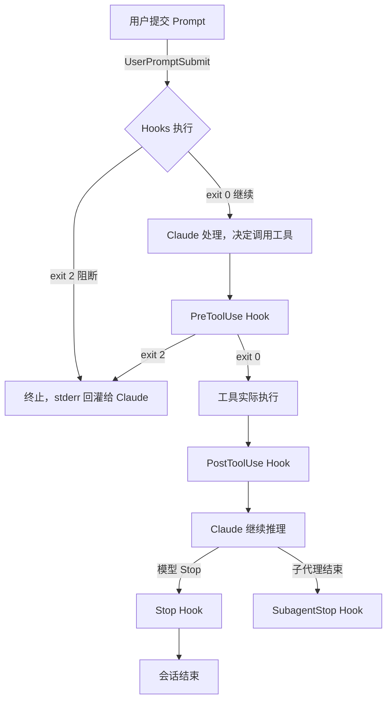

# 13 · Hooks 机制

> [!abstract] TL;DR
> Hooks 是 Claude Code 的**确定性自动化层**：在特定事件（工具调用前后、会话启动、用户提交等）以 100% 确定性执行外部命令，与"靠模型自觉去做"截然不同。核心用途：事前拦截危险命令、事后自动 lint/format、Stop 时推送通知。配置在 `settings.json` 的 `hooks` 字段；stdin 传 JSON 上下文，exit code 控制流程继续/阻断。

---

## 概述与定位

Claude Code 默认的执行路径依赖模型的判断：模型决定调哪个工具、做什么操作。这本质上是**概率性**的——同一个提示在不同上下文可能走不同路径，模型也可能"忘记"某个约定俗成的步骤。

**Hooks** 解决的是"我希望每次 X 发生时，Y 必定执行"这类需求。它是挂在 Claude Code 事件总线上的**确定性钩子**，用 shell 命令实现，和模型是否愿意配合无关。

典型使用场景一览：

| 场景 | 推荐 Hook 事件 |
|---|---|
| 每次保存代码后自动 lint/format | `PostToolUse`（匹配 `Write`/`Edit`） |
| 拦截 `rm -rf` 等危险 Bash 命令 | `PreToolUse`（匹配 `Bash`） |
| 编辑源文件后强制跑测试 | `PostToolUse`（匹配 `Write`/`Edit`） |
| 会话结束时桌面通知 | `Stop` |
| 记录每次用户提交内容供审计 | `UserPromptSubmit` |
| 子代理退出时汇报 | `SubagentStop` |

Hooks 与权限规则（`settings.json` 的 `permissions`）互补但**分工不同**：
- 权限规则是**白/黑名单**——决定"允不允许用某工具"。
- Hooks 是**事件回调**——决定"工具被调用时额外做什么/要不要放行"。两者可叠用。

---

## 原理与机制

Claude Code 在处理每一次交互时维护一条**工具调用生命周期**。Hooks 将外部进程插入这条生命周期的关键节点。



**事件全集（截至 2025 年）：**

| 事件 | 触发时机 | 典型用途 |
|---|---|---|
| `PreToolUse` | 工具执行**前** | 拦截、参数检查、审批 |
| `PostToolUse` | 工具执行**后** | lint、测试、记录日志 |
| `Stop` | 主 Claude 实例停止时 | 桌面通知、CI 回写 |
| `SubagentStop` | 子代理实例停止时 | 子代理完成时通知 |
| `SessionStart` | 会话创建时（最早触发）| 环境预热、注入上下文 |
| `UserPromptSubmit` | 每次用户提交 Prompt 前 | 全局前置检查、审计日志 |
| `Notification` | Claude Code 发出通知时 | 把内置通知桥接到系统通知中心 |
| `PreCompact` | 上下文即将压缩前 | 导出摘要、归档记录 |

---

## 配置/字段详解

Hooks 在 `settings.json` 的顶层 `hooks` 字段下配置，结构如下：

```jsonc
{
  "hooks": {
    "<事件名>": [
      {
        "matcher": "<正则，匹配工具名>",
        "hooks": [
          {
            "type": "command",
            "command": "<shell 命令字符串>"
          }
        ]
      }
    ]
  }
}
```

**字段说明：**

| 字段 | 类型 | 说明 |
|---|---|---|
| `<事件名>` | 顶层 key | 八个事件之一，如 `PreToolUse` |
| `matcher` | 正则字符串 | 匹配工具名（`Bash`/`Write`/`Edit`/`Read`……）；空字符串 `""` 匹配所有工具 |
| `type` | `"command"` | 目前只支持 `command` |
| `command` | shell 字符串 | 实际执行的命令，Windows 下走 bash（WSL 或 Git Bash） |

**matcher 示例：**

```jsonc
"matcher": "Bash"          // 精确匹配 Bash 工具
"matcher": "Write|Edit"    // 匹配 Write 或 Edit
"matcher": ""              // 所有工具（PreToolUse/PostToolUse 通配）
"matcher": "^(Write|Edit|NotebookEdit)$"  // 精确匹配写操作工具
```

**stdin 输入（JSON）：**

Claude Code 在调用 hook 命令时，通过 **stdin** 传入一个 JSON 对象，包含当前事件的上下文：

```json
// PreToolUse / PostToolUse 的 stdin 示例
{
  "session_id": "abc123",
  "tool_name": "Bash",
  "tool_input": {
    "command": "rm -rf /tmp/old_build"
  },
  "tool_response": {  // 仅 PostToolUse 存在
    "output": "..."
  }
}
```

```json
// UserPromptSubmit 的 stdin 示例
{
  "session_id": "abc123",
  "prompt": "用户输入的原始文本"
}
```

**stdout / exit code 决策表：**

| exit code | 含义 | Claude Code 的行为 |
|---|---|---|
| `0` | 成功，继续 | 流程正常继续 |
| `2` | **阻断** | 终止当前操作；hook 命令的 **stderr** 内容会作为错误消息**回灌给 Claude**，Claude 可据此决策 |
| 其他非零（如 `1`） | 警告/异常 | 仅在界面提示 hook 失败，**不阻断**流程 |

> [!note]
> exit code `2` 是阻断的专用码，它的 stderr 是唯一能把 hook 检查结果传递给 Claude 的通道。如果你想让 Claude 知道"为什么被拦"，在 stderr 里写清楚。

**PreToolUse 的 permission decision（进阶）：**

`PreToolUse` hook 还可以在 stdout 输出一个 JSON 来精细控制权限：

```json
{ "decision": "allow" }   // 明确放行，跳过后续权限弹窗
{ "decision": "deny", "reason": "禁止删除操作" }   // 拒绝
{ "decision": "ask", "reason": "需要人工审批" }    // 弹出审批对话框
```

不输出 JSON 时，exit code 决定流程（exit 0=继续，exit 2=阻断）。

---

## 工具视角与实战

### 场景一：编辑后自动 Prettier 格式化（PostToolUse）

```jsonc
// settings.json
{
  "hooks": {
    "PostToolUse": [
      {
        "matcher": "^(Write|Edit)$",
        "hooks": [
          {
            "type": "command",
            "command": "npx prettier --write \"$(echo $STDIN_JSON | python3 -c \"import sys,json;d=json.load(sys.stdin);print(d['tool_input'].get('file_path',''))\")\""
          }
        ]
      }
    ]
  }
}
```

实践上，复杂命令建议提取到独立脚本：

```jsonc
"command": "bash ~/.claude/hooks/post_edit_format.sh"
```

`post_edit_format.sh`：

```bash
#!/usr/bin/env bash
# stdin 是 JSON，取出 file_path 并 prettier
INPUT=$(cat)
FILE=$(echo "$INPUT" | python3 -c "import sys,json;d=json.load(sys.stdin);print(d['tool_input'].get('file_path',''))")
if [[ -n "$FILE" && "$FILE" =~ \.(js|ts|jsx|tsx|css|json)$ ]]; then
  npx prettier --write "$FILE" 2>&1
fi
exit 0
```

### 场景二：拦截危险 Bash 命令（PreToolUse）

```jsonc
{
  "hooks": {
    "PreToolUse": [
      {
        "matcher": "Bash",
        "hooks": [
          {
            "type": "command",
            "command": "bash ~/.claude/hooks/guard_bash.sh"
          }
        ]
      }
    ]
  }
}
```

`guard_bash.sh`：

```bash
#!/usr/bin/env bash
INPUT=$(cat)
CMD=$(echo "$INPUT" | python3 -c "import sys,json;d=json.load(sys.stdin);print(d['tool_input'].get('command',''))")

# 拦截危险模式
if echo "$CMD" | grep -qE 'rm\s+-rf|DROP\s+TABLE|truncate|mkfs'; then
  echo "检测到危险命令，已阻断: $CMD" >&2
  exit 2
fi
exit 0
```

### 场景三：Windows PowerShell 版 Stop 通知

Windows 下 hooks 走 bash（Git Bash）调 PowerShell：

```jsonc
{
  "hooks": {
    "Stop": [
      {
        "matcher": "",
        "hooks": [
          {
            "type": "command",
            "command": "powershell -Command \"Add-Type -AssemblyName System.Windows.Forms; [System.Windows.Forms.MessageBox]::Show('Claude Code 已完成', 'Claude Code')\""
          }
        ]
      }
    ]
  }
}
```

或用 Windows 原生 Toast 通知（需 `BurntToast` 模块）：

```jsonc
"command": "powershell -File C:/Users/YourName/.claude/hooks/notify_stop.ps1"
```

### 场景四：PostToolUse 强制跑测试

```jsonc
{
  "hooks": {
    "PostToolUse": [
      {
        "matcher": "^(Write|Edit)$",
        "hooks": [
          {
            "type": "command",
            "command": "bash ~/.claude/hooks/run_tests_on_edit.sh"
          }
        ]
      }
    ]
  }
}
```

`run_tests_on_edit.sh`：

```bash
#!/usr/bin/env bash
INPUT=$(cat)
FILE=$(echo "$INPUT" | python3 -c "import sys,json;d=json.load(sys.stdin);print(d['tool_input'].get('file_path',''))")

# 只在 src/ 下的修改时跑测试
if [[ "$FILE" == */src/* ]]; then
  npm test --watchAll=false 2>&1
  if [[ $? -ne 0 ]]; then
    echo "测试失败，请修复后继续" >&2
    exit 2
  fi
fi
exit 0
```

### 与 settings.json 权限规则的联动与分工

```
settings.json
├── permissions          ← 声明式白/黑名单：哪些工具/路径可用
│   ├── allow: [...]
│   └── deny: [...]
└── hooks                ← 事件回调：可执行任意逻辑，可超越权限声明
    ├── PreToolUse       ← 可动态 allow/deny/ask（优先于静态权限）
    └── PostToolUse      ← 工具已执行后的补偿逻辑
```

> [!note]
> PreToolUse hook 返回 `{ "decision": "allow" }` 可以**绕过**静态权限白名单的弹窗确认，反之返回 `{ "decision": "deny" }` 可以**拦截**静态权限允许的操作。动态逻辑优先于声明式规则。

详见 [[91.Claude Code/04-配置与权限.md]]。

---

## 安全性与正确使用

> [!caution]
> **Hooks 执行任意 shell 命令，是 Claude Code 最高权限的入口之一。** settings.json 中的 hook command 字段等同于一段无任何沙箱的 shell 脚本，它以**当前用户身份**运行，能读写文件系统、访问网络、执行任意程序。恶意或错误配置的 hook 可能造成数据丢失、信息泄露或系统破坏。

**安全使用准则：**

1. **不要把 hook 脚本放在仓库公共目录**（`.claude/hooks/` 在项目根下会随仓库传播）；用户级 `~/.claude/hooks/` 更安全。
2. **hook 脚本内容要做输入验证**：stdin 来自 Claude Code，但工具参数（如 `tool_input.command`）最终来自模型输出，存在注入风险——用 `python3 -c` 解析 JSON 而非 shell 字符串操作（防止 `"$(malicious)"` 注入）。
3. **避免在 hook 里无条件信任 stdin 内容**：对从 JSON 里取出的文件路径/命令，做 `realpath`/白名单校验再使用。
4. **exit code 的语义要严格遵守**：`exit 2` 才阻断；用 `exit 1` 误以为"会阻断"是常见坑——它只会提示警告，流程继续。
5. **测试 hook 时先用 dry-run 模式**：在脚本开头加 `set -n`（语法检查）或把危险操作先打印不执行，确认逻辑无误后再去掉。
6. **Windows 路径/编码注意**：hook command 走 Git Bash 时，Windows 中文路径可能乱码；脚本里的文件路径用 ASCII，中文内容写文件时用 Python `wb` 模式，参见全局 CLAUDE.md 中"可靠写文件"方法。

> [!caution]
> **PreToolUse `decision: allow` 可绕过权限弹窗**，这意味着如果 hook 脚本本身有逻辑漏洞（如正则不严导致误放行），它会在不提示用户的情况下让危险操作通过。不要把"所有情况都返回 allow"当做"安静模式"使用。

**hook 本身的权限边界**：hook 运行在 Claude Code 进程之外，不受 `permissions` 的约束；但 hook 调用的命令受操作系统用户权限约束。

---

## 小结

- Hooks 是 Claude Code 的**确定性自动化层**，弥补"靠模型自觉"的概率缺陷。
- 八个事件覆盖会话的全生命周期，最常用的是 `PreToolUse`（拦截）和 `PostToolUse`（后处理）。
- stdin 传 JSON 上下文，**exit code 2 阻断 + stderr 回灌给 Claude** 是控制流程的核心手段。
- `PreToolUse` 可通过 stdout JSON 精细控制 `allow`/`deny`/`ask`，优先于静态权限声明。
- Hook command 以当前用户权限运行任意 shell，**安全配置是第一责任**。

---

## 相关阅读

- [[32.hooks/06-claude-code-hooks.md]]
- [[91.Claude Code/04-配置与权限.md]]
- [[91.Claude Code/07-Subagents与工作流.md]]
- [[91.Claude Code/12-故障排查与技巧.md]]

下一步：了解如何在 CI/CD 流水线中无头调用 Claude → [[91.Claude Code/14-CI集成与无头模式.md]]；或回顾配置体系 → [[91.Claude Code/04-配置与权限.md]]。

> 🏠 [[91.Claude Code/00.总览|Claude Code 总览]]
