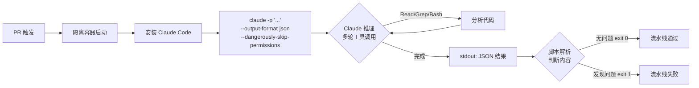

# 14 · CI 集成与无头模式

> [!abstract] TL;DR
> Claude Code 的**无头模式**（`claude -p "..."`）让你在 CI/CD 流水线、脚本、cron 任务里以非交互方式调用 Claude，输出可以是纯文本、JSON 或流式 JSON，配合退出码做通过/失败判断。核心参数：`--output-format`、`--max-turns`、`--allowedTools`、`--permission-mode`。在隔离容器里加 `--dangerously-skip-permissions` 可完全无人值守。与 Agent SDK 的区别：SDK 是嵌入式 library，无头 CLI 是独立进程、开箱即用。

---

## 概述与定位

Claude Code 默认是**交互式 TUI**——等用户输入、弹权限确认框、实时流式显示。这套体验在终端前坐着的人类工程师面前很好用，但在以下场景完全行不通：

- **GitHub Actions / GitLab CI** 流水线：没有终端，没有人点"允许"。
- **定时脚本**：午夜自动跑批量重构，没人盯着。
- **工具链集成**：把 Claude 的输出 pipe 给另一个程序解析。

**无头模式**（headless / print mode）解决这个问题：用 `-p` 标志传入单次 prompt，Claude 处理完就退出，输出写到 stdout，错误写到 stderr，退出码表示成功与否。整个过程**零交互**。

无头模式与交互模式的核心差异：

| 维度 | 交互模式 | 无头模式 |
|---|---|---|
| 启动方式 | `claude`（无参数）| `claude -p "prompt"` |
| 输入 | TUI 键盘输入 | 命令行参数 / stdin |
| 输出 | 流式渲染到终端 | stdout（可选格式） |
| 权限弹窗 | 有，等用户点击 | 无，靠 `--permission-mode` 控制 |
| 持续会话 | 是 | 否（除非 `--session-id` 恢复） |
| 典型场景 | 开发时对话 | CI、脚本、自动化 |

---

## 原理与机制

无头模式下，Claude Code CLI 以**单次任务**模式运行：

1. 解析命令行参数（prompt、工具白名单、轮次上限等）。
2. 初始化会话，注入系统提示和工具集。
3. Claude 推理，可能多轮使用工具（受 `--max-turns` 限制）。
4. 最终输出写入 stdout，按 `--output-format` 格式化。
5. 进程退出，退出码反映任务状态。

**退出码语义：**

| 退出码 | 含义 |
|---|---|
| `0` | 成功完成 |
| `1` | 运行时错误（API 错误、工具失败等） |
| `2` | 参数/配置错误 |

CI 脚本通过检查退出码决定流水线是否继续：`if claude -p "..." ; then echo "pass" ; fi`。

---

## 配置/字段详解

### 核心参数速查

| 参数 | 说明 | 示例 |
|---|---|---|
| `-p "prompt"` | 无头模式的入口，传入单次 prompt | `claude -p "审查这个文件"` |
| `--output-format` | 输出格式：`text`（默认）/ `json` / `stream-json` | `--output-format json` |
| `--max-turns N` | 最多推理 N 轮（防止无限循环） | `--max-turns 5` |
| `--allowedTools` | 工具白名单，逗号分隔 | `--allowedTools Read,Glob,Grep` |
| `--disallowedTools` | 工具黑名单 | `--disallowedTools Bash` |
| `--permission-mode` | 权限模式（见下表） | `--permission-mode default` |
| `--dangerously-skip-permissions` | 跳过所有权限确认（危险，仅用于沙箱） | 见安全章节 |
| `--session-id` | 恢复已有会话上下文 | `--session-id abc123` |
| `--system-prompt` | 注入自定义系统提示 | `--system-prompt "你是 CI 审查员"` |
| `--verbose` | 输出详细日志（含工具调用过程） | `--verbose` |

**`--permission-mode` 可选值：**

| 值 | 行为 |
|---|---|
| `default` | 按 settings.json 规则，未知操作弹窗（无头时弹窗=阻塞） |
| `acceptEdits` | 自动接受文件编辑，其他按规则 |
| `bypassPermissions` | 跳过所有权限检查（等同 `--dangerously-skip-permissions`） |

**`--output-format` 三种格式：**

```
# text（默认）：纯文本，最终 Claude 回复
这是一个简单的纯文本输出。

# json：完整结构化结果，任务完成后一次性输出
{
  "type": "result",
  "result": "最终回复文本",
  "cost_usd": 0.0023,
  "duration_ms": 4521,
  "num_turns": 3
}

# stream-json：每条事件一行 JSON（NDJSON），实时流式
{"type":"system","subtype":"init","session_id":"abc123"}
{"type":"assistant","message":{"content":[{"type":"text","text":"正在分析..."}]}}
{"type":"tool_use","name":"Read","input":{"file_path":"src/main.py"}}
{"type":"tool_result","name":"Read","output":"..."}
{"type":"result","result":"分析完成","cost_usd":0.0023}
```

`stream-json` 格式适合需要实时进度反馈的场景（如 CI 日志流式输出）；`json` 格式适合解析最终结果做判断。

---

## 工具视角与实战

### CI 集成标准模式（GitHub Actions）

```yaml
# .github/workflows/ai-review.yml
name: AI Code Review

on:
  pull_request:
    branches: [main]

jobs:
  review:
    runs-on: ubuntu-latest
    container:
      image: node:20-bookworm   # 隔离容器！
    
    steps:
      - uses: actions/checkout@v4
      
      - name: 安装 Claude Code
        run: npm install -g @anthropic-ai/claude-code
      
      - name: 运行 AI 代码审查
        env:
          ANTHROPIC_API_KEY: ${{ secrets.ANTHROPIC_API_KEY }}
        run: |
          claude -p "审查本次 PR 的改动，重点关注安全漏洞和性能问题，输出 JSON 格式的问题列表" \
            --output-format json \
            --max-turns 10 \
            --allowedTools Read,Glob,Grep,Bash \
            --dangerously-skip-permissions \
            > review_result.json
      
      - name: 解析结果并决定是否通过
        run: |
          RESULT=$(cat review_result.json | python3 -c "
          import sys, json
          d = json.load(sys.stdin)
          print(d.get('result', ''))
          ")
          echo "审查结果: $RESULT"
          # 根据结果内容决定退出码
          if echo "$RESULT" | grep -qi "critical\|高危\|安全漏洞"; then
            echo "发现严重问题，阻断流水线"
            exit 1
          fi
```

**Mermaid：CI 流水线调用无头模式流程**



### GitLab CI 版本

```yaml
# .gitlab-ci.yml
ai-review:
  image: node:20-bookworm
  script:
    - npm install -g @anthropic-ai/claude-code
    - |
      claude -p "对 $CI_COMMIT_DIFF 进行三角分诊，输出 JSON：priority(high/medium/low), summary, affected_files" \
        --output-format json \
        --max-turns 8 \
        --allowedTools Read,Grep,Glob \
        --dangerously-skip-permissions \
        > triage.json
    - cat triage.json | python3 -c "import sys,json; d=json.load(sys.stdin); exit(1 if d.get('result','').find('high')>=0 else 0)"
  variables:
    ANTHROPIC_API_KEY: $ANTHROPIC_API_KEY  # GitLab CI/CD Variables 配置
  only:
    - merge_requests
```

### 批量重构自动化（脚本场景）

```bash
#!/usr/bin/env bash
# batch_refactor.sh：批量把旧 API 调用替换为新 API

FILES=$(find src/ -name "*.py" -newer requirements.txt)

for FILE in $FILES; do
  echo "处理: $FILE"
  claude -p "将 $FILE 中的 requests.get() 替换为 httpx.get()（异步版本），保留功能不变，输出修改摘要" \
    --output-format text \
    --max-turns 5 \
    --allowedTools Read,Edit \
    --dangerously-skip-permissions
  
  if [[ $? -ne 0 ]]; then
    echo "处理 $FILE 失败" >&2
  fi
done
```

### stream-json 实时进度解析

```python
#!/usr/bin/env python3
# stream_consumer.py：消费 stream-json 输出，实时展示进度

import subprocess
import json
import sys

proc = subprocess.Popen(
    [
        "claude", "-p", "分析项目结构并给出优化建议",
        "--output-format", "stream-json",
        "--max-turns", "10",
        "--allowedTools", "Read,Glob,Grep",
    ],
    stdout=subprocess.PIPE,
    stderr=subprocess.PIPE,
    text=True,
    env={"ANTHROPIC_API_KEY": "sk-ant-..."},
)

for line in proc.stdout:
    line = line.strip()
    if not line:
        continue
    try:
        event = json.loads(line)
        etype = event.get("type", "")
        if etype == "tool_use":
            print(f"[工具调用] {event['name']}: {str(event.get('input',''))[:80]}")
        elif etype == "result":
            print(f"\n[最终结果]\n{event.get('result','')}")
        elif etype == "assistant":
            for block in event.get("message", {}).get("content", []):
                if block.get("type") == "text":
                    print(f"[Claude] {block['text'][:120]}")
    except json.JSONDecodeError:
        pass

proc.wait()
sys.exit(proc.returncode)
```

### 与 Agent SDK 的关系

经常被问：无头 CLI 和 Agent SDK 哪个用？

| 维度 | 无头 CLI | Agent SDK |
|---|---|---|
| 接入方式 | 独立进程，shell 调用 | Python/TypeScript library，嵌入代码 |
| 部署依赖 | 只需 npm install 装 CLI | 需要在应用代码里 import SDK |
| 控制粒度 | 参数级，较粗 | API 级，极精细（自定义工具、流式回调等）|
| 适用场景 | CI 脚本、cron、简单集成 | 需要深度嵌入的应用（如 IDE 插件、自定义 Agent）|
| 会话管理 | 无状态（`-p` 每次新建）/ 可用 `--session-id` 接续 | SDK 自行管理会话状态 |

> [!note]
> 对于"在 CI 跑一次代码审查"这类需求，无头 CLI **开箱即用，无需写 SDK 代码**，是最快路径。SDK 适合需要把 Claude 能力**编织进应用逻辑**的场景。

---

## 安全性与正确使用

> [!caution]
> **`--dangerously-skip-permissions` 跳过所有权限确认，让 Claude 可以在无任何阻断的情况下执行任意工具操作（包括 Bash 命令、文件删除等）。** 这个标志的名字里带 "dangerously" 是认真的——只能在以下条件**同时满足**时使用：
> 1. **隔离/沙箱容器环境**（如 Docker、GitHub Actions 的 runner），容器销毁后一切清零。
> 2. **代码库是只读挂载或副本**，不是生产系统目录。
> 3. **API Key 是受限的 CI 专用 Key**，不是开发者个人 Key。
>
> **绝对不要**在本地开发机器、生产服务器、或任何有持久状态的环境下加 `--dangerously-skip-permissions`。

**API Key 安全：**

CI 环境的 API Key 应通过 **Secrets / CI 变量**注入，而非硬编码：

```yaml
# GitHub Actions
env:
  ANTHROPIC_API_KEY: ${{ secrets.ANTHROPIC_API_KEY }}

# GitLab CI（在 Settings > CI/CD > Variables 配置）
variables:
  ANTHROPIC_API_KEY: $ANTHROPIC_API_KEY

# 本地脚本（从环境变量读取，不写进脚本）
export ANTHROPIC_API_KEY="sk-ant-..."
./batch_refactor.sh
```

**工具白名单最小化原则：**

在 CI 里用 `--allowedTools` 只开放**任务需要的最小工具集**：

```bash
# 只需读文件的审查任务
--allowedTools Read,Glob,Grep

# 需要编辑的重构任务（加 Edit 但不加 Bash）
--allowedTools Read,Glob,Grep,Edit

# 需要运行测试的任务（才开放 Bash，且配合 hooks 拦截危险命令）
--allowedTools Read,Glob,Grep,Edit,Bash
```

> [!caution]
> 即使在 CI 里，**不受限的 Bash 工具**也存在风险——如果 Claude 被提示注入（prompt injection）攻击，可能在 CI 容器里执行恶意命令并通过 CI 产物/日志泄露数据。推荐即使在容器里也配合 `PreToolUse` hooks 拦截危险命令模式（见 [[91.Claude Code/13-Hooks.md]]）。

**`--max-turns` 防止失控：**

无头模式下不设上限的多轮调用可能导致：
- 费用失控（每轮都消耗 token）
- 无限循环（工具调用失败后 Claude 反复重试）

推荐在 CI 场景里始终设置合理上限：代码审查用 `--max-turns 10`，简单问答用 `--max-turns 3`。

**退出码在 CI 里的正确用法：**

```bash
set -e  # 遇到非零退出码立即停止

# 错误示范：忽略退出码
claude -p "..." > out.txt
cat out.txt  # 即使 claude 失败，仍继续

# 正确示范：检查退出码
if ! claude -p "..." --output-format json > out.txt; then
  echo "Claude 运行失败，退出码: $?" >&2
  exit 1
fi
```

---

## 小结

- 无头模式（`claude -p "..."`）是 Claude Code 的**零交互调用接口**，专为 CI/CD、脚本、自动化设计。
- `--output-format json` / `stream-json` 让输出可被程序解析；退出码供流水线做通过/失败判断。
- `--allowedTools` + `--max-turns` 是控制任务范围、防止失控的两道闸。
- `--dangerously-skip-permissions` **仅限隔离容器使用**，是实现 CI 全自动化的必要代价，但必须配合最小工具集和 hooks 拦截做补偿防护。
- 无头 CLI 是开箱即用的集成路径；需要深度嵌入应用时再考虑 Agent SDK。

---

## 相关阅读

- [[91.Claude Code/13-Hooks.md]]
- [[91.Claude Code/04-配置与权限.md]]
- [[91.Claude Code/07-Subagents与工作流.md]]
- [[91.Claude Code/12-故障排查与技巧.md]]

下一步：结合 Hooks 机制为 CI 流水线加入确定性拦截 → [[91.Claude Code/13-Hooks.md]]；或查看完整配置体系 → [[91.Claude Code/04-配置与权限.md]]。

> 🏠 [[91.Claude Code/00.总览|Claude Code 总览]]
