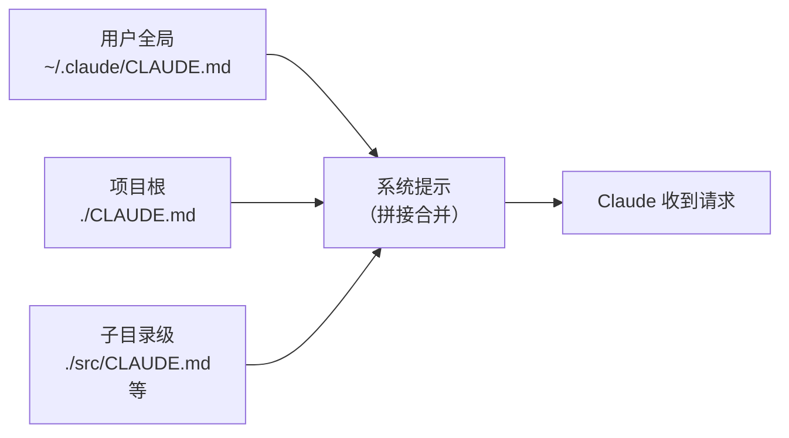

# 16 · CLAUDE.md 编写实践与模板

> [!abstract] TL;DR
> CLAUDE.md 是 Claude Code 的"项目记忆"——随每次请求自动注入上下文，无需手动粘贴。写对了能让 Claude 在不用反复解释的前提下遵守团队规范；写错了（过长、过时、自相矛盾）反而会稀释注意力、浪费 token。本篇提供三层级说明、写作原则、三个语言栈模板、反例分析与日常维护方法。

---

## 概述与定位

Claude Code 在每次对话开始时，会把当前项目的 `CLAUDE.md`（及其他层级的同名文件）拼入**系统提示**，作为固定背景知识。这意味着：

- Claude 无需你每次都说"本项目用 Python 3.11 + pytest"，它开场就知道；
- 团队规范（命名约定、禁止操作、首选工具）可以一次写入，反复生效；
- 个人偏好（语言、代码风格、交互习惯）可以写在用户级文件，跨项目继承。

CLAUDE.md 不是文档，也不是 README——它的读者是 **AI，不是人类**。写作目标是：**最小篇幅、最高密度、最强约束力**。

---

## 原理与机制

### 三层级加载与合并

Claude Code 支持多层级 CLAUDE.md，按以下顺序加载并合并（后加载的优先级更高，局部覆盖上层）：



| 层级 | 路径 | 适用范围 |
|---|---|---|
| 用户全局 | `~/.claude/CLAUDE.md` | 跨所有项目的个人偏好（语言、风格、常用习惯） |
| 项目根 | `./CLAUDE.md` 或 `.claude/CLAUDE.md` | 当前仓库的团队规范与技术栈约定 |
| 子目录 | `./packages/frontend/CLAUDE.md` 等 | monorepo 或多模块时，模块级特殊要求 |
| 本地覆盖 | `CLAUDE.local.md` | 不提交到 git 的个人临时覆盖（如本地调试路径） |

`CLAUDE.local.md` 应加入 `.gitignore`，用于存放不适合共享的个人配置（本地环境变量、私有测试账号等）。

### 注入时机与 Token 成本

每次发送请求时，**所有层级的 CLAUDE.md 都会完整拼入输入**。这直接影响每轮的 token 消耗：一个 2000 字的 CLAUDE.md，每轮对话都要带上 2000 字的输入——10 轮就是 20000 字。配合 prompt caching，如果 CLAUDE.md 内容不变，后续调用可命中缓存大幅降低费用（参见 [[91.Claude Code/15-成本与上下文管理.md]]）。

**结论：CLAUDE.md 越精简越好，且改动要批量而不要频繁微调**（频繁改动会让缓存失效）。

---

## 结构/算法/伪代码详解

### 写什么有效

CLAUDE.md 中**对 Claude 约束力最强的内容**：

1. **常用命令**：项目的构建、测试、lint 命令。Claude 拿到后不需要猜，直接用。
   ```
   ## 常用命令
   - 构建：`mvn clean package -DskipTests`
   - 测试：`pytest tests/ -x --tb=short`
   - lint：`ruff check . && mypy src/`
   ```

2. **代码约定**：命名规范、缩进、注释语言、禁止使用的 API。
   ```
   ## 代码约定
   - 所有注释和 docstring 用中文
   - 禁止使用 `os.system()`，改用 `subprocess.run()`
   - 变量名驼峰（JS/Java）或下划线（Python），禁止拼音
   ```

3. **目录结构说明**：告诉 Claude 哪个目录做什么，避免它乱找。
   ```
   ## 目录说明
   - `src/api/` 存放所有 REST 控制器
   - `src/service/` 存放业务逻辑，不能直接访问数据库
   - `tests/` 对应 `src/` 的镜像结构
   ```

4. **已知坑与特殊环境**：不写 Claude 可能踩坑的地方。
   ```
   ## 已知问题
   - Windows 环境下 `python` 命令不可用，只能用 `py -3`
   - 测试数据库用 SQLite，路径 `./test.db`（不提交）
   ```

5. **务必/禁止清单**：显式指令，语气要强。
   ```
   ## 务必
   - 改动 public API 后必须同步更新 `docs/api.md`
   ## 禁止
   - 不要删除 `config/prod.yaml`
   - 不要在业务代码里写 `print()`，用 logging
   ```

### 写什么无效甚至有害

| 内容类型 | 问题 | 建议 |
|---|---|---|
| 大段背景介绍（"本项目是一个...企业级...微服务..."） | 稀释注意力，Claude 不需要产品介绍 | 删掉，只留技术约束 |
| 过时的命令或路径 | Claude 照着跑会失败，比没有 CLAUDE.md 更糟 | 定期审查，删旧命令或注明"已废弃" |
| 自相矛盾的指令（"用4空格缩进" + "遵循 PEP8"） | Claude 无法同时满足，行为不可预期 | 统一口径，只保留一种表述 |
| 过细的实现细节（"第45行的变量叫 xxx"） | 代码改完立刻过时，维护成本极高 | 不写，让 Claude 自己读代码 |
| 大段权限/hooks 配置解释 | 那是 `settings.json` 的职责，不是 CLAUDE.md | 迁移到 `.claude/settings.json`（见 [[91.Claude Code/04-配置与权限.md]]） |

---

## 工具视角与实战

### 三个精简模板示例

#### Python 项目

```markdown
## 技术栈
Python 3.11 · FastAPI · SQLAlchemy 2.x · pytest

## 常用命令
- 启动开发服务器：`uvicorn app.main:app --reload`
- 运行测试：`pytest tests/ -x --tb=short`
- 类型检查：`mypy app/`
- lint：`ruff check app/ tests/`

## 代码约定
- 注释和 docstring 用中文
- 路由函数返回 Pydantic schema，不直接返回 ORM 对象
- 数据库操作在 `app/repository/` 层，禁止在路由层直接写 SQL
- 禁止 `os.system()`，用 `subprocess.run(check=True)`

## 目录说明
- `app/api/` 路由层（仅参数校验和响应组装）
- `app/service/` 业务逻辑
- `app/repository/` 数据库访问
- `tests/` 镜像 app/ 结构

## 禁止
- 不要提交 `.env` 文件
- 不要在 service 层 import FastAPI 依赖
```

#### Java Spring Boot 项目

```markdown
## 技术栈
Java 17 · Spring Boot 3.x · Maven · JUnit 5 · MyBatis-Plus

## 常用命令
- 构建：`mvn clean package -DskipTests`
- 测试：`mvn test`
- 启动：`mvn spring-boot:run -Dspring-boot.run.profiles=dev`

## 代码约定
- 注释用中文
- Controller 只做参数校验和响应，业务逻辑在 Service
- DTO/VO/Entity 各层不互串，见 `docs/arch.md` 分层规则
- 日志用 `@Slf4j`，禁止 `System.out.println()`

## 目录说明
- `src/main/java/com/example/controller/` 接口层
- `src/main/java/com/example/service/` 业务层
- `src/main/java/com/example/mapper/` 数据访问层
- `src/main/resources/mapper/` MyBatis XML

## 务必
- 新增接口必须在 `docs/api.md` 补充说明
```

#### 前端 React 项目

```markdown
## 技术栈
React 18 · TypeScript · Vite · Tailwind CSS · Zustand · Vitest

## 常用命令
- 开发服务器：`npm run dev`
- 构建：`npm run build`
- 测试：`npm run test`
- lint：`npm run lint`（eslint + prettier）

## 代码约定
- 组件文件用 PascalCase，工具函数文件用 camelCase
- 组件用函数式 + hooks，禁止 class 组件
- 样式只用 Tailwind，禁止行内 `style={}` 和裸 CSS 文件
- 全局状态放 `src/stores/`（Zustand），禁止 props drilling 超过两层

## 目录说明
- `src/components/` 通用 UI 组件（无业务逻辑）
- `src/features/` 按业务功能划分的模块
- `src/stores/` Zustand store
- `src/hooks/` 自定义 hooks

## 禁止
- 不要直接修改 `public/` 下的文件，静态资源放 `src/assets/`
- 不要跳过 TypeScript 类型，禁止 `as any`
```

### 维护方法

**初始化**：在项目根目录运行 `/init`，Claude Code 会扫描项目结构并生成一个基础 CLAUDE.md 草稿。生成后需要人工审查，删除不准确的内容、补充团队规范。

**追加记忆**：
- 对话中说"记住：..."或以 `#` 开头的输入，Claude Code 会把内容追加到 CLAUDE.md；
- 对话结束后发现有新的约定要固化，用 `/remember <内容>` 写入；
- 也可以直接编辑 CLAUDE.md 文件（Write 工具或编辑器均可）。

**定期精简**：每隔一段时间（如每次 sprint 结束）打开 CLAUDE.md，删除已过时的命令、合并重复条目，保持文件在 500 字以内（中小项目）或 1000 字以内（复杂项目）。

### 与 hooks/permissions 的分工

CLAUDE.md 是**记忆与约定**，Claude 读了会尽力遵守，但无法强制执行。如果需要**强制阻止某类操作**（如禁止 Claude 删除 prod 配置、禁止执行某类 bash 命令），应在 `.claude/settings.json` 里配置 `permissions.deny` 规则或 hooks——这是代码层面的硬约束，Claude 无法绕过。

```
CLAUDE.md（软约束，靠 AI 理解遵守）
    "不要删除 config/prod.yaml"
    → Claude 会尽量遵守，但无法保证 100%

settings.json（硬约束，hooks/permissions 强制）
    "deny": ["Bash(rm config/prod.yaml)"]
    → Claude 尝试执行时直接被阻断
```

详细的权限与 hooks 配置见 [[91.Claude Code/04-配置与权限.md]]。

---

## 安全性与正确使用

> [!note] 常见的 CLAUDE.md 写作陷阱
>
> **陷阱一：把敏感信息写进 CLAUDE.md**
> API 密钥、密码、私有端点不应出现在 CLAUDE.md 中——文件会随对话注入，也可能被 git 提交后泄露。敏感信息用环境变量，在 `CLAUDE.local.md`（加入 .gitignore）里只写路径提示，不写值。
>
> **陷阱二：把 CLAUDE.md 当团队文档维护**
> CLAUDE.md 的读者是 AI，写给人读的背景介绍和决策理由放 README 或 docs/，CLAUDE.md 只放操作性指令。两者不要混用，否则两边都维护困难。
>
> **陷阱三：子目录 CLAUDE.md 与根级矛盾**
> 子目录 CLAUDE.md 会叠加在根级之上，若两者有冲突，Claude 可能出现不一致行为。合并时要显式用"本目录覆盖根级约定"的措辞，或在根级注明"frontend/ 子目录见其内部 CLAUDE.md"。
>
> **陷阱四：用 CLAUDE.md 替代代码注释**
> "第 123 行的函数是做 xxx 用的"这类内容写入 CLAUDE.md 后，代码一改就过时。这类说明应写成代码内的注释或 docstring，CLAUDE.md 只描述架构约定和操作流程。

---

## 小结

CLAUDE.md 的价值在于**一次写好，持续生效**——它让 Claude 开箱即知项目规则，减少每次对话的重复解释成本。但它不是越长越好：每行内容都有 token 代价，过时信息比没有信息更危险。三条核心原则：只写操作性约束、定期精简、敏感信息绝不写入。配合 `settings.json` 的硬约束，两者分工互补，构成 Claude Code 项目级"记忆+执行"体系。

---

## 相关阅读

- [[91.Claude Code/04-配置与权限.md]] — settings.json、permissions、hooks 硬约束配置
- [[91.Claude Code/15-成本与上下文管理.md]] — CLAUDE.md 长度对 token 成本的影响
- [[91.Claude Code/07-Subagents与工作流.md]] — 子代理定义文件的 frontmatter 写法（与 CLAUDE.md 类似）
- [[91.Claude Code/03-基本使用与斜杠命令.md]] — `/init`、`/remember`、`#` 快捷追加用法

下一步：用 CLAUDE.md 固化约定后，了解如何通过权限配置强制执行 → [[91.Claude Code/04-配置与权限.md]]；或查看成本影响 → [[91.Claude Code/15-成本与上下文管理.md]]。

> 🏠 [[91.Claude Code/00.总览|Claude Code 总览]]
