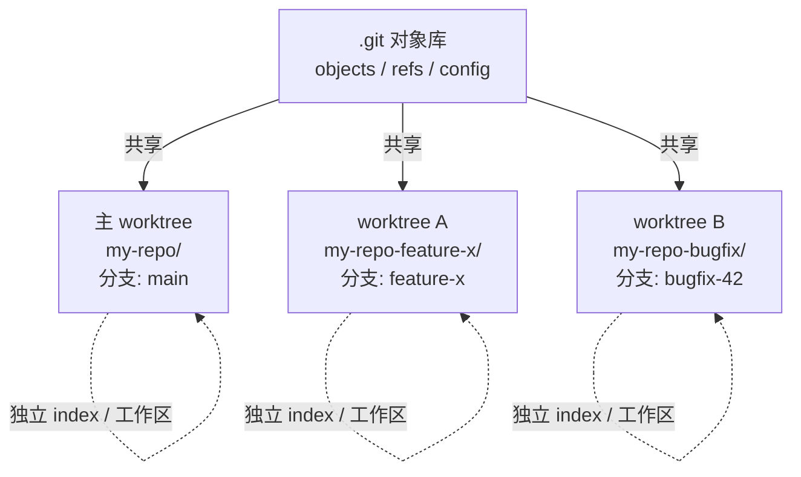

# 17 · worktree 工作流

> [!abstract] TL;DR
> `git worktree` 让你在同一个仓库里开出多个**完全独立的工作目录**，每个目录对应一个分支，共享同一个 `.git`。配合 Claude Code 使用时，最大收益是：**每个会话/任务占一个 worktree，文件修改互不干扰**，实验性大改动失败也不污染主分支，`git worktree remove` 一句话清场。

---

## 概述与定位

`git worktree` 是 Git 2.5 引入的原生功能，允许你从同一个本地仓库同时检出多个分支到多个目录。与"新 clone 一份"不同，所有 worktree **共用同一个 `.git` 目录**（对象库、引用、配置），所以：

- 磁盘占用仅多出工作文件本身，而非完整 `.git` 再来一份
- 在任意一个 worktree 内提交都直接写入同一个对象库，相互可见
- 但各 worktree 的**工作区文件、暂存区（index）是完全隔离的**

在 Claude Code 语境里，这个功能解决了一个典型痛点：**同时开多个 Claude 会话处理不同任务，都在同一个工作目录里改文件，彼此踩踏**。拆分到不同 worktree 之后，每个会话"看到"的文件系统是独立的，不会互相污染。

这也是 superpowers 系列技能（见 `/using-git-worktrees`、`/worktree` 触发词）推荐的标准隔离模式。当 Claude Code 自身的 Agent 工具带 `isolation: "worktree"` 参数时，底层实际调用的就是这套机制。

---

## 原理与机制

```
主仓库目录
  my-repo/
  ├── .git/              ← 所有 worktree 共享此对象库
  │   ├── objects/
  │   ├── refs/
  │   └── worktrees/     ← git 记录每个 worktree 的元数据
  ├── src/               ← 主 worktree（通常是 main/master）
  └── ...

链接 worktree（在仓库目录外）
  my-repo-feature-x/     ← git worktree add 创建
  ├── .git               ← 一个文件，指向主 .git/worktrees/feature-x
  ├── src/               ← 完全独立的工作区文件
  └── ...

  my-repo-bugfix-42/     ← 另一个 worktree
  ├── .git
  └── ...
```

关键点：

1. **每个 worktree 有独立 index（暂存区）**：在 `feature-x` worktree 里 `git add`，不影响主目录或 `bugfix-42` 的暂存区。
2. **同一分支不能在两个 worktree 中同时检出**：若你试图在第二个 worktree 检出主 worktree 当前所在的分支，git 会报错 `fatal: 'main' is already checked out`。
3. **`.git` 文件（非目录）**：链接 worktree 里的 `.git` 是一个纯文本文件，内容类似 `gitdir: /path/to/main-repo/.git/worktrees/feature-x`，Git 工具链通过它找到真正的对象库。
4. **垃圾回收与 gc**：所有 worktree 可见的对象，哪怕只被一个 worktree 引用的提交也受到保护，不会被 gc 误删。



---

## 结构/算法/伪代码详解

### 基本操作速查

**创建 worktree 并新建分支**

```bash
# 在仓库根目录旁边新建目录，检出到新分支 feature-x
git worktree add ../my-repo-feature-x -b feature-x

# 也可以基于特定起点（如远程分支）
git worktree add ../my-repo-feature-x -b feature-x origin/main
```

**创建 worktree 并检出已有分支**

```bash
# 检出本地已有分支（该分支不能已被其他 worktree 占用）
git worktree add ../my-repo-release release/v2.0
```

**列出当前所有 worktree**

```bash
git worktree list
# 输出示例：
# /d/projects/my-repo         abc1234 [main]
# /d/projects/my-repo-feat    def5678 [feature-x]
# /d/projects/my-repo-bugfix  789abcd [bugfix-42]
```

**删除一个 worktree**

```bash
# 先切到主 worktree（或任意非目标 worktree）执行
git worktree remove ../my-repo-feature-x

# 若 worktree 目录有未提交改动，需加 --force
git worktree remove --force ../my-repo-feature-x
```

**清理已不存在目录的 worktree 记录**（手动删文件夹后修复元数据）

```bash
git worktree prune
```

**锁定 / 解锁**（防止 prune 误删，适合 NFS 或临时离线场景）

```bash
git worktree lock ../my-repo-feature-x --reason "CI 跑长测试中，勿删"
git worktree unlock ../my-repo-feature-x
```

### 推荐目录约定

多数团队把 linked worktree 放在**主仓库的同级**或**专用子目录**里：

```
projects/
├── my-repo/                 # 主仓库 + 主 worktree
├── my-repo-feature-x/       # worktree A
├── my-repo-bugfix-42/       # worktree B
└── my-repo-review-pr123/    # worktree C（code review 专用）
```

也有团队在仓库内用 `worktrees/` 子目录，但需要把该路径加入 `.gitignore`，否则 git 会看到未跟踪文件。

---

## 工具视角与实战

### 场景一：多个 Claude Code 会话并行，各跑各的 worktree

这是最核心的使用模式。假设你有两件事要同时做：

1. **任务 A**：实现新功能 `search-filter`（预计改动 10+ 个文件）
2. **任务 B**：紧急修复 `#bug-401`（2 个文件）

传统方式：两个 Claude 会话都在主目录里改，stash/unstash 来回切，或互相踩到对方还没提交的改动。

worktree 方式：

```bash
# 给任务 A 开一个 worktree
git worktree add ../my-repo-search-filter -b feat/search-filter

# 给任务 B 开另一个 worktree
git worktree add ../my-repo-bugfix401 -b fix/bug-401

# 在 Claude Code 里，分别把这两个目录作为工作目录
# （或在主目录启动两个 Claude 会话，分别 cd 到对应路径）
```

两个 Claude 会话完全独立操作，互不干扰，任意一个失败也不影响另一个。

### 场景二：实验性大改动，失败直接丢弃

```bash
# 开实验分支
git worktree add ../my-repo-refactor -b experiment/big-refactor

# 在新目录里让 Claude 尽情重构，放开手脚
# ...如果最终发现方向错了：

git worktree remove ../my-repo-refactor
git branch -D experiment/big-refactor
# 主目录的 main 分支一行未动
```

### 场景三：code review 与开发并行

```bash
# review 某个 PR 对应的分支，不影响自己正在开发的 feature
git worktree add ../my-repo-review-pr origin/pr/feature-auth

# 在新目录里阅读、批注、测试
# review 完删掉
git worktree remove ../my-repo-review-pr
```

### 场景四：配合子代理/并行任务

[[91.Claude Code/07-Subagents与工作流.md]] 介绍了如何用 Task 工具 spawn 多个子代理并行跑任务。当子代理需要改动文件时，若都在同一目录里操作，多个子代理的文件改动会互相覆盖。

解决方案：在启动子代理之前，先为每个独立任务预建对应的 worktree，把 worktree 路径传给子代理作为工作目录：

```bash
# 主流程脚本预建 worktrees
git worktree add ../repo-task-a -b task/task-a
git worktree add ../repo-task-b -b task/task-b

# 子代理 A 在 ../repo-task-a 目录里操作
# 子代理 B 在 ../repo-task-b 目录里操作
# 互不干扰，最后分别合并
```

Claude Code 的 Agent 工具若带 `isolation: "worktree"` 参数，正是自动完成了上述步骤：为该 Agent 新建一个 worktree，Agent 结束后清理；如果没有改动，worktree 自动删除。

---

## 安全性与正确使用

> [!note]
> **共享 `.git` 的含义**：所有 worktree 操作（`git commit`、`git fetch`、`git gc`）都写入同一个对象库。在一个 worktree 里 `git gc --prune=now` 可能影响其他 worktree 引用的对象；`git fetch` 拉到的远程分支对所有 worktree 立即可见。这不是问题，但要意识到"隔离的是工作区，不是对象库"。

> [!note]
> **依赖安装不共享**：`node_modules`、`.venv`、`target/`、`build/` 这些构建产物和依赖目录属于工作区文件，各 worktree 独立，不会自动复制。新建 worktree 后，如果项目需要，必须重新跑 `npm install` / `pip install` / `cargo build` 等。这是最容易被忘记的坑，直接表现是"代码没改，新 worktree 里跑不起来"。

> [!note]
> **Git Hooks 的位置**：hooks 存在 `.git/hooks/` 下，由主对象库管理，所有 worktree 共享同一套 hooks。在任意 worktree 提交都会触发 pre-commit、commit-msg 等。这通常是你想要的行为；但如果你在某个 worktree 里临时绕过 hooks（`--no-verify`），对其他 worktree 没有影响。

> [!note]
> **IDE 多开**：VS Code / JetBrains 类 IDE 每个窗口对应一个目录，打开多个 worktree 没有问题；但"项目级别"的设置（如 `.vscode/settings.json`）是工作区文件，不会自动同步到其他 worktree——新 worktree 继承的是 `.git` 检出那一刻的快照。若你在主目录改了 `.vscode` 但还没提交，新 worktree 检出的是旧版本。

> [!note]
> **磁盘占用**：linked worktree 的工作区文件是**硬链接或完整复制**（取决于文件系统），并非符号链接。大量二进制文件（如 Unity 项目的 asset）会成倍增加磁盘占用；纯源码仓库几乎无感。`git worktree list` 可快速盘点当前有哪些，及时 `remove` 不用的。

> [!note]
> **忘记 remove 导致孤儿分支积累**：每个 worktree 绑定一个分支，若 worktree 目录被手动删除（没走 `git worktree remove`），`.git/worktrees/` 里的元数据还在，该分支在 `git branch` 里也还在，看起来正常但目录已不存在。用 `git worktree prune` 清理过时的元数据，再 `git branch -d` 删掉已合并的分支。

**何时该用 worktree**

| 场景 | 推荐用 worktree |
|---|---|
| 多个 Claude 会话并行改同一仓库 | 是 |
| 实验性重构/改动，不确定是否保留 | 是 |
| code review 与自己的开发分支并行 | 是 |
| 同时维护两个大版本（如 v1、v2） | 是 |
| 只是跑个小修复、几分钟就提交 | 不必要，stash 即可 |
| 只有一个 Claude 会话在跑 | 不必要 |
| 仓库有大量二进制资源、磁盘紧张 | 谨慎使用 |

---

## 小结

`git worktree` 是一个被大量开发者忽视的原生 Git 功能。与 Claude Code 结合后，它解决的核心问题是**多会话/多任务并行的文件系统隔离**：每个任务一个独立工作目录，互不踩踏，实验失败直接销毁，不留痕迹于主分支。掌握四条核心命令——`add`、`list`、`remove`、`prune`——就足以覆盖 90% 的使用场景。遇到新 worktree 启动异常，优先检查**依赖是否重装**；遇到分支检出冲突，检查**该分支是否已被其他 worktree 占用**。

---

## 相关阅读

- [[91.Claude Code/07-Subagents与工作流.md]] — 子代理与并行任务编排，worktree 隔离的上游场景
- [[91.Claude Code/00.总览|Claude Code 总览]] — 全系列导航
- [[91.Claude Code/12-故障排查与技巧.md]] — 依赖安装、模型权限等常见坑的排查

---

> 🏠 [[91.Claude Code/00.总览|Claude Code 总览]]
